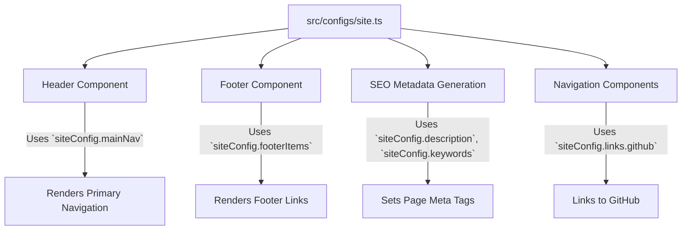

 # Configurations and Enums

This document provides a comprehensive overview of the global configuration files, site metadata definitions, and enumerations used throughout the LandeMon application. These files are crucial for maintaining consistency in data typing, managing site-wide settings, and defining core application behaviors.

Understanding these foundational files ensures proper application setup, data handling, and extensibility. They serve as the single source of truth for many application-wide values, from environment variables to content categories and request types.

## Site Configurations (`src/configs/site.ts`)

The `site.ts` file is the central hub for all site-wide metadata and configurations. It defines how the application presents itself, including its name, description, social media links, and primary navigation structure. This configuration is essential for SEO, user experience, and overall branding.

```tsx title="src/configs/site.ts" {3-4,8-20}
import { Icons } from '@/components/icons';
import { env } from '@/env.mjs';

export type SiteConfig = typeof siteConfig;

export const siteConfig = {
  name: env.NEXT_PUBLIC_SITE_NAME,
  author: env.NEXT_PUBLIC_SITE_NAME,
  slogan: 'Cinema at Your Fingertips.',
  description:
    'Watch movies & TV shows online or stream right to your smart TV, game console, PC, Mac, mobile, tablet and more.',
  keywords: [
    'watch movies',
    'movies online',
    'watch TV',
    'TV online',
    'TV shows online',
    'watch TV shows',
    'stream movies',
    'stream tv',
    'instant streaming',
    'watch online',
    'movies',
    'watch TV online',
    'no download',
    'full length movies',
    env.NEXT_PUBLIC_SITE_NAME,
  ],
  url: env.NEXT_PUBLIC_APP_URL,
  ogImage: `${env.NEXT_PUBLIC_APP_URL}/images/hero.jpg`,
  links: {
    twitter: `${env.NEXT_PUBLIC_TWITTER}`,
    github: 'https://github.com/lande26/LandeMon',
    githubAccount: '',
  },
  footerItems: [
    { title: 'About', href: '/' },
    { title: 'Help Center', href: '/' },
    { title: 'Contact Us', href: '/' },
    { title: 'Privacy Policy', href: '/' },
  ],
  mainNav: [
    {
      title: 'Home',
      href: '/home',
      // icon: Icons.play,
    },
    {
      title: 'TV Shows',
      href: '/tv-shows',
      // icon: Icons.tvShow,
    },
    {
      title: 'Movies',
      href: '/movies',
      // icon: Icons.movie,
    },
    {
      title: 'Anime',
      href: '/anime',
      // icon: Icons.list,
    },
    {
      title: 'New & Popular',
      href: '/new-and-popular',
      // icon: Icons.trendingUp,
    },
  ],
};
```
[View on GitHub](https://github.com/lande26/LandeMon/blob/main/src/configs/site.ts)

### Key Aspects of `siteConfig`:

*   **Metadata**: `name`, `slogan`, `description`, `keywords`, `url`, and `ogImage` are defined here, leveraging environment variables for dynamic values. These are crucial for search engine optimization and social media sharing.
*   **External Links**: `links` object centralizes references to external platforms like Twitter and GitHub, ensuring consistency across the application.
*   **Navigation**:
    *   `footerItems`: An array of objects defining the links displayed in the application's footer.
    *   `mainNav`: An array of objects structuring the primary navigation bar, including titles and corresponding hrefs.

This configuration is typically imported and used by components that need access to global site information, such as the `Header` or `Footer` components, or for generating page metadata.

## Enumerations for Data Consistency

Enumerations play a vital role in defining a fixed set of named constants, providing a clear and type-safe way to represent categories or states within the application.

### Genre Enumeration (`src/enums/genre.ts`)

The `Genre` enum maps common genre names to their respective numerical IDs, primarily used when interacting with external APIs like TMDB (The Movie Database). This ensures that genre requests and displays are standardized.

```typescript title="src/enums/genre.ts" {1-5}
export enum Genre {
  ACTION = 28,
  ADVENTURE = 12,
  ANIMATION = 16,
  COMEDY = 35,
  CRIME = 80,
  DOCUMENTARY = 99,
  DRAMA = 18,
  FAMILY = 10751,
  FANTASY = 14,
  HISTORY = 36,
  HORROR = 27,
  MUSIC = 10402,
  MYSTERY = 9648,
  ROMANCE = 10749,
  SCIENCE_FICTION = 878,
  TV_MOVIE = 10770,
  THRILLER = 53,
  WAR = 10752,
  WESTERN = 37,
  ACTION_ADVENTURE = 10759,
  KIDS = 10762,
  NEWS = 10763,
  REALITY = 10764,
  SCIFI_FANTASY = 10765,
  SOAP = 10766,
  TALK = 10767,
  WAR_POLITICS = 10768,
}
```
[View on GitHub](https://github.com/lande26/LandeMon/blob/main/src/enums/genre.ts)

This enum is crucial for constructing API queries and filtering content based on specific genres.

### Request Type Enumeration (`src/enums/request-type.ts`)

The `RequestType` enum defines various categories for fetching media content, such as trending, top-rated, or genre-specific requests. It standardizes the types of content lists that can be requested from the backend or external APIs. This file also introduces related types for TMDB responses and show requests.

```typescript title="src/enums/request-type.ts" {4-10,13-17}
import { type MediaType, type Show } from '@/types';
import { type Genre } from './genre';

export enum RequestType {
  TRENDING = 'trending',
  TOP_RATED = 'top_rated',
  NETFLIX = 'netflix',
  POPULAR = 'popular',
  GENRE = 'genre',
  ANIME_GENRE = 'anime_genre',
  KOREAN = 'korean',
  DEFAULT = 'default',
  ANIME_LATEST = 'anime_latest',
  ANIME_TRENDING = 'anime_trending',
  ANIME_TOP_RATED = 'anime_top_rated',
  ANIME_NETFLIX = 'anime_netflix',
}

export type TmdbPagingResponse = {
  results: Show[];
  page: number;
  totalPages: number;
  totalResults: number;
};

export type TmdbRequest = {
  requestType: RequestType;
  mediaType: MediaType;
  genre?: Genre;
  page?: number;
};

export type ShowRequest = {
  title: string;
  req: TmdbRequest;
  visible: boolean;
};
```
[View on GitHub](https://github.com/lande26/LandeMon/blob/main/src/enums/request-type.ts)

The `TmdbRequest` type, utilizing `RequestType`, `MediaType`, and `Genre`, provides a structured way to define specific API queries.

## Core Types (`src/types/index.ts`)

The `index.ts` file within the `src/types` directory serves as a central repository for defining application-wide data structures and interfaces. This includes critical enums like `MediaType` and complex types such as `Show`, `NavItem`, and various API response structures.

```typescript title="src/types/index.ts" {3-7, 10-14}
// import type { MEDIA_TYPE } from "@prisma/client";

export enum MediaType {
  ALL = 'all',
  TV = 'tv',
  MOVIE = 'movie',
  ANIME = 'anime',
}

export type CategorizedShows = {
  title: string;
  shows: Show[];
  visible: boolean;
};

export type NavItem = {
  title: string;
  href?: string;
  disabled?: boolean;
  external?: boolean;
  icon?: React.ComponentType<React.SVGProps<SVGSVGElement>>;
  onClick?: () => void;
};

export type Show = {
  adult: boolean;
  backdrop_path: string | null;
  media_type: MediaType;
  // media_type: string;
  budget: number | null;
  homepage: string | null;
  showId: string;
  id: number;
  imdb_id: string | null;
  original_language: string;
  original_title: string | null;
  overview: string | null;
  popularity: number;
  poster_path: string | null;
  number_of_seasons: number | null;
  number_of_episodes: number | null;
  release_date: string | null;
  first_air_date: string | null;
  last_air_date: string | null;
  revenue: number | null;
  runtime: number | null;
  status: string | null;
  tagline: string | null;
  title: string | null;
  name: string | null;
  video: boolean;
  vote_average: number;
  vote_count: number;
  original_name?: string;
  keywords: KeyWordResponse;
  seasons: ISeason[];
};

export type KeyWord = {
  id: number;
  name: string;
};

export type KeyWordResponse = {
  id: number;
  keywords: KeyWord[];
  results: KeyWord[];
};

export type Genre = {
  id: number;
  name: string | null;
};

export type VideoType =
  | 'Bloopers'
  | 'Featurette'
  | 'Behind the Scenes'
  | 'Clip'
  | 'Trailer'
  | 'Teaser';

export type VideoResult = {
  iso_639_1: string;
  iso_3166_1: string;
  name: string;
  key: string;
  site: string;
  size: number;
  type: VideoType;
  official: boolean;
  published_at: string;
  id: string;
};

export type ShowWithGenreAndVideo = Show & {
  genres: Genre[];
  videos?: {
    results: VideoResult[];
  };
};

export type ISeason = {
  _id: string;
  air_date: string;
  name: string;
  overview: string;
  id: number;
  poster_path: string;
  season_number: number;
  vote_average: number;
  episodes: IEpisode[];
};

export type IEpisode = {
  air_date: string;
  episode_number: number;
  id: number;
  name: string;
  overview: string;
  production_code: string;
  runtime: number;
  season_number: number;
  show_id: number;
  still_path: string;
  vote_average: number;
  vote_count: number;
};

export interface IStack<T> {
  push(item: T): void;
  pop(): T | undefined;
  peek(): T | undefined;
  size(): number;
}
```
[View on GitHub](https://github.com/lande26/LandeMon/blob/main/src/types/index.ts)

### Essential Types Defined:

*   **`MediaType` Enum**: Categorizes content into `ALL`, `TV`, `MOVIE`, or `ANIME`, enabling flexible content filtering and API calls.
*   **`Show` Type**: A comprehensive type representing a media item (movie or TV show), including details such as `title`, `overview`, `poster_path`, and `media_type`. This type is extensively used when fetching and displaying content from TMDB.
*   **`NavItem` Type**: Defines the structure for navigation items, used by `siteConfig` for menu creation.
*   **`CategorizedShows` Type**: Groups `Show` items under a specific title, useful for displaying content in categorized rows or sections.
*   **API Response Types**: Types like `TmdbPagingResponse`, `KeyWordResponse`, `VideoResult`, `ShowWithGenreAndVideo`, `ISeason`, and `IEpisode` mirror the structure of data received from external APIs, ensuring type safety in data handling.

## Key Integration Points

These configuration files and enums form the backbone of data modeling and application behavior in LandeMon.

### Data Flow for Content Requests

The following diagram illustrates how `MediaType`, `Genre`, and `RequestType` are used to construct and process content requests within the application.


```mermaid
graph TD
    A["User Interaction (e.g., clicks 'Movies' or 'Action' genre)"] --> B["Build `TmdbRequest` Object"];
    B --> C["`TmdbRequest` Creation"];
    C -- "Uses `RequestType` enum" --> D["Defines query type (e.g., 'TRENDING', 'GENRE')"];
    C -- "Uses `MediaType` enum" --> E["Specifies content type ('MOVIE', 'TV', 'ANIME')"];
    C -- "Optionally uses `Genre` enum" --> F["Adds genre ID for filtering"];
    G["API Service (fetches data)"] -- "Processes `TmdbRequest`" --> H["Returns `TmdbPagingResponse`"];
    H --> I["Display Content (e.g., on homepage, category page)"];
```


### Site Configuration Usage

The `siteConfig` object is a global constant, readily available for various components that need to display static site information or construct dynamic URLs.





### Best Practices:

*   **Centralization**: By centralizing configurations and types, the application reduces redundancy and promotes a single source of truth for critical values.
*   **Type Safety**: Using enums and well-defined types (`Show`, `TmdbRequest`) enhances code readability, reduces runtime errors, and improves developer experience through better autocompletion and static analysis.
*   **Environment Variables**: Leveraging `env.NEXT_PUBLIC_SITE_NAME` and `env.NEXT_PUBLIC_APP_URL` in `site.ts` allows for easy adaptation of site metadata across different deployment environments without code changes.
*   **Scalability**: Defining clear `RequestType` and `MediaType` enums makes it easier to extend the application with new content categories or request paradigms in the future.