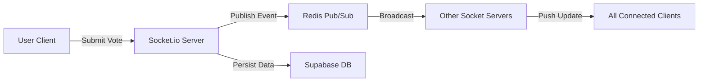

# Introduction

PollMap is a high-performance, real-time polling and engagement platform engineered for live events, classrooms, and interactive presentations. The system enables organizers to gather instant feedback and foster audience participation through a seamless, low-latency interface.

## Project Purpose

The primary goal of PollMap is to eliminate the lag typically associated with web-based polling. By leveraging a specialized real-time infrastructure, the platform ensures that vote updates are synchronized across all connected clients with sub-300ms latency, making it suitable for high-stakes live environments where immediate visual feedback is critical.

## Core Value Propositions

PollMap distinguishes itself through three primary pillars of value:

*   **Instantaneous Engagement:** Utilizing WebSocket bidirectional communication and Redis Pub/Sub, the platform provides near-instantaneous updates to all participants.
*   **AI-Powered Efficiency:** Integration with Google Gemini AI allows organizers to bypass manual data entry by extracting poll questions and options directly from images via OCR.
*   **Enterprise-Grade Reliability:** A stateless API design and horizontally scalable WebSocket servers ensure 99% uptime and the ability to handle high volumes of concurrent connections.

## Key Feature Sets

### 1. Advanced Polling System
*   **Flexible Creation:** Supports both manual entry and AI-driven image extraction.
*   **Access Control:** Features password-protected polls and time-bound expiring session links.
*   **Participation Management:** Includes live vote counters, participant tracking, and role-based access control for organizers.

### 2. Real-time Analytics
*   **Dynamic Visualization:** Integrated Nivo Charts provide data via Bar, Pie, Line, and Radar charts.
*   **Export Capabilities:** Results can be exported as PNG images or PDF documents for offline reporting.
*   **Social Integration:** Built-in functionality to share analytics across various social media platforms.

### 3. High-Performance Infrastructure
*   **Low Latency:** Redis caching and Pub/Sub messaging reduce latency by approximately 150ms.
*   **Scalability:** Containerized deployment via Docker and load balancing via Nginx.
*   **Secure Persistence:** Managed PostgreSQL database and authentication handled through Supabase.

## High-Level Interaction Flow

The following diagram illustrates the lifecycle of a real-time vote within the PollMap ecosystem:

## Technical Stack Summary

| Layer | Technology | Purpose |
| :--- | :--- | :--- |
| **Frontend** | React 19, Vite, Tailwind CSS | UI Rendering and State Management |
| **Real-time** | Socket.io, Redis | Bidirectional Communication & Message Queuing |
| **Backend** | Node.js, Express.js | REST API and Business Logic |
| **Database** | Supabase (PostgreSQL) | Persistent Storage & User Authentication |
| **AI** | Google Gemini AI | OCR and Text Extraction |
| **DevOps** | Docker, AWS EC2, Nginx | Containerization and Traffic Routing |

## Performance Metrics

PollMap is designed to meet rigorous performance benchmarks to ensure a fluid user experience:

*   **Real-time Latency:** < 300ms for vote synchronization.
*   **Database Efficiency:** 70% reduction in queries achieved via Redis caching.
*   **Availability:** 99% system uptime through auto-scaling capabilities.