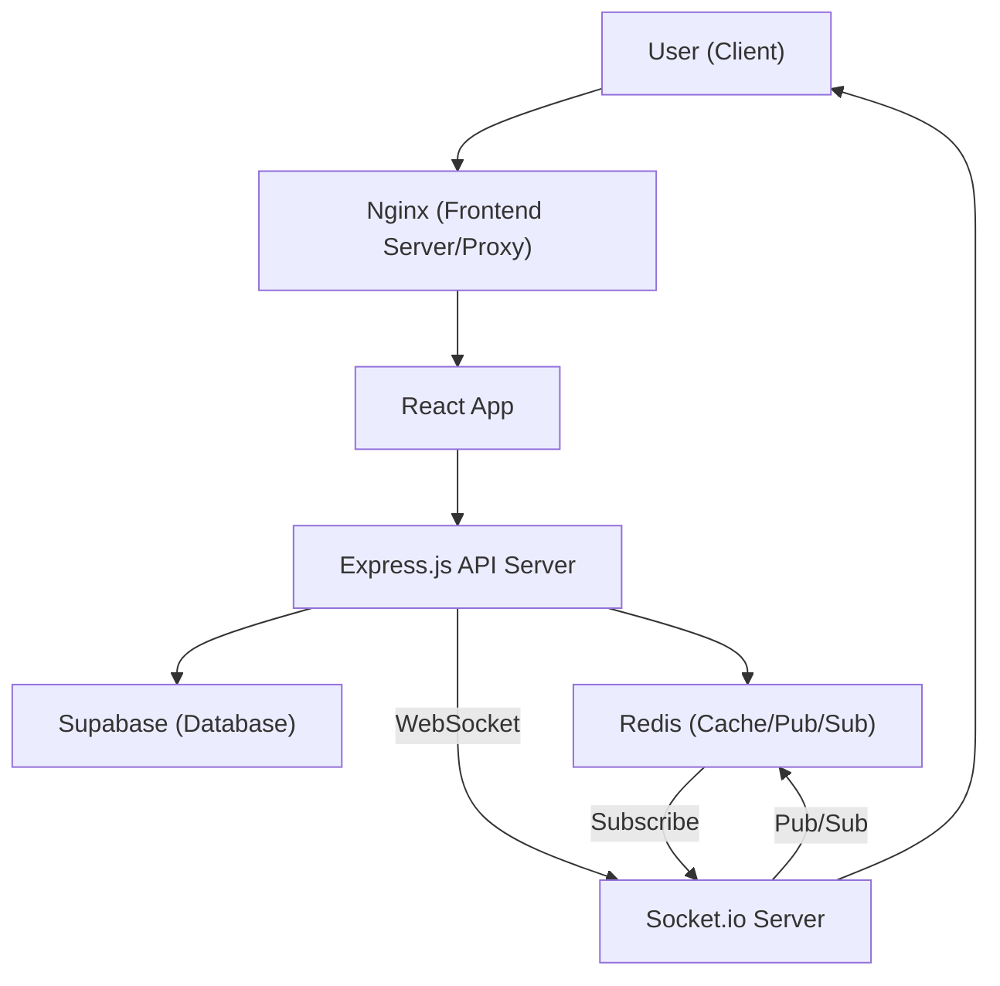

# Project Overview

PollMap is a high-performance, real-time polling and Q&A platform engineered for dynamic live events, educational settings, and interactive presentations. It leverages a robust tech stack including React, Node.js, WebSockets, and Redis to deliver sub-300ms real-time updates, ensuring an engaging and responsive user experience.

The platform offers a comprehensive suite of features designed to facilitate seamless audience interaction and insightful data analysis. This includes a flexible polling system capable of manual creation or AI-powered extraction from images, secure password-protected polls, and expiring session links for time-bound events. Participants can engage in real-time voting, with instant synchronization across all connected clients, while organizers can track participants and monitor live vote counters.

Beyond live engagement, PollMap provides a powerful analytics dashboard. This dashboard visualizes real-time vote statistics and trends through various chart types like Bar, Pie, Line, and Radar. Results can be conveniently exported as PNG images or PDF documents and shared across social media platforms, making it easy to disseminate findings.

The underlying infrastructure is built for scalability and reliability. It utilizes WebSocket communication via Socket.io for bidirectional data transfer, Redis Pub/Sub for efficient message queuing and caching, and a horizontally scalable WebSocket server architecture. The API is designed to be stateless, supporting a microservices approach for maximum flexibility and resilience.

## Key Features

PollMap distinguishes itself with a feature set tailored for both immediate engagement and post-event analysis.

### Polling System
*   **Versatile Poll Creation**: Manually craft polls with custom questions and options, or leverage Google Gemini AI's Optical Character Recognition (OCR) capabilities to extract poll content directly from images.
*   **Real-time Voting**: Experience instant vote synchronization across all connected clients, ensuring everyone sees the most up-to-date results in real-time.
*   **Security and Access Control**: Implement password protection for polls to restrict access and utilize expiring session links for time-bound events.
*   **Participant Management**: Monitor live vote counts and track active participants to gauge engagement levels.
*   **Role-Based Access**: Differentiate between event organizers and participants through a clear role-based access control system.

### Analytics & Reporting
*   **Comprehensive Dashboard**: Access a rich analytics dashboard featuring multiple chart types (Bar, Pie, Line, Radar) to visualize poll data effectively.
*   **Live Statistics**: Monitor real-time vote statistics and identify emerging trends as they happen.
*   **Export and Share**: Export poll results as high-quality PNG images or professional PDF documents, and easily share them across social media platforms.

### Real-time Infrastructure
*   **WebSocket Communication**: Utilizes Socket.io for efficient, bidirectional real-time communication between clients and the server.
*   **Redis Pub/Sub**: Employs Redis for message queuing and caching, significantly improving performance and enabling real-time event distribution.
*   **Scalability**: Designed with horizontally scalable WebSocket servers to handle high volumes of concurrent connections and ensure high availability.
*   **Stateless API**: The API is stateless, facilitating a microservices architecture and enhancing scalability.

## Technology Stack

PollMap is built upon a modern and performant technology stack.

**Frontend:**
*   **UI Library**: React 19
*   **Build Tool**: Vite
*   **Styling**: Tailwind CSS
*   **Data Visualization**: Nivo Charts
*   **Icons**: Lucide React
*   **Image Export**: html2canvas
*   **PDF Generation**: jsPDF

**Backend:**
*   **Runtime**: Node.js
*   **Web Framework**: Express.js
*   **WebSocket Communication**: Socket.io
*   **Caching & Pub/Sub**: Redis
*   **Database & Auth**: Supabase

**AI Integration:**
*   **OCR & Text Extraction**: Google Gemini AI

## Architecture

The PollMap application is architected with a focus on scalability, performance, and maintainability, employing a microservices-inspired approach.

### System Design



```mermaid
graph TD
    A["User (Client)"] --> B["Nginx (Frontend Server/Proxy)"]
    B --> C["React App"]
    C --> D["Express.js API Server"]
    D --> E["Supabase (Database)"]
    D --> F["Redis (Cache/Pub/Sub)"]
    D -- WebSocket --> G["Socket.io Server"]
    G -- Pub/Sub --> F
    F -- Subscribe --> G
    G --> A
```


The system comprises several key layers:

1.  **Frontend Layer**: A React application, served efficiently by Nginx.
2.  **API Layer**: A set of RESTful Express.js endpoints designed to be stateless for easier scaling.
3.  **WebSocket Layer**: Dedicated Socket.io servers manage real-time communication, connected to the API layer.
4.  **Cache Layer**: Redis serves as a high-performance cache for session data and acts as a message broker for real-time updates via Pub/Sub.
5.  **Database Layer**: Supabase provides a robust PostgreSQL database for persistent storage and user authentication.
6.  **Load Balancer**: Nginx handles incoming traffic, distributing it across available servers to ensure optimal performance and availability.

### Real-time Communication Flow

The core of PollMap's real-time functionality relies on the efficient interplay between Socket.io and Redis.

When a user casts a vote:
1.  The vote is transmitted via a WebSocket connection to the active Socket.io server.
2.  The Socket.io server immediately publishes this vote event to a Redis channel.
3.  All other active Socket.io servers, subscribed to that same Redis channel, receive the event.
4.  These servers then broadcast the updated vote count to all their connected clients.
5.  Clients receive the update, reflecting the new vote count within milliseconds, achieving the sub-300ms latency target.

This distributed approach, utilizing Redis Pub/Sub, ensures that even with multiple Socket.io instances, real-time updates are disseminated rapidly and reliably.

## Installation and Setup

Setting up PollMap involves cloning the repository, installing dependencies, configuring environment variables, and initializing the backend services.

### Prerequisites

*   Node.js 18 or higher
*   A running Redis server
*   A Supabase account
*   A Google Gemini AI API key
*   Docker (optional, for containerized deployment)

### Setup Steps

1.  **Clone the repository**:
    ```bash
    git clone https://github.com/lande26/pollmap.git
    cd pollmap
    ```

2.  **Install Frontend Dependencies**:
    ```bash
    cd client
    npm install
    ```

3.  **Install Backend Dependencies**:
    ```bash
    cd ../server
    npm install
    ```

4.  **Configure Environment Variables**:
    Create a `.env` file in the `server` directory with the following structure:

    ```plaintext
    SUPABASE_URL=your_supabase_project_url
    SUPABASE_ANON_KEY=your_supabase_anon_key
    SUPABASE_SERVICE_ROLE_KEY=your_service_role_key
    REDIS_URL=redis://localhost:6379
    REDIS_PASSWORD=your_redis_password
    VITE_GEMINI_API_KEY=your_gemini_api_key
    PORT=3000
    NODE_ENV=development
    CORS_ORIGIN=http://localhost:5173
    JWT_SECRET=your_jwt_secret_key
    ```

5.  **Start Redis Server**:
    Ensure your Redis server is running. If using the default local setup:
    ```bash
    redis-server
    ```

6.  **Run the Application**:
    Start the backend server first, then the frontend in a separate terminal:
    ```bash
    # In server/ directory
    npm run dev

    # In client/ directory
    npm run dev
    ```

7.  **Access the Application**:
    *   Frontend: `http://localhost:5173`
    *   Backend API: `http://localhost:3000`

## Development Scripts

PollMap provides convenient scripts for development and production builds.

**Frontend (`client/`)**:
*   `npm run dev`: Starts the development server with hot-reloading.
*   `npm run build`: Creates a production-ready build of the frontend application.
*   `npm run lint`: Runs ESLint to check for code style issues.

**Backend (`server/`)**:
*   `npm run dev`: Starts the backend server using `nodemon` for automatic restarts during development.
*   `npm start`: Starts the production-ready backend server.
*   `npm run lint`: Runs ESLint to check for code style issues.

## Key Takeaways

PollMap is a sophisticated real-time engagement platform designed for high-performance interactive sessions. Its core strengths lie in its low-latency WebSocket infrastructure powered by Socket.io and Redis, versatile polling features including AI-powered text extraction, and a comprehensive analytics suite. The modern tech stack, including React, Node.js, and Supabase, ensures a scalable and maintainable architecture.