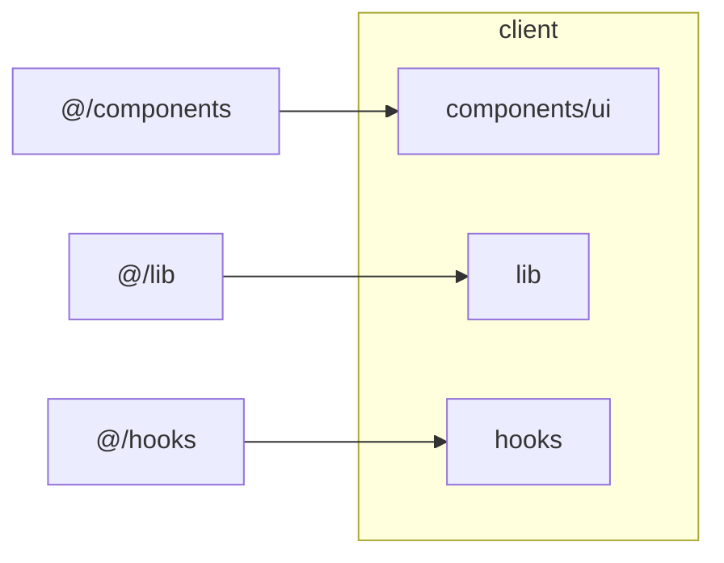
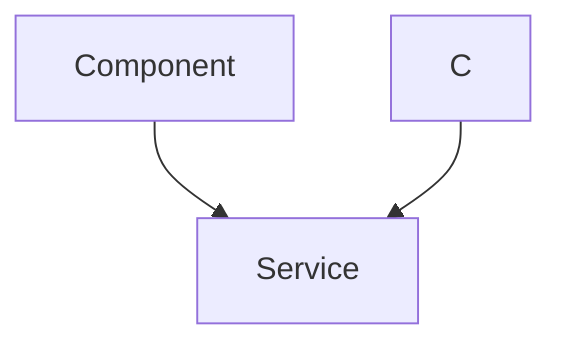

# UI Components

This section details the reusable UI elements used throughout the application, focusing on the `Button` component and its underlying styling utilities. These components are designed to provide a consistent and accessible user interface across the PollMap application. The configuration for UI components relies heavily on `shadcn/ui` and `tailwind-merge`.

## Button Component

The `Button` component, located at `client/src/components/ui/button.tsx`, is a core UI element that provides a styled button with various variants and sizes. It leverages `class-variance-authority` (cva) and `tailwind-merge` for managing CSS classes and ensuring consistent styling.

### Variants and Sizes

The `Button` component supports different variants, such as `default`, `destructive`, `outline`, `secondary`, `ghost`, and `link`, each with distinct visual styles. It also offers different sizes like `default`, `sm`, `lg`, and `icon`.

```typescript filename="client/src/components/ui/button.tsx"
import * as React from "react"
import { Slot } from "@radix-ui/react-slot"
import { cva, type VariantProps } from "class-variance-authority"

import { cn } from "@/lib/utils"

const buttonVariants = cva(
  "inline-flex items-center justify-center gap-2 whitespace-nowrap rounded-md text-sm font-medium transition-all disabled:pointer-events-none disabled:opacity-50 [&_svg]:pointer-events-none [&_svg:not([class*='size-'])]:size-4 shrink-0 [&_svg]:shrink-0 outline-none focus-visible:border-ring focus-visible:ring-ring/50 focus-visible:ring-[3px] aria-invalid:ring-destructive/20 dark:aria-invalid:ring-destructive/40 aria-invalid:border-destructive",
  {
    variants: {
      variant: {
        default: "bg-primary text-primary-foreground hover:bg-primary/90",
        destructive:
          "bg-destructive text-white hover:bg-destructive/90 focus-visible:ring-destructive/20 dark:focus-visible:ring-destructive/40 dark:bg-destructive/60",
        outline:
          "border bg-background shadow-xs hover:bg-accent hover:text-accent-foreground dark:bg-input/30 dark:border-input dark:hover:bg-input/50",
        secondary:
          "bg-secondary text-secondary-foreground hover:bg-secondary/80",
        ghost:
          "hover:bg-accent hover:text-accent-foreground dark:hover:bg-accent/50",
        link: "text-primary underline-offset-4 hover:underline",
      },
      size: {
        default: "h-9 px-4 py-2 has-[>svg]:px-3",
        sm: "h-8 rounded-md gap-1.5 px-3 has-[>svg]:px-2.5",
        lg: "h-10 rounded-md px-6 has-[>svg]:px-4",
        icon: "size-9",
      },
    },
    defaultVariants: {
      variant: "default",
      size: "default",
    },
  }
)

function Button({
  className,
  variant,
  size,
  asChild = false,
  ...props
}: React.ComponentProps<"button"> &
  VariantProps<typeof buttonVariants> & {
    asChild?: boolean
  }) {
  const Comp = asChild ? Slot : "button"

  return (
    <Comp
      data-slot="button"
      className={cn(buttonVariants({ variant, size, className }))}
      {...props}
    />
  )
}

export { Button, buttonVariants }
```

[View on GitHub](https://github.com/lande26/PollMap/blob/main/client/src/components/ui/button.tsx)

The code above defines the `Button` component using `cva` to manage different styles based on the `variant` and `size` props. The `cn` function (from `client/src/lib/utils.ts`) is used to merge these styles with any additional class names provided to the component.

### Usage Example

```typescript
import { Button } from "@/components/ui/button"

function MyComponent() {
  return (
    <div>
      <Button variant="primary">Primary Button</Button>
      <Button variant="secondary">Secondary Button</Button>
      <Button variant="outline">Outline Button</Button>
    </div>
  );
}
```

### Tailwind Configuration

The project uses Tailwind CSS for styling. The base color and other Tailwind configurations can be found in `client/components.json`:

```json filename="client/components.json"
{
  "$schema": "https://ui.shadcn.com/schema.json",
  "style": "new-york",
  "rsc": false,
  "tsx": true,
  "tailwind": {
    "config": "",
    "css": "src/index.css",
    "baseColor": "slate",
    "cssVariables": true,
    "prefix": ""
  },
  "iconLibrary": "lucide",
  "aliases": {
    "components": "@/components",
    "utils": "@/lib/utils",
    "ui": "@/components/ui",
    "lib": "@/lib",
    "hooks": "@/hooks"
  },
  "registries": {}
}
```

[View on GitHub](https://github.com/lande26/PollMap/blob/main/client/components.json)

This `components.json` file configures the `shadcn/ui` integration with Tailwind CSS, specifying the style, base color, and aliases for commonly used directories.

### Class Merging Utility

The `cn` function in `client/src/lib/utils.ts` is a utility function that simplifies the process of merging CSS classes using `clsx` and `tailwind-merge`.

```typescript filename="client/src/lib/utils.ts"
import { clsx, type ClassValue } from "clsx"
import { twMerge } from "tailwind-merge"

export function cn(...inputs: ClassValue[]) {
  return twMerge(clsx(inputs))
}
```

[View on GitHub](https://github.com/lande26/PollMap/blob/main/client/src/lib/utils.ts)

The `cn` function takes multiple class values as input, merges them using `clsx`, and then further optimizes the merged class string using `tailwind-merge` to resolve any Tailwind CSS conflicts.

```javascript
import { cn } from "@/lib/utils";

const className = cn("bg-blue-500", "hover:bg-blue-700", "text-white", "font-bold", "py-2", "px-4", "rounded");
console.log(className); // Output: bg-blue-500 hover:bg-blue-700 text-white font-bold py-2 px-4 rounded
```

## UI Component Structure

The UI components are structured to promote reusability and maintainability. The `client/components.json` file defines aliases to simplify imports and maintain consistency across the codebase.





### Key Integration Points

-   **shadcn/ui**: Used for generating consistent and accessible UI components.
-   **Tailwind CSS**: Provides a utility-first CSS framework for styling components.
-   **class-variance-authority (cva)**: Manages component variants and their associated styles.
-   **tailwind-merge**: Resolves conflicting Tailwind CSS classes.
-   **clsx**: Conditionally includes CSS classes.

### Best Practices

-   **Component Composition**: Build complex UI elements by composing smaller, reusable components.
-   **Consistent Styling**: Use Tailwind CSS and `shadcn/ui` to maintain a consistent visual style across the application.
-   **Accessibility**: Ensure that all UI components are accessible to users with disabilities by following ARIA guidelines.
-   **Variant Management**: Utilize `cva` to manage component variants and their associated styles effectively.

```typescript
import { Button } from "@/components/ui/button";

function SubmitButton({ disabled }: { disabled: boolean }) {
  return (
    <Button variant="default" disabled={disabled}>
      {disabled ? "Submitting..." : "Submit"}
    </Button>
  );
}
```

In this example, the `SubmitButton` component uses the base `Button` component and adds a `disabled` prop to control its state. It also changes the text based on whether the button is disabled.





###  Button Component Customization

The `Button` component can be customized further by adding new variants or modifying existing ones. This involves updating the `buttonVariants` definition in `client/src/components/ui/button.tsx`.

For example, to add a `success` variant:

```typescript filename="client/src/components/ui/button.tsx"
const buttonVariants = cva(
  "...",
  {
    variants: {
      variant: {
        default: "...",
        destructive: "...",
        outline: "...",
        secondary: "...",
        ghost: "...",
        link: "...",
        success: "bg-green-500 text-white hover:bg-green-700", // Added success variant
      },
      size: {
        default: "...",
        sm: "...",
        lg: "...",
        icon: "size-9",
      },
    },
    defaultVariants: {
      variant: "default",
      size: "default",
    },
  }
);
```

[View on GitHub](https://github.com/lande26/PollMap/blob/main/client/src/components/ui/button.tsx)

This adds a new `success` variant to the `Button` component, which can be used as follows:

```typescript
<Button variant="success">Success Button</Button>
```
```
```