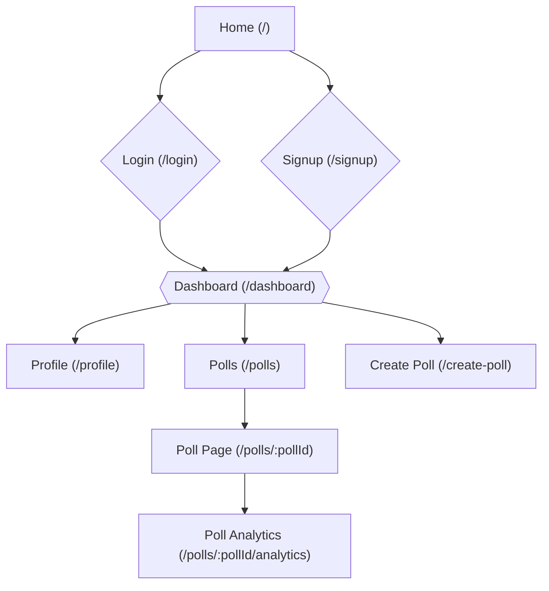
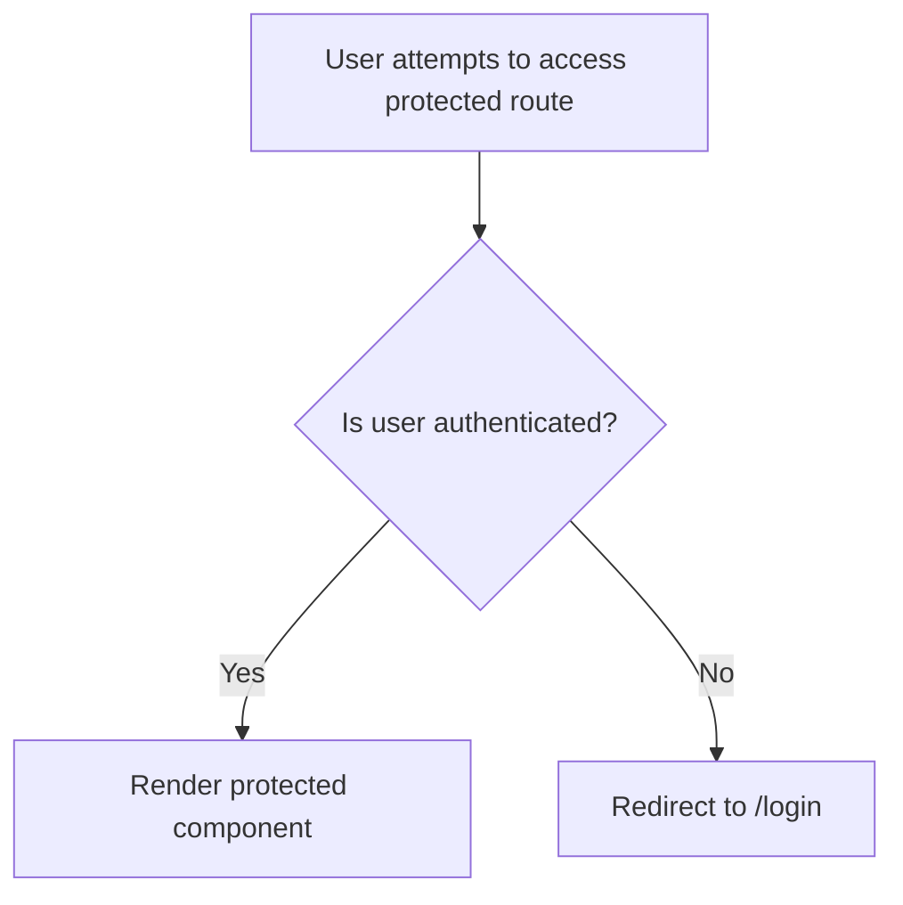

# Page Structure and Routing

This document describes the structure and routing logic of the PollMap application. It details how different pages are organized and how navigation is handled using React Router.

## Overview

The application's routing is primarily managed within `client/src/App.jsx`. It utilizes `react-router-dom` to define routes for various pages, including the home page, login, signup, dashboard, profile, and individual polls. A layout component provides a consistent header and overall structure to most pages. Protected routes ensure that only authenticated users can access certain sections of the application.

## Key Components

*   **`App.jsx`**: The main application component responsible for setting up routing and global providers.
*   **`Home.jsx`**: The landing page of the application.
*   **`Dashboard.jsx`**: The user dashboard, displaying polls created by the user and offering options to create new polls.
*   **`ProtectedRoute.jsx`**: A higher-order component that protects routes, redirecting unauthenticated users to the login page.
*   **`Layout.jsx`**: A wrapper component that provides a consistent layout, including the header.

## Route Definitions

The `App.jsx` file defines the following routes:

*   `/`: Home page.
*   `/login`: Login page.
*   `/signup`: Signup page.
*   `/dashboard`: User dashboard (protected).
*   `/profile`: User profile (protected).
*   `/bookmarks`: Bookmarks page (protected, under construction).
*   `/polls`: Polls listing page (protected).
*   `/create-poll`: Page to create a new poll (protected).
*   `/polls/:pollId`: Individual poll page (protected).
*   `/polls/:pollId/analytics`: Poll analytics page (protected).

Here's a snippet from `App.jsx` illustrating how routes are defined:

```javascript
// File: client/src/App.jsx
import { Routes, Route, BrowserRouter } from 'react-router-dom';
import Home from './pages/Home.jsx';
import Login from './pages/login.jsx';
import Signup from './pages/singup.jsx';
import Dashboard from './pages/Dashboard.jsx';
import Profile from './pages/Profile.jsx';
import ProtectedRoute from './components/ProtectedRoute/ProtectedRoute.jsx';
import Polls from './pages/polls.jsx';
import CreatePoll from './pages/CreatePolll.jsx';
import PollPage from './pages/PollPage.jsx';
import PollAnalytics from './pages/PollAnalytics.jsx';

function App() {
  return (
    <BrowserRouter>
      <Routes>
        <Route path="/" element={<Layout showHeader={true}><Home /></Layout>} />
        <Route path="/login" element={<Layout showHeader={false}><Login /></Layout>} />
        <Route path="/signup" element={<Layout showHeader={false}><Signup /></Layout>} />
        <Route path="/dashboard" element={<ProtectedRoute><Layout showHeader={true}><Dashboard /></Layout></ProtectedRoute>} />
        <Route path="/profile" element={<ProtectedRoute><Layout showHeader={true}><Profile /></Layout></ProtectedRoute>} />
        <Route path="/polls" element={<ProtectedRoute><Layout showHeader={true}><Polls /></Layout></ProtectedRoute>} />
        <Route path="/create-poll" element={<ProtectedRoute><Layout showHeader={true}><CreatePoll /></Layout></ProtectedRoute>} />
        <Route path="/polls/:pollId" element={<ProtectedRoute><Layout showHeader={true}><PollPage /></Layout></ProtectedRoute>} />
        <Route path="/polls/:pollId/analytics" element={<ProtectedRoute><Layout showHeader={true}><PollAnalytics /></Layout></ProtectedRoute>} />
      </Routes>
    </BrowserRouter>
  );
}

export default App;
```

[View on GitHub](https://github.com/lande26/PollMap/blob/main/client/src/App.jsx)

### Protected Routes

The `ProtectedRoute` component in `client/src/App.jsx` is essential for ensuring that only authenticated users can access specific parts of the application. If a user is not authenticated (i.e., `user` is null), they are redirected to the `/login` page.

```javascript
// File: client/src/components/ProtectedRoute/ProtectedRoute.jsx
import React from 'react';
import { Navigate } from 'react-router-dom';
import { UserAuth } from '../../context/AuthContext';

const ProtectedRoute = ({ children }) => {
  const { user } = UserAuth();

  if (!user) {
    return <Navigate to='/login' />;
  }
  return children;
};

export default ProtectedRoute;
```

[View on GitHub](https://github.com/lande26/PollMap/blob/main/client/src/components/ProtectedRoute/ProtectedRoute.jsx)

### Layout Component

The `Layout` component, also in `client/src/App.jsx`, provides a consistent look and feel across different pages. It conditionally renders the `Header` component based on the `showHeader` prop.

```javascript
// File: client/src/App.jsx
const Layout = ({ children, showHeader = true }) => {
  return (
    <div className="min-h-screen relative">
      {showHeader && <Header />}
      <div className={showHeader ? "pt-20" : ""}>
        {children}
      </div>
    </div>
  )
}
```

[View on GitHub](https://github.com/lande26/PollMap/blob/main/client/src/App.jsx)

### Dashboard Component

The `Dashboard` component (`client/src/pages/Dashboard.jsx`) is the central hub for users to manage their polls. It fetches and displays polls created by the logged-in user.

```javascript
// File: client/src/pages/Dashboard.jsx
import React, { useState, useEffect } from 'react';
import { useNavigate } from 'react-router-dom';
import { UserAuth } from '../context/AuthContext';
import { supabase } from '../supabaseClient';

const Dashboard = () => {
  const navigate = useNavigate();
  const { session, signOut, user } = UserAuth();
  const [polls, setPolls] = useState([]);
  const [loading, setLoading] = useState(true);

  useEffect(() => {
    const fetchPolls = async () => {
      try {
        const { data, error } = await supabase
          .from('polls')
          .select(`
            *,
            options (
              id,
              option_text,
              votes_count
            )
          `)
          .eq('created_by', user?.id)
          .order('created_at', { ascending: false });

        if (error) throw error;

        setPolls(data);
        setLoading(false);
      } catch (error) {
        console.error('Error fetching polls:', error);
        setLoading(false);
      }
    };

    fetchPolls();
  }, [user]);

  // ... rest of the component
};

export default Dashboard;
```

[View on GitHub](https://github.com/lande26/PollMap/blob/main/client/src/pages/Dashboard.jsx)

### Home Component

The `Home` component (`client/src/pages/Home.jsx`) serves as the landing page for the application. It provides a brief overview of the platform and directs users to either log in or sign up.

```javascript
// File: client/src/pages/Home.jsx
import React from 'react'
import { useNavigate } from 'react-router-dom'

function Home() {
    const navigate = useNavigate();

    return (
        <div className="flex bg-base-200 min-h-screen flex-col items-center text-white p-8">
      <h1 className="text-4xl mt-2 md:text-5xl font-bold mb-6 text-center flex flex-col gap-2 md:block">Welcome to <span className="text-[#535BF1]">PollMap</span></h1>
      <p className="text-lg text-center max-w-2xl mb-8">
        PollMap is your platform for real-time, interactive polling. Create polls, participate in
        active discussions, and get instant feedback with live updates and visualizations. Discover
        what people think on topics that matter to you and have your voice heard!
      </p>
      <div className ="flex flex-col md:flex-row gap-4 mb-8">
        <button
            onClick={() => navigate('/login')}
            className="bg-blue-600 hover:bg-blue-700 text-white px-12 py-4 rounded-full text-xl font-semibold transition-all duration-300 transform hover:scale-105 shadow-2xl backdrop-blur-sm"
          >
            Create Poll
          </button>
      </div>
    </div>

    )
}

export default Home
```

[View on GitHub](https://github.com/lande26/PollMap/blob/main/client/src/pages/Home.jsx)

## Navigation

Navigation is handled using the `useNavigate` hook from `react-router-dom`. For example, in the `Dashboard` component, the `handleCreatePoll` function uses `navigate('/create-poll')` to redirect the user to the poll creation page.

```javascript
// File: client/src/pages/Dashboard.jsx
import { useNavigate } from 'react-router-dom';

const Dashboard = () => {
  const navigate = useNavigate();

  const handleCreatePoll = () => {
    navigate('/create-poll');
  };

  // ...
};
```

## Mermaid Diagram - Route Flow

This diagram shows the basic flow of routes in the application.





## Mermaid Diagram - Protected Route Logic

This diagram illustrates the logic behind the `ProtectedRoute` component.





## Key Integration Points

*   **Authentication Context:** The `AuthContext` provides authentication state, which is used by the `ProtectedRoute` to determine if a user is authenticated.
*   **Supabase Integration:** The `Dashboard` component integrates with Supabase to fetch polls created by the logged-in user.  This data is then displayed to the user.
*   **React Router:**  React Router provides the mechanism for defining routes and navigating between pages.

## Additional Considerations

*   **Error Handling:** Ensure proper error handling is implemented when fetching data, especially within the `Dashboard` component.  Display informative messages to the user in case of failures.
*   **Loading States:** Implement loading states for components that fetch data asynchronously, providing a better user experience.  The `Dashboard` component uses a basic loading state, but this could be enhanced with a more visually appealing loader.
*   **Route Guards:** For more complex scenarios, consider implementing more advanced route guards to handle different authorization levels and permissions.
```