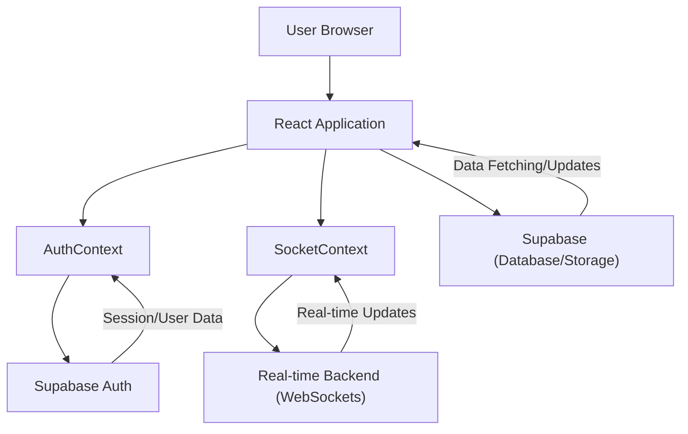

# State Management and Context

This section details how `PollMap` manages its application state, focusing on user authentication and real-time data synchronization. We leverage React Context to provide global access to these state pieces across the application.

## Authentication Context (`AuthContext.jsx`)

The `AuthContext` is responsible for managing user authentication state. It integrates with Supabase for handling user sign-up, sign-in (email/password and Google OAuth), and session management.

### Key Features:

*   **Session and User Management**: Tracks the current authenticated session and user object.
*   **Authentication Methods**: Provides functions for `signup`, `login`, `signInWithGoogle`, and `signOut`.
*   **Real-time Auth State**: Subscribes to Supabase's `onAuthStateChange` to keep the application state synchronized with authentication events.
*   **Loading State**: Indicates when authentication is being checked or processed.

```tsx
// client/src/context/AuthContext.jsx
import { createContext, useContext, useEffect, useState } from "react";
import { supabase } from "../supabaseClient";

const AuthContext = createContext();

export const AuthProvider = ({ children }) => {
  const [session, setSession] = useState(undefined);
  const [user, setUser] = useState(undefined);
  const [loading, setLoading] = useState(true);

  // ... (signup, login, signInWithGoogle functions)

  useEffect(() => {
    supabase.auth.getSession().then(({ data: { session } }) => {
      setSession(session);
      setUser(session?.user ?? null);
      setLoading(false);
    });

    const {
      data: { subscription },
    } = supabase.auth.onAuthStateChange((_event, session) => {
      setSession(session);
      setUser(session?.user ?? null);
      setLoading(false);
    });

    return () => subscription.unsubscribe();

  }, []);

  async function signOut() {
    const { error } = await supabase.auth.signOut();
    if (error) {
      console.error("Error signing out:", error);
    }
  }

  return (
    <AuthContext.Provider
      value={{ signup, login, signInWithGoogle, session, user, loading, signOut }}
    >
      {!loading && children}
    </AuthContext.Provider>
  );
};

export const UserAuth = () => {
  return useContext(AuthContext);
};
```

## Real-time Socket Context (`SocketContext.jsx`)

The `SocketContext` manages the connection to a real-time backend service (likely a WebSocket server) for features requiring live updates, such as poll status changes or new vote notifications.

### Key Features:

*   **Socket Connection**: Establishes and maintains a WebSocket connection to the server.
*   **Online Users**: Tracks users currently connected to the real-time service.
*   **Event Handling**: Listens for `connect` and `disconnect` events from the socket server.

```tsx
// client/src/context/SocketContext.jsx
import React, {createContext, useContext, useEffect, useState} from 'react';
import io from 'socket.io-client';

const SocketContext = createContext();

export const useSocketContext = () => {
    return useContext(SocketContext);
};

export const SocketContextProvider = ({children}) => {
    const [socket, setSocket] = useState(null);
    const [onlineUsers, setOnlineUsers] = useState([]);

    useEffect(() => {
        const socket = io("http://localhost:5001"); // Ensure this URL is correct for your backend
        setSocket(socket);

        socket.on("connect", () => {
            console.log("Connected to socket server with ID:", socket.id);
        });
        socket.on("disconnect", () => {
            console.log("Disconnected from socket server");
        });
        return () => socket.close();
    }, []);

    return (
        <SocketContext.Provider value={{ socket, onlineUsers }}>
            {children}
        </SocketContext.Provider>
    );
};
```

## Supabase Client (`supabaseClient.js`)

This file initializes the Supabase client, making it available for use throughout the application to interact with the Supabase backend.

```tsx
// client/src/supabaseClient.js
import {createClient} from '@supabase/supabase-js';

const supabaseUrl = import.meta.env.VITE_SUPABASE_URL;
const supabaseAnonKey = import.meta.env.VITE_SUPABASE_ANON_KEY;

export const supabase = createClient(supabaseUrl, supabaseAnonKey);
```

## Architecture Overview

The following diagram illustrates the basic flow of state management and interaction with external services.





## Key Takeaways

*   `AuthContext` centralizes user authentication, providing seamless integration with Supabase.
*   `SocketContext` enables real-time functionalities by managing WebSocket connections.
*   The Supabase client is configured and exported for direct backend interactions.
*   React Context is the primary mechanism for sharing authentication and real-time data states across the application components.