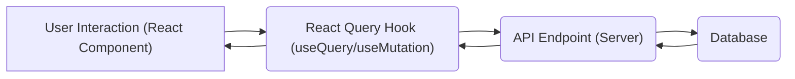

# Client-Side Architecture

This document details the client-side architecture of the PollMap application, focusing on the structure, key components, and technologies used in the frontend. The application is built using React, leveraging libraries like React Router, TanStack Query, and Socket.IO to provide a dynamic and interactive user experience.

## Overview

The frontend architecture is structured around a component-based approach, with clear separation of concerns. React components are used to build the user interface, while libraries like React Router manage navigation, TanStack Query handles data fetching and caching, and Socket.IO facilitates real-time communication.

### Key Components

*   **App.jsx:** The main application component that orchestrates routing, authentication, and global state management.
*   **pages/:** Directory containing page-level components, such as Login, Signup, Home, Dashboard, and Polls. Each page represents a distinct route in the application.
*   **components/:** Directory containing reusable UI components, such as Header, ProtectedRoute, and other custom components.
*   **context/:** Directory containing React Context providers, such as AuthContext and SocketContext, for managing authentication state and real-time communication, respectively.
*   **vite.config.js:** Configuration file for Vite, the build tool used for the project. It includes settings for plugins, aliases, and other build-related options.

### Technologies

| Technology         | Description                                                                        |
| :----------------- | :--------------------------------------------------------------------------------- |
| React              | A JavaScript library for building user interfaces.                               |
| React Router       | A standard library for routing in React applications.                            |
| TanStack Query     | A powerful data fetching and caching library for React.                           |
| Socket.IO          | A library that enables real-time, bidirectional communication between web clients and servers. |
| Tailwind CSS       | A utility-first CSS framework for rapidly styling HTML elements.                   |
| Vite               | A fast build tool and development server for modern web projects.                  |

## Core Structure: App.jsx

The `App.jsx` file serves as the entry point for the client-side application. It sets up the React Router, authentication context, and other global configurations.

```javascript
// File: client/src/App.jsx
import React, { useEffect, useState, useCallback } from 'react'
import { Routes, Route, BrowserRouter } from 'react-router-dom'
import { QueryClient, QueryClientProvider } from '@tanstack/react-query'
import { AuthProvider } from './context/AuthContext.jsx'
import Login from './pages/login.jsx'
import Signup from './pages/singup.jsx'
import Home from './pages/Home.jsx'
import Header from './components/Header/Header.jsx'
// ... other imports

function App() {
  const [mousePosition, setMousePosition] = useState({ x: 0, y: 0 })
  const client = new QueryClient()

  // ... mouse movement and particles logic

  return (
    <>
      <QueryClientProvider client={client}>
        <AuthProvider>
          <SocketContextProvider>
            <BrowserRouter>
              <Routes>
                {/* Define routes here */}
                <Route path="/" element={<Layout showHeader={true}><Home /></Layout>} />
                <Route path="/login" element={<Layout showHeader={false}><Login /></Layout>} />
                {/* ... other routes */}
              </Routes>
            </BrowserRouter>
          </SocketContextProvider>
        </AuthProvider>
      </QueryClientProvider>
    </>
  )
}

export default App
```

[View on GitHub](https://github.com/lande26/PollMap/blob/main/client/src/App.jsx)

This code snippet shows the basic structure of the `App` component, including the setup of React Router for navigation and the use of `QueryClientProvider` and `AuthProvider` to provide data fetching and authentication contexts to the application.

## Layout Component

The `Layout` component provides a consistent structure for each page, including the header and main content area. It accepts a `showHeader` prop to conditionally render the header.

```javascript
// Inside client/src/App.jsx
const Layout = ({ children, showHeader = true }) => {
  return (
    <div className="min-h-screen relative">
      {showHeader && <Header />}
      <div className={showHeader ? "pt-20" : ""}>
        {children}
      </div>
    </div>
  )
}
```

[View on GitHub](https://github.com/lande26/PollMap/blob/main/client/src/App.jsx)

The `Layout` component simplifies the structure of pages by abstracting the header and overall page layout. It uses conditional rendering to show or hide the header based on the `showHeader` prop.

## Vite Configuration

The `vite.config.js` file configures the Vite build tool, including plugins, aliases, and other build-related options.

```javascript
// File: client/vite.config.js
import { defineConfig } from 'vite'
import react from '@vitejs/plugin-react'
import tailwindcss from '@tailwindcss/vite'
import path from 'path'
export default defineConfig({
  plugins: [react(), tailwindcss()],
  resolve: {
    alias: {
      "@": path.resolve(__dirname, "./src"),
    },
  },
})
```

[View on GitHub](https://github.com/lande26/PollMap/blob/main/client/vite.config.js)

This configuration file sets up Vite to use the React and Tailwind CSS plugins, and defines an alias for the `@` symbol to point to the `src` directory. This simplifies importing modules within the application.

## Authentication Context

The `AuthContext` provides authentication state and functions to the application. It allows components to access the current user's authentication status and perform login/logout operations.

```javascript
// File: client/src/main.jsx
import { StrictMode } from 'react'
import { createRoot } from 'react-dom/client'
import './index.css'
import { AuthProvider } from './context/AuthContext.jsx'
import App from './App.jsx'

createRoot(document.getElementById('root')).render(
  <StrictMode>
       <AuthProvider> 
    <App />
       </AuthProvider>
  </StrictMode>,
)
```

[View on GitHub](https://github.com/lande26/PollMap/blob/main/client/src/main.jsx)

The `AuthContext` is wrapped around the `App` component in `main.jsx`, making the authentication state available to all components in the application.

## React Query Setup

React Query is initialized and used to manage server state.  It simplifies data fetching, caching, and updating.

```javascript
// Inside client/src/App.jsx
import { QueryClient, QueryClientProvider } from '@tanstack/react-query'

function App() {
  const client = new QueryClient()

  return (
    <QueryClientProvider client={client}>
       {/* Rest of the app */}
    </QueryClientProvider>
  )
}
```

[View on GitHub](https://github.com/lande26/PollMap/blob/main/client/src/App.jsx)

This snippet shows how `QueryClientProvider` is used to provide the React Query client to the entire application.  This allows components to use hooks like `useQuery` and `useMutation` for data fetching and manipulation.

## Client-Side Routing

React Router is used to handle navigation between different pages in the application. The `Routes` and `Route` components are used to define the routes and their corresponding components.

```javascript
// Inside client/src/App.jsx
import { Routes, Route, BrowserRouter } from 'react-router-dom'
import Home from './pages/Home.jsx'
import Login from './pages/login.jsx'
import Signup from './pages/singup.jsx'

function App() {
  return (
    <BrowserRouter>
      <Routes>
        <Route path="/" element={<Home />} />
        <Route path="/login" element={<Login />} />
        <Route path="/signup" element={<Signup />} />
        {/* ... other routes */}
      </Routes>
    </BrowserRouter>
  )
}
```

[View on GitHub](https://github.com/lande26/PollMap/blob/main/client/src/App.jsx)

This code snippet demonstrates how React Router is used to define the routes for the application. The `BrowserRouter` component enables client-side routing, and the `Routes` and `Route` components define the mapping between URLs and components.

## Visual Effects

The frontend incorporates a particle effect for visual appeal. The `react-tsparticles` library is used to create and manage the particle background.

```javascript
// Inside client/src/App.jsx
import Particles from "react-tsparticles"
import { loadSlim } from "tsparticles-slim"

function App() {
    const particlesInit = useCallback(async engine => {
        await loadSlim(engine)
      }, [])
    
      const particlesLoaded = useCallback(async container => {
        await console.log(container)
      }, [])
  
  return (
    <>
        <Particles
            id="tsparticles"
            init={particlesInit}
            loaded={particlesLoaded}
            options={{
                // Particle options here
            }}
            style={{
              position: 'absolute',
              top: 0,
              left: 0,
              width: '100%',
              height: '100%',
              zIndex: 1
            }}
          />
        {/* Rest of the app */}
    </>
  )
}
```

[View on GitHub](https://github.com/lande26/PollMap/blob/main/client/src/App.jsx)

This snippet integrates the `react-tsparticles` library to create a visually appealing particle background effect. The `particlesInit` and `particlesLoaded` callbacks are used to initialize and handle the particle container.

## Key Integration Points

The frontend architecture is designed to be modular and extensible. The use of React components, React Router, TanStack Query, and Socket.IO allows for a clean separation of concerns and easy integration of new features.

### Data Flow

Data fetching and caching are handled by TanStack Query. Components use the `useQuery` hook to fetch data from the server and automatically cache the results. Mutations, such as creating or updating polls, are handled by the `useMutation` hook.

### Real-time Communication

Socket.IO is used to enable real-time communication between the client and server. The `SocketContext` provides a socket instance to the application, allowing components to send and receive events in real-time.





### Best Practices

*   **Component-Based Architecture:** Building the UI using reusable React components promotes maintainability and scalability.
*   **Centralized State Management:** Using React Context for authentication and Socket.IO connections simplifies state management and ensures that components have access to the necessary data.
*   **Data Fetching and Caching:** Using TanStack Query simplifies data fetching and caching, improving performance and reducing the amount of boilerplate code.
*   **Asynchronous Operations:** Properly handle asynchronous operations, especially when interacting with APIs or external services. Use Promises and async/await to avoid blocking the main thread.