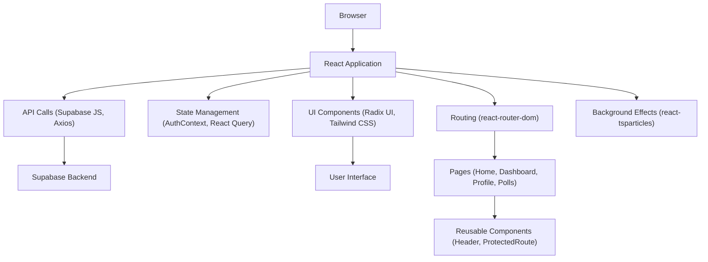

# Frontend Architecture

This document outlines the frontend architecture of the PollMap application, detailing its structure, key components, and technological choices. The client-side application is built using React and leverages Vite for development and building.

## Project Setup and Dependencies

The project is managed with npm and uses Vite as its build tool. The `package.json` file lists all project dependencies, including React, routing libraries, state management tools, UI component libraries, and various utility packages.

```json
{
  "name": "client",
  "private": true,
  "version": "0.0.0",
  "type": "module",
  "scripts": {
    "dev": "vite",
    "build": "vite build",
    "lint": "eslint .",
    "preview": "vite preview"
  },
  "dependencies": {
    "@google/genai": "^1.21.0",
    "@google/generative-ai": "^0.24.1",
    "@nivo/bar": "^0.99.0",
    "@nivo/core": "^0.99.0",
    "@nivo/line": "^0.99.0",
    "@nivo/pie": "^0.99.0",
    "@nivo/radar": "^0.99.0",
    "@nivo/sunburst": "^0.99.0",
    "@radix-ui/react-avatar": "^1.1.10",
    "@radix-ui/react-dialog": "^1.1.15",
    "@radix-ui/react-dropdown-menu": "^2.1.16",
    "@radix-ui/react-label": "^2.1.7",
    "@radix-ui/react-progress": "^1.1.7",
    "@radix-ui/react-radio-group": "^1.3.8",
    "@radix-ui/react-select": "^2.2.6",
    "@radix-ui/react-separator": "^1.1.7",
    "@radix-ui/react-slot": "^1.2.3",
    "@radix-ui/react-switch": "^1.2.6",
    "@radix-ui/react-tabs": "^1.1.13",
    "@radix-ui/react-tooltip": "^1.2.8",
    "@supabase/auth-ui-react": "^0.4.7",
    "@supabase/auth-ui-shared": "^0.1.8",
    "@supabase/supabase-js": "^2.55.0",
    "@tailwindcss/vite": "^4.1.12",
    "@tanstack/react-query": "^5.85.5",
    "@upstash/redis": "^1.35.6",
    "axios": "^1.13.2",
    "class-variance-authority": "^0.7.1",
    "clsx": "^2.1.1",
    "framer-motion": "^12.23.24",
    "gsap": "^3.13.0",
    "html2canvas": "^1.4.1",
    "jspdf": "^3.0.3",
    "lucide-react": "^0.542.0",
    "react": "^19.1.1",
    "react-dom": "^19.1.1",
    "react-hot-toast": "^2.6.0",
    "react-router-dom": "^7.8.1",
    "react-toastify": "^11.0.5",
    "react-tsparticles": "^2.12.2",
    "recharts": "^3.1.2",
    "socket.io-client": "^4.8.1",
    "sonner": "^2.0.7",
    "tailwind-merge": "^3.3.1",
    "tsparticles": "^3.9.1",
    "tsparticles-slim": "^2.12.0"
  },
  "devDependencies": {
    "@eslint/js": "^9.33.0",
    "@types/react": "^19.1.10",
    "@types/react-dom": "^19.1.7",
    "@vitejs/plugin-react": "^5.0.0",
    "autoprefixer": "^10.4.21",
    "eslint": "^9.33.0",
    "eslint-plugin-react-hooks": "^5.2.0",
    "eslint-plugin-react-refresh": "^0.4.20",
    "globals": "^16.3.0",
    "postcss": "^8.5.6",
    "tailwindcss": "^4.1.12",
    "tw-animate-css": "^1.4.0",
    "vite": "^7.1.2"
  }
}
```

The build process is configured using `vite.config.js`, which sets up the React plugin and Tailwind CSS integration. An alias for `@` is defined to simplify module imports from the `src` directory.

```js
import { defineConfig } from 'vite'
import react from '@vitejs/plugin-react'
import tailwindcss from '@tailwindcss/vite'
import path from 'path'
export default defineConfig({
  plugins: [react(), tailwindcss()],
  resolve: {
    alias: {
      "@": path.resolve(__dirname, "./src"),
    },
  },
})
```

## Application Entry Point and Routing

The `main.jsx` file serves as the application's entry point. It initializes React's StrictMode and renders the main `App` component. The `AuthProvider` is wrapped around the `App` component to ensure authentication context is available throughout the application.

```jsx
import { StrictMode } from 'react'
import { createRoot } from 'react-dom/client'
import './index.css'
import { AuthProvider } from './context/AuthContext.jsx'
import App from './App.jsx'

createRoot(document.getElementById('root')).render(
  <StrictMode>
       <AuthProvider>
    <App />
       </AuthProvider>
  </StrictMode>,
)
```

The `App.jsx` file orchestrates the application's routing using `react-router-dom`. It sets up a `BrowserRouter` to enable client-side routing and defines `Routes` for different application pages. Protected routes are implemented using a `ProtectedRoute` component, ensuring that users must be authenticated to access certain sections of the application.

The application also features a dynamic background with particles, controlled by `react-tsparticles`, adding a visually engaging element. Mouse movement is tracked to influence particle behavior, creating an interactive backdrop.

```jsx
import React, { useEffect, useState, useCallback } from 'react'
import { Routes, Route, BrowserRouter } from 'react-router-dom'
import { QueryClient, QueryClientProvider } from '@tanstack/react-query'
import { AuthProvider } from './context/AuthContext.jsx'
import Login from './pages/login.jsx'
import Signup from './pages/Signup.jsx'
import Home from './pages/Home.jsx'
import Header from './components/Header/Header.jsx'
import Dashboard from './pages/Dashboard.jsx'
import Profile from './pages/Profile.jsx'
import ProtectedRoute from './components/ProtectedRoute/ProtectedRoute.jsx'
import Particles from "react-tsparticles"
import { loadSlim } from "tsparticles-slim"
import './animations.css'
import './app.css'
import './index.css'
import Polls from './pages/polls.jsx'
import { SocketContextProvider } from './context/SocketContext.jsx'
import CreatePoll from './pages/CreatePolll.jsx'
import PollPage from './pages/PollPage.jsx'
import PollAnalytics from './pages/PollAnalytics.jsx'
import PasswordProtectedPoll from './components/ProtectedRoute/PasswordProtectedPoll.jsx'

// ... (rest of App.jsx)

return (
    <>
      <QueryClientProvider client={client}>
        <AuthProvider>
          <SocketContextProvider>
            {/* Particles background - absolute positioning */}
            <Particles
              id="tsparticles"
              init={particlesInit}
              loaded={particlesLoaded}
              options={{
                // ... particle configurations
              }}
              style={{
                position: 'absolute',
                top: 0,
                left: 0,
                width: '100%',
                height: '100%',
                zIndex: 1
              }}
            />
            <BrowserRouter>
              <Routes>
                <Route path="/" element={
                  <Layout showHeader={true}>
                    <Home />
                  </Layout>
                } />
                {/* ... other routes */}
              </Routes>
            </BrowserRouter>
          </SocketContextProvider>
        </AuthProvider>
      </QueryClientProvider>
    </>
  )
```

## Component Structure and State Management

The frontend employs a component-based architecture, with `App.jsx` acting as the root component that renders other pages and shared components like `Header`. State management is handled through React's built-in mechanisms and augmented by libraries like `@tanstack/react-query` for server state management and `AuthContext` for user authentication state.

The `Layout` component provides a consistent structure for pages, optionally including a `Header`. This promotes reusability and maintains a cohesive user interface across the application.

## Key Technologies and Libraries

*   **React**: The core library for building the user interface.
*   **Vite**: A fast build tool for development and production builds.
*   **React Router DOM**: For handling client-side navigation and routing.
*   **@tanstack/react-query**: For efficient data fetching, caching, and state synchronization with the server.
*   **@supabase/supabase-js**: For interacting with the Supabase backend, including authentication and database operations.
*   **tailwindcss**: For rapid UI development with a utility-first CSS framework.
*   **@radix-ui/react-***: A collection of unstyled, accessible UI components for React.
*   **react-tsparticles**: For creating dynamic particle backgrounds.

## Architecture Diagram





## Key Takeaways

The PollMap frontend is designed for modularity and scalability. It leverages modern React practices and a robust set of libraries to deliver a dynamic and responsive user experience. The separation of concerns through components, context, and routing makes the codebase maintainable and extensible. The use of `@tanstack/react-query` ensures efficient data handling, while `AuthContext` and `ProtectedRoute` enforce security. The visual appeal is enhanced with interactive particle backgrounds.