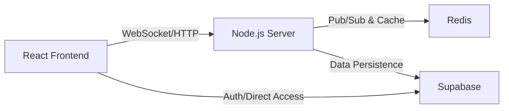
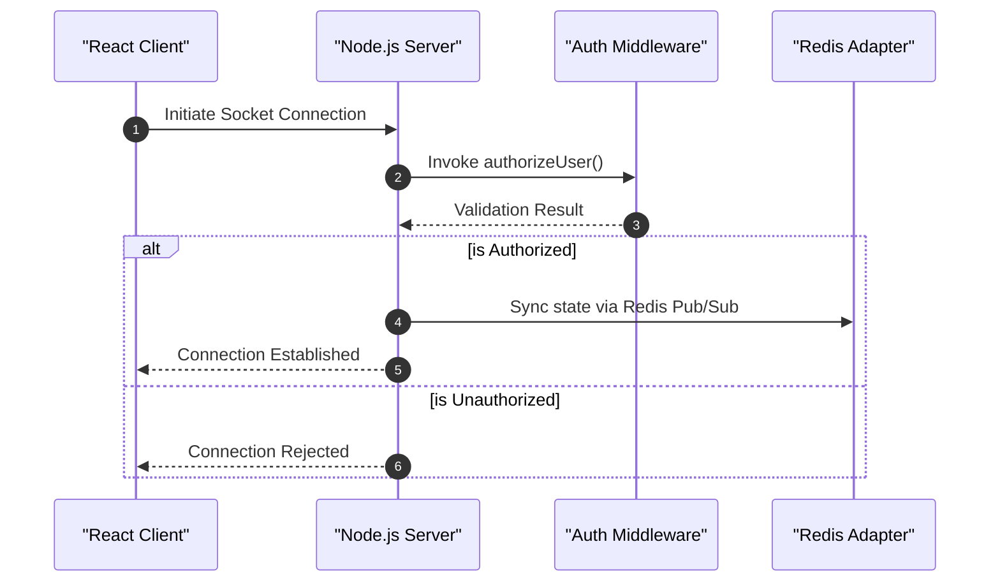

# System Architecture

The PollMap system is designed as a real-time, distributed application that enables interactive polling. It leverages a decoupled architecture consisting of a React-based frontend, a Node.js socket server for real-time orchestration, and a combination of Redis and Supabase for state management and persistence.

## High-Level Overview

The architecture follows a client-server-database pattern with an added caching and pub/sub layer to ensure low-latency updates across multiple server instances.



## Component Breakdown

### 1. Frontend (Client)
The frontend is a React application that serves as the primary user interface. It is wrapped in several provider layers to manage global state and security:
- **`AuthProvider`**: Manages user sessions and authentication state.
- **`AuthModalProvider`**: Handles the UI state for authentication modals.
- **`ErrorBoundary`**: Ensures application stability by catching runtime errors in the component tree.

### 2. Backend (Server)
The server acts as the real-time middleware, utilizing **Express** for standard HTTP requests and **Socket.io** for bidirectional communication.

#### Key Server Responsibilities:
- **Real-time Orchestration**: Using `handlePollSocket` and `handleRoomSocket` to manage live interactions.
- **Security**: Implementing `authorizeUser` middleware to validate socket connections.
- **Cache Management**: Providing endpoints to invalidate poll data via the `cacheService`.

#### API Endpoints
| Endpoint | Method | Description |
| :--- | :--- | :--- |
| `/` | GET | Welcome message and server availability check. |
| `/health` | GET | Health check endpoint returning status and timestamp. |
| `/cache/polls/:pollId` | DELETE | Triggers `cacheService.invalidatePollCache` for a specific poll. |

### 3. State and Persistence Layer
The system employs a dual-layer approach to data management:

- **Redis**: Used as a Socket.io adapter (`@socket.io/redis-adapter`) to allow the server to scale horizontally. It handles Pub/Sub events and temporary caching to reduce database load.
- **Supabase**: Serves as the primary PostgreSQL database and authentication provider, managing long-term storage for rooms and poll data.

## Communication Flow

The following sequence illustrates the connection and authentication handshake when a client connects to the real-time server.



## Infrastructure Configuration

The application is containerized using Docker to ensure environment consistency across development and production.

### Service Mapping
| Service | Image/Build | Port (Internal $\rightarrow$ External) | Primary Dependency |
| :--- | :--- | :--- | :--- |
| `redis` | `redis:alpine` | `6379` $\rightarrow$ `6379` | None |
| `server` | `./server` | `5001` $\rightarrow$ `5050` | `redis` |
| `client` | `./client` | `80` $\rightarrow$ `8080` | `server` |

### Critical Environment Configuration
The server utilizes specific environment variables to coordinate with the infrastructure:
```javascript
// Extracted from server/server.js
const pubClient = createClient({ 
  url: process.env.REDIS_URL || 'redis://localhost:6379' 
});

const allowedOrigins = [
  "http://localhost:5173",
  "https://poll-map.vercel.app",
  process.env.CLIENT_URL
];