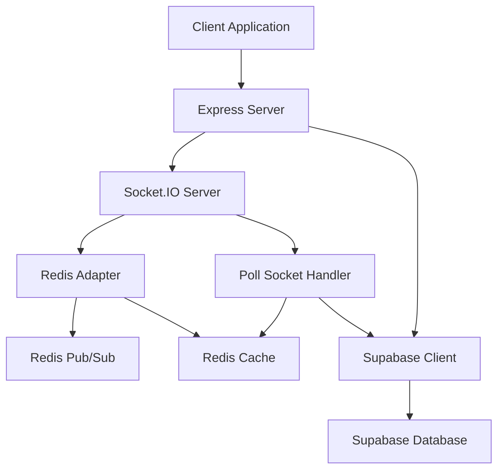

# Backend Implementation

This section details the server-side architecture and implementation of the PollMap application, focusing on its core functionalities, technologies used, and integration points.

## Server Setup and Core Technologies

The backend is built using Node.js with Express for handling HTTP requests. Socket.IO is integrated for real-time communication, enabling live updates for poll results. Redis is employed as a message broker and for caching to enhance performance and scalability. Supabase serves as the database solution, providing a robust backend-as-a-service.

The `server/package.json` file outlines the project's dependencies:

```json
{
  "name": "server",
  "version": "1.0.0",
  "main": "server.js",
  "scripts": {
    "dev": "nodemon server.js"
  },
  "dependencies": {
    "@socket.io/redis-adapter": "^8.3.0",
    "@supabase/supabase-js": "^2.57.0",
    "cors": "^2.8.5",
    "dotenv": "^17.2.1",
    "express": "^5.1.0",
    "redis": "^5.8.2",
    "socket.io": "^4.8.1"
  },
  "devDependencies": {
    "nodemon": "^3.1.10"
  }
}
```

The `server/server.js` file orchestrates the server's setup:

```javascript
import express from 'express';
import dotenv from 'dotenv';
import cors from 'cors';
import { createServer } from 'http';
import { Server } from 'socket.io';
import {createClient} from 'redis';
import {createAdapter} from '@socket.io/redis-adapter';
import { supabase } from './supabaseClient.js';
import { handlePollSocket, cacheService } from './socket/poll.socket.js';
dotenv.config();

const app = express();
const server = createServer(app);

const pubClient = createClient({url: process.env.REDIS_URL || 'redis://localhost:6379'});
const subClient = pubClient.duplicate();

const io = new Server(server, {
  cors:{
    origin : "http://localhost:5173",
  }
});

Promise.all([pubClient.connect(), subClient.connect()]).then(() => {
  io.adapter(createAdapter(pubClient, subClient));
  console.log('Redis adapter connected');

  cacheService.setClient(pubClient);
});

handlePollSocket(io);

app.use(cors({origin: 'http://localhost:5173'}));
app.use(express.json());

app.get('/', (req, res) => {
  res.send('Welcome to PollMap Server!');
});

app.delete('/cache/polls/:pollId', async (req, res) => {
  try {
    await cacheService.invalidatePollCache(req.params.pollId);
    res.json({ message: 'Cache cleared successfully' });
  } catch (error) {
    res.status(500).json({ error: 'Failed to clear cache' });
  }
});

const PORT = process.env.PORT || 5001;
server.listen(PORT, () => {
  console.log(`Server is running on http://localhost:${PORT}`);
});
```

## Database Integration (Supabase)

Supabase is initialized and used for data persistence. The `server/supabaseClient.js` file configures the Supabase client with environment variables for the URL and service role key.

```javascript
import { createClient } from "@supabase/supabase-js";
import dotenv from "dotenv";
dotenv.config();

const supabase = createClient(
  process.env.SUPABASE_URL,
  process.env.SUPABASE_SERVICE_ROLE_KEY
);
console.log("Supabase client created");
export { supabase };
```

## Real-time Communication and Caching

The application leverages Socket.IO with a Redis adapter for distributed real-time messaging. This allows multiple server instances to communicate with each other, ensuring that all connected clients receive updates regardless of which server instance handles their request. A `cacheService` is implemented, likely utilizing Redis, to store and invalidate poll data, reducing database load and improving response times.

The `server.js` file demonstrates the setup of the Socket.IO server and the Redis adapter:

```javascript
const pubClient = createClient({url: process.env.REDIS_URL || 'redis://localhost:6379'});
const subClient = pubClient.duplicate();

const io = new Server(server, {
  cors:{
    origin : "http://localhost:5173",
  }
});

Promise.all([pubClient.connect(), subClient.connect()]).then(() => {
  io.adapter(createAdapter(pubClient, subClient));
  console.log('Redis adapter connected');

  cacheService.setClient(pubClient);
});
```

An endpoint is provided for cache invalidation:

```javascript
app.delete('/cache/polls/:pollId', async (req, res) => {
  try {
    await cacheService.invalidatePollCache(req.params.pollId);
    res.json({ message: 'Cache cleared successfully' });
  } catch (error) {
    res.status(500).json({ error: 'Failed to clear cache' });
  }
});
```

## Architecture Diagram





## Key Takeaways

-   **Scalability**: The use of Socket.IO with a Redis adapter enables horizontal scaling of the backend.
-   **Performance**: Redis caching significantly improves the responsiveness of poll data retrieval.
-   **Real-time Updates**: Socket.IO ensures immediate feedback to clients on poll changes.
-   **Modern Stack**: Node.js, Express, Socket.IO, and Supabase provide a robust and modern foundation for the backend.