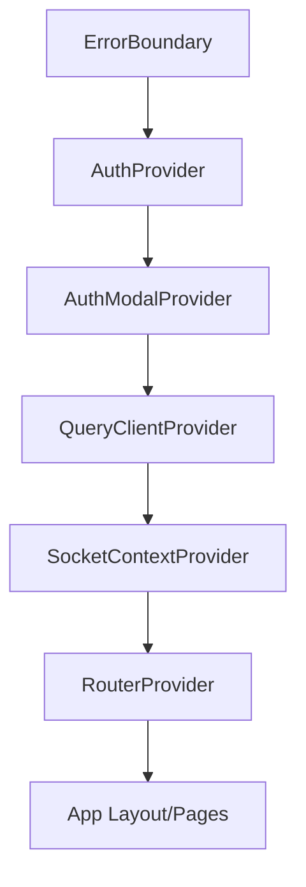
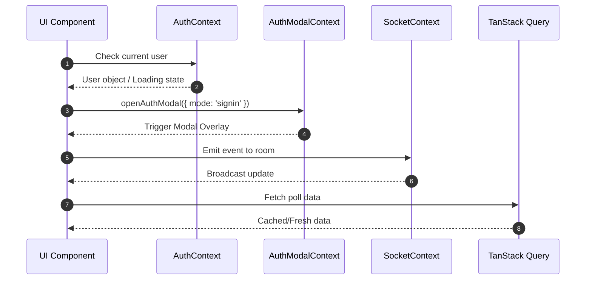

# Frontend Architecture

The PollMap frontend is a modern React application built with Vite, utilizing a modular provider-based architecture to handle authentication, real-time communication, and global state.

## Application Structure

The application follows a deeply nested provider pattern to ensure that essential services (authentication, sockets, and data fetching) are available throughout the entire component tree.

### Provider Hierarchy

The initialization sequence starts in `main.jsx` and extends into `App.jsx`. The hierarchy is structured as follows:



1.  **`ErrorBoundary`**: The outermost wrapper to catch and handle JavaScript errors in the child component tree.
2.  **`AuthProvider` & `AuthModalProvider`**: Manage user session state and the visibility/mode of the authentication modal.
3.  **`QueryClientProvider`**: Integrates TanStack Query for server-state management and caching.
4.  **`SocketContextProvider`**: Provides the Socket.io instance for real-time events across the application.
5.  **`RouterProvider`**: The final layer that injects the routing configuration.

## Routing Strategy

PollMap uses `react-router-dom` with a centralized configuration in `router.jsx`. The strategy emphasizes performance and security through lazy loading and route guards.

### Route Optimization
To reduce the initial bundle size, all page components are loaded lazily using `React.lazy()`. A higher-order function `withSuspense` is used to wrap these components, providing a consistent `RouteFallback` loading UI.

```javascript
const withSuspense = (node) => (
  <React.Suspense fallback={<RouteFallback />}>
    {node}
  </React.Suspense>
);
```

### Access Control and Layouts
The application employs two primary mechanisms for route handling:
- **`ProtectedRoute`**: A wrapper that restricts access to authenticated users.
- **`AuthRouteHandler`**: A specialized handler for `/login` and `/signup` that checks if a user is already authenticated (redirecting them to `/dashboard`) or triggers the authentication modal.
- **`Layout` Component**: A wrapper that conditionally renders the `Header` and `Footer` to maintain a consistent UI across pages.

### Route Map

| Path | Component/Handler | Access | Description |
| :--- | :--- | :--- | :--- |
| `/` | `Home` | Public | Landing page |
| `/login` | `AuthRouteHandler` | Public | Login trigger |
| `/signup` | `AuthRouteHandler` | Public | Signup trigger |
| `/dashboard` | `Dashboard` | Protected | User overview |
| `/profile` | `Profile` | Protected | User settings |
| `/polls` | `Polls` | Protected | Polls listing |
| `/create-poll` | `CreatePoll` | Protected | Poll creation interface |
| `/polls/:pollId` | `PollPage` | Protected | Active poll view |
| `/polls/:pollId/analytics`| `PollAnalytics` | Protected | Poll result analysis |
| `/rooms` | `RoomsPage` | Protected | Room management |
| `/rooms/:roomCode` | `RoomPage` | Protected | Specific room view |
| `/rooms/join/:token` | `JoinRoomByLink` | Protected | Token-based room entry |

## Global State Management

State is distributed across several specialized contexts to prevent "prop drilling" and maintain a separation of concerns.

### Contextual State Breakdown



- **`AuthContext`**: Tracks the current user session and authentication status.
- **`AuthModalContext`**: Controls the state of the global authentication modal (open/closed, sign-in vs sign-up).
- **`SocketContext`**: Manages the persistent WebSocket connection for real-time updates.
- **TanStack Query**: Handles asynchronous server state, caching, and synchronization.

## Build Configuration

The project uses **Vite** for fast bundling and **Tailwind CSS** for styling. A key configuration detail is the use of path aliasing to simplify imports.

**`vite.config.js` configuration:**
```javascript
resolve: {
  alias: {
    "@": path.resolve(__dirname, "./src"),
  },
},
```
This allows developers to use `@/components/...` instead of relative paths (e.g., `../../../components/...`), improving maintainability as the directory structure grows.