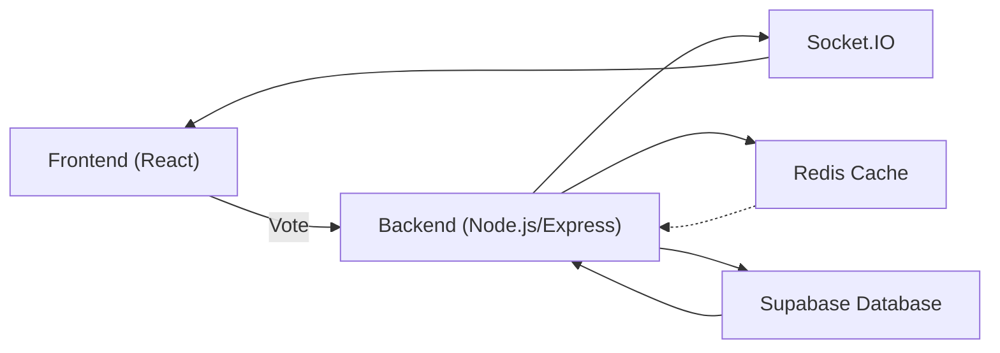

# Server-Side Architecture

The backend of PollMap is built using Node.js with Express, utilizing Socket.IO for real-time communication, Redis for caching, and Supabase for database management. This architecture allows for efficient handling of poll data, real-time updates, and scalability.

## Key Components

*   **Express.js:** Handles API routes and middleware.
*   **Socket.IO:** Enables real-time communication between the server and clients.
*   **Redis:** Provides caching to reduce database load and improve response times.
*   **Supabase:** Acts as the primary database, storing poll data, options, and votes.

## Server Configuration

The `server/package.json` file defines the project's dependencies and scripts.

```json title="server/package.json"
{
  "name": "server",
  "version": "1.0.0",
  "main": "server.js",
  "scripts": {
    "dev": "nodemon server.js"
  },
  "keywords": [],
  "author": "",
  "type": "module",
  "license": "ISC",
  "description": "",
  "dependencies": {
    "@socket.io/redis-adapter": "^8.3.0",
    "@supabase/supabase-js": "^2.57.0",
    "cors": "^2.8.5",
    "dotenv": "^17.2.1",
    "express": "^5.1.0",
    "redis": "^5.8.2",
    "socket.io": "^4.8.1"
  },
  "devDependencies": {
    "nodemon": "^3.1.10"
  }
}
```

[View on GitHub](https://github.com/lande26/PollMap/blob/main/server/package.json)

This file specifies the necessary packages for the server, including Express, Socket.IO, Redis, Supabase, and other utilities. The `dev` script uses `nodemon` to automatically restart the server on file changes, improving the development workflow.

## Server Initialization

The `server/server.js` file initializes the Express server, sets up Socket.IO with Redis adapter, and defines API endpoints.

```javascript title="server/server.js"
import express from 'express';
import dotenv from 'dotenv';
import cors from 'cors';
import { createServer } from 'http';
import { Server } from 'socket.io';
import {createClient} from 'redis';
import {createAdapter} from '@socket.io/redis-adapter';
import { supabase } from './supabaseClient.js';
import { handlePollSocket, cacheService } from './socket/poll.socket.js';
dotenv.config();

const app = express();
const server = createServer(app);


const pubClient = createClient({url: process.env.REDIS_URL || 'redis://localhost:6379'});
const subClient = pubClient.duplicate();

const io = new Server(server, {
  cors:{
    origin : "http://localhost:5173",
    // credentials : true,
  }
});

Promise.all([pubClient.connect(), subClient.connect()]).then(() => {
  io.adapter(createAdapter(pubClient, subClient));
  console.log('Redis adapter connected');

  cacheService.setClient(pubClient);
});

handlePollSocket(io);

app.use(cors({origin: 'http://localhost:5173'}));
app.use(express.json());

app.get('/', (req, res) => {
  res.send('Welcome to PollMap Server!');
});

app.delete('/cache/polls/:pollId', async (req, res) => {
  try {
    await cacheService.invalidatePollCache(req.params.pollId);
    res.json({ message: 'Cache cleared successfully' });
  } catch (error) {
    res.status(500).json({ error: 'Failed to clear cache' });
  }
});

const PORT = process.env.PORT || 5001;
server.listen(PORT, () => {
  console.log(`Server is running on http://localhost:${PORT}`);
});
```

[View on GitHub](https://github.com/lande26/PollMap/blob/main/server/server.js)

This code snippet showcases the server's initialization process, including setting up Express, configuring CORS, connecting to Redis for Socket.IO adapter, and defining a simple API endpoint.  It also initializes the `cacheService` with the Redis client.

## Socket.IO Configuration

The `server/socket/poll.socket.js` file handles Socket.IO events for real-time poll updates.

```javascript title="server/socket/poll.socket.js"
import { supabase } from '../supabaseClient.js';

// Redis cache functions
const createCacheClient = () => {
  // This will be set from server.js
  let redisClient = null;
  
  return {
    setClient: (client) => {
      redisClient = client;
    },
    
    cachePoll: async (pollId, data, expiry = 300) => {
      if (!redisClient) return;
      try {
        await redisClient.setEx(`poll:${pollId}`, expiry, JSON.stringify(data));
        console.log(`Cached poll: ${pollId}`);
      } catch (error) {
        console.error('Redis cache set error:', error);
      }
    },
    
    getCachedPoll: async (pollId) => {
      if (!redisClient) return null;
      try {
        const cached = await redisClient.get(`poll:${pollId}`);
        return cached ? JSON.parse(cached) : null;
      } catch (error) {
        console.error('Redis cache get error:', error);
        return null;
      }
    },
    
    invalidatePollCache: async (pollId) => {
      if (!redisClient) return;
      try {
        await redisClient.del(`poll:${pollId}`);
        console.log(`Invalidated cache for poll: ${pollId}`);
      } catch (error) {
        console.error('Redis cache delete error:', error);
      }
    },
    
    cachePollsList: async (key, data, expiry = 60) => {
      if (!redisClient) return;
      try {
        await redisClient.setEx(`polls:${key}`, expiry, JSON.stringify(data));
      } catch (error) {
        console.error('Redis cache set error:', error);
      }
    },
    
    getCachedPollsList: async (key) => {
      if (!redisClient) return null;
      try {
        const cached = await redisClient.get(`polls:${key}`);
        return cached ? JSON.parse(cached) : null;
      } catch (error) {
        console.error('Redis cache get error:', error);
        return null;
      }
    }
  };
};

export const cacheService = createCacheClient();

export const handlePollSocket = (io) => {
  io.on("connection", (socket) => {
    console.log(`a user connected ${socket.id}`);
    
    // Get single poll with cache
    const handleGetPoll = async (pollId, callback) => {
      try {
        // Try cache first
        const cachedPoll = await cacheService.getCachedPoll(pollId);
        if (cachedPoll) {
          callback({ data: cachedPoll });
          console.log(`Served poll ${pollId} from cache`);
          return;
        }

        // If not cached, fetch from database
        const pollData = await getPollDataService(pollId);
        
        // Cache the result
        await cacheService.cachePoll(pollId, pollData);

        callback({ data: pollData });
        console.log(`Fetched and cached poll: ${pollId}`);
      } catch (error) {
        console.error('Error fetching poll:', error);
        callback({ error: 'Failed to fetch poll' });
      }
    };

    // Get polls list with cache
    const handleGetPolls = async ({ page = 1, limit = 12 }, callback) => {
      try {
        const cacheKey = `page_${page}_limit_${limit}`;
        
        // Try cache first
        const cachedPolls = await cacheService.getCachedPollsList(cacheKey);
        if (cachedPolls) {
          callback(cachedPolls);
          console.log(`Served polls page ${page} from cache`);
          return;
        }

        // If not cached, fetch from database
        const from = (page - 1) * limit;
        const to = from + limit - 1;

        const { data: polls, error, count } = await supabase
          .from('polls')
          .select(`
            *,
            options(*),
            profiles(username, avatar_url)
          `, { count: 'exact' })
          .order('created_at', { ascending: false })
          .range(from, to);

        if (error) throw error;

        // Process polls data
        const processedPolls = await Promise.all(
          polls.map(async (poll) => {
            const { count: participantCount } = await supabase
              .from('votes')
              .select('user_id', { count: 'exact', head: true })
              .eq('poll_id', poll.id);

            const totalVotes = poll.options.reduce((sum, option) => sum + option.votes_count, 0);
            const engagementRate = participantCount > 0 ? Math.round((totalVotes / participantCount) * 100) : 0;

            return {
              ...poll,
              totalVotes,
              participantCount: participantCount || 0,
              engagementRate
            };
          })
        );

        const result = {
          polls: processedPolls,
          hasMore: polls.length === limit,
          totalCount: count
        };

        // Cache the result
        await cacheService.cachePollsList(cacheKey, result);

        callback(result);
        console.log(`Fetched and cached polls page: ${page}`);
      } catch (error) {
        console.error('Error fetching polls:', error);
        callback({ error: 'Failed to fetch polls' });
      }
    };
    
    // Joining a poll room
    const handleJoinPoll = (pollId) => {
      if (!pollId) {
        socket.emit("pollError", { message: "Poll ID is required" });
        return;
      }
      socket.join(pollId);
      console.log(`User ${socket.id} joined poll room: ${pollId}`);
      socket.emit("joinedPoll", { pollId });
    };
    
    // Voting in a poll with cache invalidation
    const handleVote = async (data) => {
      console.log("Vote received:", data);
      
      if (!data || !data.pollId || !data.optionId) {
        socket.emit("pollError", { message: "Invalid vote data" });
        return;
      }
      
      try {
        // Check if user has already voted (only if userId is provided)
        if (data.userId) {
          const { data: existingVote, error: checkError } = await supabase
            .from('votes')
            .select('*')
            .eq('poll_id', data.pollId)
            .eq('user_id', data.userId);
            
          if (checkError) throw checkError;
          
          if (existingVote && existingVote.length > 0) {
            socket.emit("pollError", { message: "You have already voted in this poll" });
            return;
          }
        }
        
        // Record the vote in the database
        const { data: vote, error: voteError } = await supabase
          .from('votes')
          .insert([{
            poll_id: data.pollId,
            option_id: data.optionId,
            user_id: data.userId || null
          }]);
          
        if (voteError) throw voteError;
        
        console.log("Vote recorded successfully");
        
        // Update the vote count for the option
        console.log("Updating vote count for option:", data.optionId);
        const { error: updateError } = await supabase.rpc('increment_vote', {
          option_id: data.optionId
        });
        
        if (updateError) throw updateError;
        
        console.log("Vote count updated successfully");
        
        // Invalidate cache for this poll
        await cacheService.invalidatePollCache(data.pollId);
        
        // Get updated poll data
        console.log("Fetching updated poll data for poll:", data.pollId);
        const pollData = await getPollDataService(data.pollId);
        console.log("Updated poll data:", pollData);
        
        // Re-cache the updated poll
        await cacheService.cachePoll(data.pollId, pollData);
        
        // Broadcast updated results to all clients in the poll room
        io.to(data.pollId).emit("pollDataUpdated", { data: pollData });
        console.log("Poll data updated and broadcasted");
        
      } catch (error) {
        console.error("Error processing vote:", error);
        socket.emit("pollError", { message: "Failed to process vote" });
      }
    };
    
    // Disconnecting
    const handleDisconnect = () => {
      console.log(`User disconnected: ${socket.id}`);
    };
    
    // Register event handlers
    socket.on("getPoll", handleGetPoll);
    socket.on("getPolls", handleGetPolls);
    socket.on("joinPoll", handleJoinPoll);
    socket.on("vote", handleVote);
    socket.on("disconnect", handleDisconnect);
  });
};

// Helper function to get poll data with options and vote counts
async function getPollDataService(pollId) {
  try {
    console.log("Querying Supabase for poll with ID:", pollId);
    
    // Get poll with options and profiles
    const { data: poll, error: pollError } = await supabase
      .from('polls')
      .select(`
        *,
        options(*),
        profiles(username, avatar_url)
      `)
      .eq('id', pollId)
      .single();
      
    if (pollError) {
      console.error("Supabase error fetching poll:", pollError);
      throw pollError;
    }
    
    console.log("Poll data from Supabase:", poll);
    
    // Calculate total votes
    const totalVotes = poll.options.reduce((sum, option) => sum + option.votes_count, 0);
    console.log("Total votes calculated:", totalVotes);
    
    return {
      ...poll,
      totalVotes
    };
  } catch (error) {
    console.error('Error in getPollDataService:', error);
    throw error;
  }
}
```

[View on GitHub](https://github.com/lande26/PollMap/blob/main/server/socket/poll.socket.js)

This code sets up the Socket.IO event handlers, including joining a poll, voting, and fetching poll data. It also implements caching using Redis to improve performance. The `handleVote` function invalidates the cache after a vote is cast to ensure that the updated poll data is fetched.

## Redis Caching

The server utilizes Redis for caching poll data to reduce the load on the Supabase database and improve response times. The `cacheService` object in `server/socket/poll.socket.js` provides methods for caching, retrieving, and invalidating poll data.

```javascript title="server/socket/poll.socket.js - cachePoll"
cachePoll: async (pollId, data, expiry = 300) => {
  if (!redisClient) return;
  try {
    await redisClient.setEx(`poll:${pollId}`, expiry, JSON.stringify(data));
    console.log(`Cached poll: ${pollId}`);
  } catch (error) {
    console.error('Redis cache set error:', error);
  }
},
```

[View on GitHub](https://github.com/lande26/PollMap/blob/main/server/socket/poll.socket.js)

This function caches poll data in Redis with a specified expiry time (default 300 seconds). The data is stored as a JSON string.

```javascript title="server/socket/poll.socket.js - getCachedPoll"
getCachedPoll: async (pollId) => {
  if (!redisClient) return null;
  try {
    const cached = await redisClient.get(`poll:${pollId}`);
    return cached ? JSON.parse(cached) : null;
  } catch (error) {
    console.error('Redis cache get error:', error);
    return null;
  }
},
```

[View on GitHub](https://github.com/lande26/PollMap/blob/main/server/socket/poll.socket.js)

This function retrieves poll data from the Redis cache. If the data is found, it is parsed from JSON and returned. If not found or an error occurs, it returns `null`.

```javascript title="server/socket/poll.socket.js - invalidatePollCache"
invalidatePollCache: async (pollId) => {
  if (!redisClient) return;
  try {
    await redisClient.del(`poll:${pollId}`);
    console.log(`Invalidated cache for poll: ${pollId}`);
  } catch (error) {
    console.error('Redis cache delete error:', error);
  }
},
```

[View on GitHub](https://github.com/lande26/PollMap/blob/main/server/socket/poll.socket.js)

This function invalidates the cache for a specific poll ID by deleting the corresponding key from Redis.

## Supabase Integration

Supabase is used as the primary database for storing poll data. The `supabaseClient.js` file initializes the Supabase client.  The `getPollDataService` function retrieves poll data from Supabase, including poll details, options, and vote counts.

```javascript title="server/socket/poll.socket.js - getPollDataService"
async function getPollDataService(pollId) {
  try {
    console.log("Querying Supabase for poll with ID:", pollId);
    
    // Get poll with options and profiles
    const { data: poll, error: pollError } = await supabase
      .from('polls')
      .select(`
        *,
        options(*),
        profiles(username, avatar_url)
      `)
      .eq('id', pollId)
      .single();
      
    if (pollError) {
      console.error("Supabase error fetching poll:", pollError);
      throw pollError;
    }
    
    console.log("Poll data from Supabase:", poll);
    
    // Calculate total votes
    const totalVotes = poll.options.reduce((sum, option) => sum + option.votes_count, 0);
    console.log("Total votes calculated:", totalVotes);
    
    return {
      ...poll,
      totalVotes
    };
  } catch (error) {
    console.error('Error in getPollDataService:', error);
    throw error;
  }
}
```

[View on GitHub](https://github.com/lande26/PollMap/blob/main/server/socket/poll.socket.js)

This function fetches poll data, including options and associated profile information, from Supabase. It calculates the total votes for the poll. This data is then used to update the clients in real-time.

## Real-time Updates

Socket.IO is used to provide real-time updates to clients when votes are cast. The server emits `pollDataUpdated` event to all clients in the poll room with the updated poll data.

```javascript title="server/socket/poll.socket.js - emitting pollDataUpdated"
io.to(data.pollId).emit("pollDataUpdated", { data: pollData });
```

[View on GitHub](https://github.com/lande26/PollMap/blob/main/server/socket/poll.socket.js)

This line of code emits the `pollDataUpdated` event to all clients in the specified poll room (`data.pollId`), sending the updated poll data (`pollData`).

## Architecture Diagram





This diagram provides a high-level overview of the server-side architecture, illustrating the interactions between the frontend, backend, Socket.IO, Redis, and Supabase.

## API Endpoint Example

```javascript title="server/server.js - Clear Cache Endpoint"
app.delete('/cache/polls/:pollId', async (req, res) => {
  try {
    await cacheService.invalidatePollCache(req.params.pollId);
    res.json({ message: 'Cache cleared successfully' });
  } catch (error) {
    res.status(500).json({ error: 'Failed to clear cache' });
  }
});
```

[View on GitHub](https://github.com/lande26/PollMap/blob/main/server/server.js)

This API endpoint allows for manually clearing the cache for a specific poll. It is used for testing and debugging purposes.

## Key Integration Points

*   **Real-time Voting Flow:** The frontend sends a vote to the backend, which records it in Supabase, invalidates the Redis cache, fetches the updated poll data, and emits a `pollDataUpdated` event to all connected clients via Socket.IO.
*   **Caching Strategy:** Redis caching is used to reduce database load and improve response times. Poll data is cached with an expiry time, and the cache is invalidated whenever a vote is cast.
*   **Scalability:** The use of Socket.IO with the Redis adapter allows for horizontal scaling of the server. Multiple server instances can share the same Redis instance for real-time communication.

By combining Express.js, Socket.IO, Redis, and Supabase, the server-side architecture provides a robust and scalable solution for managing real-time poll data and updates.
```