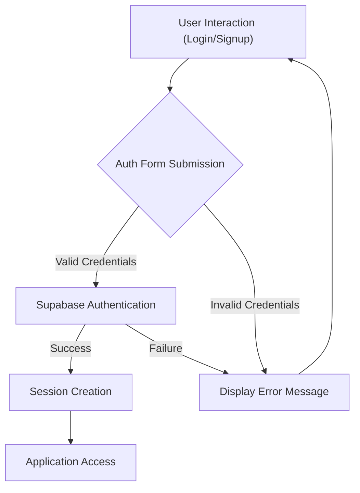
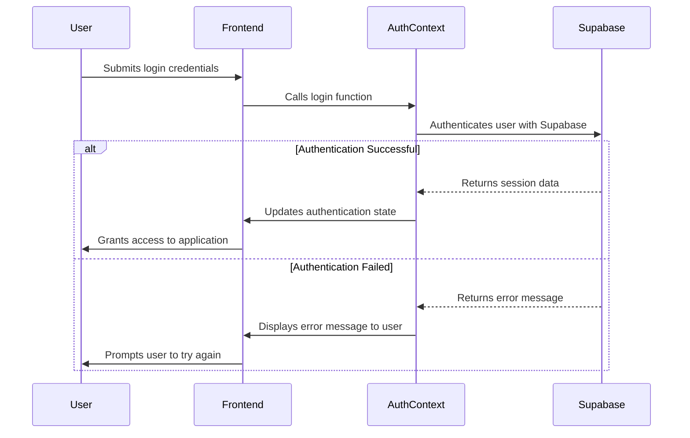

# Authentication and Authorization

This document details the authentication and authorization mechanisms implemented in PollMap. It covers how users are authenticated via Supabase and how their sessions are managed to control access to different features within the application.

## Authentication with Supabase

PollMap utilizes Supabase for user authentication. The `AuthContext` provides the core functionality for signing up, logging in, signing out, and managing user sessions.

### `AuthContext.jsx`

The `AuthContext.jsx` file ( [View on GitHub](https://github.com/lande26/PollMap/blob/main/client/src/context/AuthContext.jsx) ) is responsible for managing the authentication state of the application. It provides methods for user signup, login, and session management using Supabase.

```javascript title="client/src/context/AuthContext.jsx - Authentication Context"
import { createContext, useContext, useEffect, useState } from "react";
import { supabase } from "../supabaseClient";

const AuthContext = createContext();

export const AuthProvider = ({ children }) => {
  const [session, setSession] = useState(undefined);
  const [user, setUser] = useState(undefined);
  const [loading, setLoading] = useState(true);

  const signup = async (email, password) => {
    const { data, error } = await supabase.auth.signUp({
      email: email.toLowerCase(),
      password: password,
    });

    if (error) {
      console.error("Error signing up: ", error);
      return { success: false, error };
    }

    return { success: true, data };
  };

  const login = async (email, password) => {
    try {
      const { data, error } = await supabase.auth.signInWithPassword({
        email: email.toLowerCase(),
        password: password,
      });

      if (error) {
        console.error("Sign-in error:", error.message);
        return { success: false, error: error.message };
      }

      console.log("Sign-in success:", data);
      return { success: true, data }; 
    } catch (error) {
      console.error("Unexpected error during sign-in:", error.message);
      return {
        success: false,
        error: "An unexpected error occurred. Please try again.",
      };
    }
  };

  useEffect(() => {
    supabase.auth.getSession().then(({ data: { session } }) => {
      setSession(session);
      setUser(session?.user ?? null);
      setLoading(false);
    });

    const {
      data: { subscription },
    } = supabase.auth.onAuthStateChange((_event, session) => {
      setSession(session);
      setUser(session?.user ?? null);
      setLoading(false);
    });

    return () => subscription.unsubscribe();

  }, []);

  async function signOut() {
    const { error } = await supabase.auth.signOut();
    if (error) {
      console.error("Error signing out:", error);
    }
  }

  return (
    <AuthContext.Provider
      value={{ signup, login, session, user, loading, signOut }}
    >
      {!loading && children}
    </AuthContext.Provider>
  );
};

export const UserAuth = () => {
  return useContext(AuthContext);
};
```

This code snippet demonstrates the core `AuthProvider` component, which wraps the application to provide authentication context to all child components. It includes functions for `signup`, `login`, and `signOut`, leveraging Supabase's authentication methods. The `useEffect` hook ensures that the user's session is persisted across page reloads.

### User Signup

The `signup` function handles user registration. It uses Supabase's `signUp` method to create a new user account with the provided email and password.

```javascript title="client/src/context/AuthContext.jsx - Signup Function"
const signup = async (email, password) => {
  const { data, error } = await supabase.auth.signUp({
    email: email.toLowerCase(),
    password: password,
  });

  if (error) {
    console.error("Error signing up: ", error);
    return { success: false, error };
  }

  return { success: true, data };
};
```
[View on GitHub](https://github.com/lande26/PollMap/blob/main/client/src/context/AuthContext.jsx)

### User Login

The `login` function authenticates users using their email and password. It calls Supabase's `signInWithPassword` method to verify the credentials.

```javascript title="client/src/context/AuthContext.jsx - Login Function"
const login = async (email, password) => {
  try {
    const { data, error } = await supabase.auth.signInWithPassword({
      email: email.toLowerCase(),
      password: password,
    });

    if (error) {
      console.error("Sign-in error:", error.message);
      return { success: false, error: error.message };
    }

    console.log("Sign-in success:", data);
    return { success: true, data }; 
  } catch (error) {
    console.error("Unexpected error during sign-in:", error.message);
    return {
      success: false,
      error: "An unexpected error occurred. Please try again.",
    };
  }
};
```
[View on GitHub](https://github.com/lande26/PollMap/blob/main/client/src/context/AuthContext.jsx)

### Session Management

The `useEffect` hook in `AuthProvider` is crucial for managing user sessions. It retrieves the current session on component mount and sets up a listener for authentication state changes.

```javascript title="client/src/context/AuthContext.jsx - Session Management"
useEffect(() => {
  supabase.auth.getSession().then(({ data: { session } }) => {
    setSession(session);
    setUser(session?.user ?? null);
    setLoading(false);
  });

  const {
    data: { subscription },
  } = supabase.auth.onAuthStateChange((_event, session) => {
    setSession(session);
    setUser(session?.user ?? null);
    setLoading(false);
  });

  return () => subscription.unsubscribe();

}, []);
```
[View on GitHub](https://github.com/lande26/PollMap/blob/main/client/src/context/AuthContext.jsx)

This ensures that the application always reflects the current authentication status of the user.

### Sign Out

The `signOut` function uses Supabase's `signOut` method to end the user's session.

```javascript title="client/src/context/AuthContext.jsx - Signout Function"
async function signOut() {
  const { error } = await supabase.auth.signOut();
  if (error) {
    console.error("Error signing out:", error);
  }
}
```
[View on GitHub](https://github.com/lande26/PollMap/blob/main/client/src/context/AuthContext.jsx)

### Login Page (`login.jsx`)

The `login.jsx` page ([View on GitHub](https://github.com/lande26/PollMap/blob/main/client/src/pages/login.jsx)) provides the user interface for logging in. It uses the `login` function from `AuthContext` to authenticate the user.

```javascript title="client/src/pages/login.jsx - Login Form"
import React, { useState } from "react";
import { Link, useNavigate } from "react-router-dom";
import { UserAuth } from "../context/AuthContext";

const login = () => {
  const [email, setEmail] = useState("");
  const [password, setPassword] = useState("");
  const [error, setError] = useState(null);
  const [loading, setLoading] = useState(false);

  const {login} = UserAuth();
  const navigate = useNavigate();

  const handlelogin = async (e) => {
    e.preventDefault();
    const { session, error } = await login(email, password); 

    if (error) {
      setError(error); 
      setTimeout(() => {
        setError("");
      }, 3000); 
    } else {
      navigate("/dashboard");
    }

    if (session) {
      closeModal();
      setError(""); 
    }
  };

  return (
    <div>
      <form onSubmit={handlelogin} className="max-w-md m-auto pt-24">
        <h2 className="font-bold pb-2">Sign in</h2>
        <p>
          Don't have an account yet? <Link to="/signup">Sign up</Link>
        </p>
        <div className="flex flex-col py-4">
          <input
            onChange={(e) => setEmail(e.target.value)}
            className="p-3 mt-2"
            type="email"
            name="email"
            id="email"
            placeholder="Email"
          />
        </div>
        <div className="flex flex-col py-4">
          <input
            onChange={(e) => setPassword(e.target.value)}
            className="p-3 mt-2"
            type="password"
            name="password"
            id="password"
            placeholder="Password"
          />
        </div>
        <button className="w-full mt-4">Sign In</button>
        {error && <p className="text-red-600 text-center pt-4">{error}</p>}
      </form>
    </div>
  );
};

export default login;
```

### Signup Page (`singup.jsx`)

The `singup.jsx` page ([View on GitHub](https://github.com/lande26/PollMap/blob/main/client/src/pages/singup.jsx)) provides the user interface for creating a new account. It uses the `signup` function from `AuthContext` to register the user.

```javascript title="client/src/pages/singup.jsx - Signup Form"
import React, { useState } from "react";
import { Link, useNavigate } from "react-router-dom";
import { UserAuth } from "../context/AuthContext";

const Signup = () => {
  const [email, setEmail] = useState("");
  const [password, setPassword] = useState("");
  const [error, setError] = useState(null);
  const [loading, setLoading] = useState(false);

  const { session, signup } = UserAuth();
  const navigate = useNavigate();
  console.log(session);

  const handleSignUp = async (e) => {
    e.preventDefault();
    setLoading(true);

    try {
      const result = await signup(email, password); 

      if (result.success) {
        navigate("/login"); 
      } else {
        setError(result.error.message); 
      }
    } catch (err) {
      setError("An unexpected error occurred."); 
    } finally {
      setLoading(false); 
    }
  };

  return (
    <div>
      <form onSubmit={handleSignUp} className="max-w-md m-auto pt-24">
        <h2 className="font-bold pb-2">Sign up today!</h2>
        <p>
          Already have an account? <Link to="/">Sign in</Link>
        </p>
        <div className="flex flex-col py-4">
          <input
            onChange={(e) => setEmail(e.target.value)}
            className="p-3 mt-2"
            type="email"
            name="email"
            id="email"
            placeholder="Email"
          />
        </div>
        <div className="flex flex-col py-4">
          <input
            onChange={(e) => setPassword(e.target.value)}
            className="p-3 mt-2"
            type="password"
            name="password"
            id="password"
            placeholder="Password"
          />
        </div>
        <button type="submit" disabled={loading} className="w-full mt-4">
          Sign Up
        </button>
        {error && <p className="text-red-600 text-center pt-4">{error}</p>}
      </form>
    </div>
  );
};

export default Signup;
```

## Authentication Flow

The authentication flow can be visualized as follows:





## Key Integration Points

*   **Context Provider:** The `AuthContext` provides a centralized way to manage user authentication state.
*   **Supabase Client:** The Supabase client is used to interact with Supabase's authentication service.
*   **Route Protection:** Routes are protected by checking the authentication state before rendering the component.

## Best Practices

*   **Secure Password Handling:** Supabase handles password hashing and storage securely.
*   **Error Handling:** Implement robust error handling to provide informative feedback to users.
*   **Session Management:** Ensure that user sessions are properly managed to prevent unauthorized access.

## Authorization Considerations

Currently, the application uses authentication to manage access.  Future iterations may require more granular authorization based on user roles or permissions.  This could be implemented by storing user roles in Supabase and checking those roles before granting access to specific features.





```