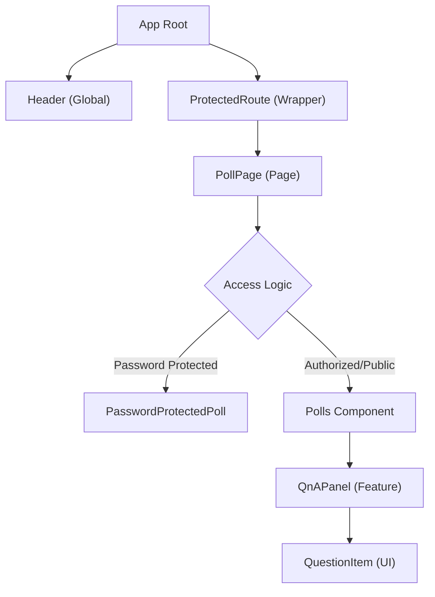
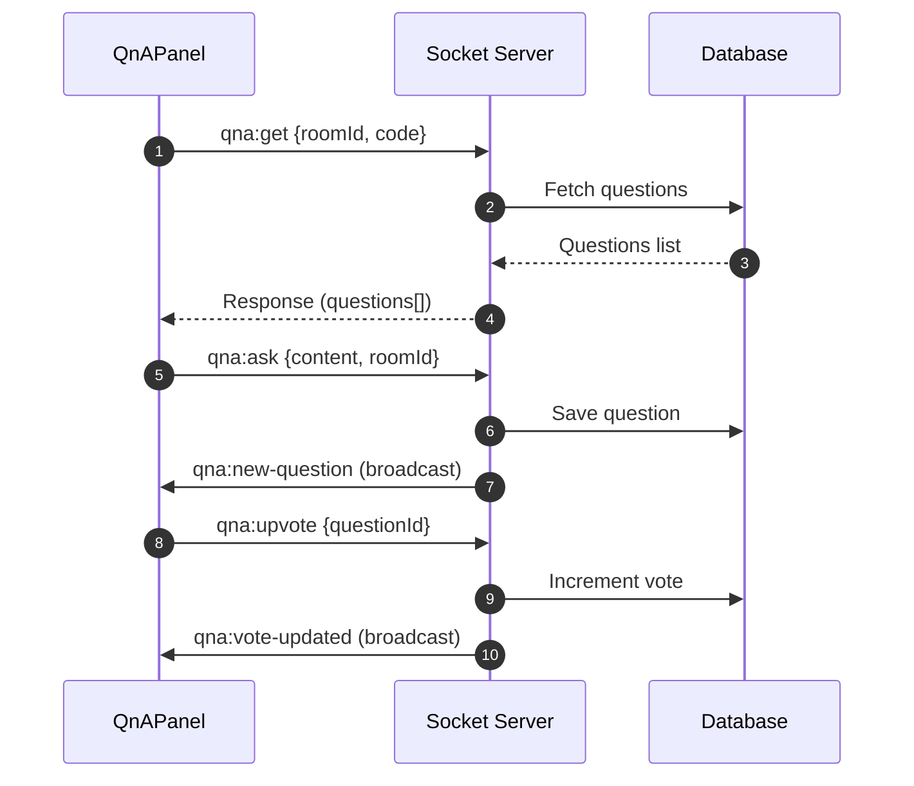

# Component Hierarchy

This section provides a detailed mapping of the PollMap UI component tree. The architecture follows a pattern of global layout wrappers, route-level protection gates, and page-specific feature components that orchestrate complex real-time interactions.

## Visual Component Tree

The following diagram illustrates the structural flow from the application root down to individual feature elements.

## Global Layout & Wrappers

### Header
The `Header` is a fixed global navigation component providing access to primary application routes and user account management. It reacts dynamically to the authentication state provided by `UserAuth`.

- **Conditional Navigation**: Renders specific links (`/dashboard`, `/rooms`, `/polls`) only when a user is authenticated.
- **Account Management**: Provides a dropdown for profile access and a logout trigger via `signOut()`.
- **Responsive Design**: Implements a mobile-specific menu toggle and scroll-based styling transitions.

### ProtectedRoute
The `ProtectedRoute` acts as a higher-order component (HOC) that guards sensitive routes. It ensures that only authenticated users can access specific parts of the application.

| State | Action/Render |
| :--- | :--- |
| `loading === true` | Renders a "Loading your access..." blur-backdrop screen. |
| `user === null` | Renders a "Sign in to continue" layout and triggers the `openAuthModal`. |
| `user !== null` | Renders the `children` components immediately. |

## Page-Level Orchestration

### PollPage
The `PollPage` component serves as the entry point for viewing a specific poll. It does not render the poll content directly but instead orchestrates the access control logic based on the poll's configuration in Supabase.

**Access Logic Flow:**
1. **Fetch Configuration**: Queries the `polls` table for `is_password_protected` and `created_by`.
2. **Identity Check**: If the current `user.id` matches `created_by`, the user is automatically granted access.
3. **Password Gate**: If the poll is password protected and the user is neither the creator nor already authenticated for this session, it renders the `PasswordProtectedPoll` component.
4. **Content Delivery**: Once requirements are met, it renders the `Polls` component.

## Feature Components

### QnAPanel
The `QnAPanel` is a complex feature component designed for real-time interaction within a room. It leverages `SocketContext` for bidirectional communication.

**Internal Hierarchy:**
- **QnAPanel**: Manages the state of questions, sorting logic (`votes` vs `newest`), and socket event listeners.
    - **QuestionItem**: A presentational component that displays individual questions, vote counts, and author information.

**Socket Event Mapping:**

## Component Summary Table

| Component | Level | Primary Responsibility | Key Dependency |
| :--- | :--- | :--- | :--- |
| `Header` | Global | Navigation & Auth State UI | `UserAuth`, `AuthModalContext` |
| `ProtectedRoute` | Wrapper | Route-level Auth Guard | `UserAuth`, `AuthModalContext` |
| `PollPage` | Page | Access Control Logic | `supabase`, `UserAuth` |
| `QnAPanel` | Feature | Real-time Q&A Management | `SocketContext`, `UserAuth` |
| `QuestionItem` | UI | Individual Question Display | `QnAPanel` (via props) |