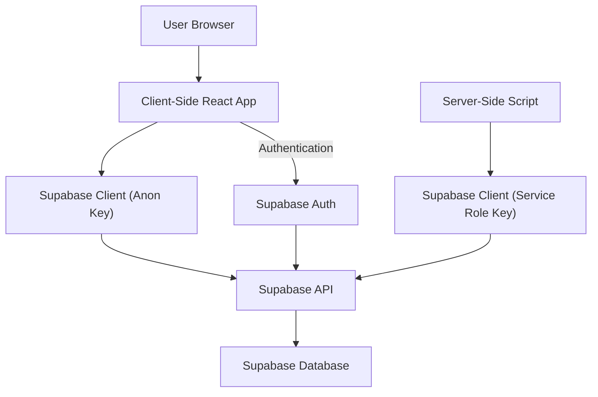

# Data Management

PollMap leverages Supabase for robust data storage, authentication, and real-time capabilities. This section details how data is managed, accessed, and secured across the application's client and server components.

## Authentication and User Management

User authentication is handled through Supabase's Auth module, providing secure sign-up, login, and third-party authentication (e.g., Google). The `AuthContext` in the client-side application manages the user's session and provides authentication functions.

The `AuthContext.jsx` file initializes Supabase's authentication state by fetching the current session and listening for authentication changes.

```tsx
// client/src/context/AuthContext.jsx
import { createContext, useContext, useEffect, useState } from "react";
import { supabase } from "../supabaseClient";

const AuthContext = createContext();

export const AuthProvider = ({ children }) => {
  const [session, setSession] = useState(undefined);
  const [user, setUser] = useState(undefined);
  const [loading, setLoading] = useState(true);

  useEffect(() => {
    supabase.auth.getSession().then(({ data: { session } }) => {
      setSession(session);
      setUser(session?.user ?? null);
      setLoading(false);
    });

    const {
      data: { subscription },
    } = supabase.auth.onAuthStateChange((_event, session) => {
      setSession(session);
      setUser(session?.user ?? null);
      setLoading(false);
    });

    return () => subscription.unsubscribe();

  }, []);

  // ... other authentication functions

  return (
    <AuthContext.Provider
      value={{ signup, login, signInWithGoogle, session, user, loading, signOut }}
    >
      {!loading && children}
    </AuthContext.Provider>
  );
};

export const UserAuth = () => {
  return useContext(AuthContext);
};
```

The `supabaseClient.js` file in the client directory is responsible for initializing the Supabase client with the public URL and anonymous key.

```tsx
// client/src/supabaseClient.js
import {createClient} from '@supabase/supabase-js';

const supabaseUrl = import.meta.env.VITE_SUPABASE_URL;
const supabaseAnonKey = import.meta.env.VITE_SUPABASE_ANON_KEY;

export const supabase = createClient(supabaseUrl, supabaseAnonKey);
```

## Server-Side Data Access

For server-side operations, a separate Supabase client is initialized in `server/supabaseClient.js`. This client uses the `SUPABASE_SERVICE_ROLE_KEY` for elevated privileges, enabling backend operations that require administrative access.

```typescript
// server/supabaseClient.js
import { createClient } from "@supabase/supabase-js";
import dotenv from "dotenv";
dotenv.config();

const supabase = createClient(
  process.env.SUPABASE_URL,
  process.env.SUPABASE_SERVICE_ROLE_KEY
);
export { supabase };
```

## Data Storage

PollMap utilizes Supabase's PostgreSQL database to store all application data, including user information, poll details, and vote records. Supabase provides Row Level Security (RLS) policies to ensure data is accessed and manipulated only by authorized users.

## Data Flow

The application follows a standard pattern for data interaction:

1.  **Client-Side**: React components within the `client` directory interact with the Supabase client initialized in `client/src/supabaseClient.js`. Authentication and session management are handled by `AuthContext.jsx`. Data fetching and mutations are performed directly from components or through custom hooks that abstract Supabase interactions.
2.  **Server-Side**: For operations requiring backend logic or elevated permissions, the `server` directory contains scripts that utilize the Supabase client initialized with the service role key. This ensures secure and controlled access to the database for administrative tasks or complex data processing.





## Key Takeaways

*   Supabase is the central data management platform, handling authentication, database, and real-time features.
*   Client and server applications use distinct Supabase clients, with the server-side client possessing elevated privileges.
*   Authentication is managed by `AuthContext` on the client, providing a seamless user experience.
*   Row Level Security (RLS) in Supabase ensures data integrity and security.