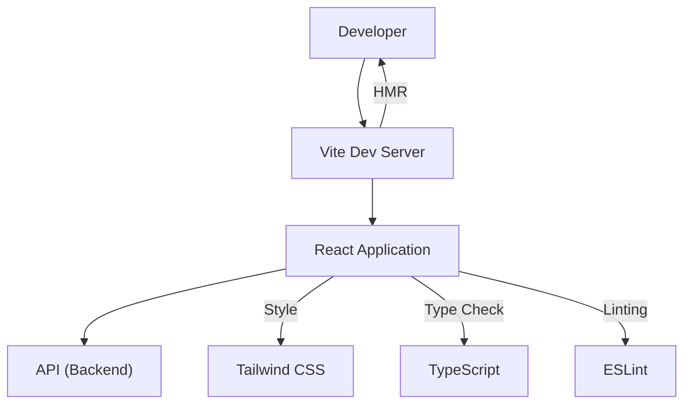

# Development Setup and Configuration

This section outlines the essential steps and configurations for setting up your development environment for the PollMap client.

## Project Structure and Dependencies

The client-side application is built using Vite, React, and TypeScript, with ESLint for code quality and Tailwind CSS for styling.

## Vite Configuration

Vite is used as the build tool, providing a fast development server and optimized production builds. The `vite.config.js` file configures plugins and path aliases.

```javascript
import { defineConfig } from 'vite'
import react from '@vitejs/plugin-react'
import tailwindcss from '@tailwindcss/vite'
import path from 'path'

export default defineConfig({
  plugins: [react(), tailwindcss()],
  resolve: {
    alias: {
      "@": path.resolve(__dirname, "./src"),
    },
  },
})
```

The `alias` configuration simplifies importing modules from the `src` directory.

## TypeScript Configuration

The `tsconfig.json` file defines the TypeScript compiler options, ensuring type safety and efficient compilation.

```json
{
  "compilerOptions": {
    "target": "ES2020",
    "useDefineForClassFields": true,
    "lib": ["ES2020", "DOM", "DOM.Iterable"],
    "module": "ESNext",
    "skipLibCheck": true,
    "moduleResolution": "bundler",
    "allowImportingTsExtensions": true,
    "resolveJsonModule": true,
    "isolatedModules": true,
    "noEmit": true,
    "jsx": "react-jsx",
    "strict": true,
    "noUnusedLocals": true,
    "noUnusedParameters": true,
    "noFallthroughCasesInSwitch": true,
    "baseUrl": ".",
    "paths": {
      "@/*": ["./src/*"]
    }
  },
  "include": ["src"]
}
```

Key options include `moduleResolution: "bundler"`, `jsx: "react-jsx"`, and the path mapping for the `@` alias.

## ESLint Configuration

ESLint is configured to enforce code style and catch potential errors. The `eslint.config.js` file integrates recommended settings for React, React Hooks, and Vite.

```javascript
import js from '@eslint/js'
import globals from 'globals'
import reactHooks from 'eslint-plugin-react-hooks'
import reactRefresh from 'eslint-plugin-react-refresh'
import { defineConfig, globalIgnores } from 'eslint/config'

export default defineConfig([
  globalIgnores(['dist']),
  {
    files: ['**/*.{js,jsx}'],
    extends: [
      js.configs.recommended,
      reactHooks.configs['recommended-latest'],
      reactRefresh.configs.vite,
    ],
    languageOptions: {
      ecmaVersion: 2020,
      globals: globals.browser,
      parserOptions: {
        ecmaVersion: 'latest',
        ecmaFeatures: { jsx: true },
        sourceType: 'module',
      },
    },
    rules: {
      'no-unused-vars': ['error', { varsIgnorePattern: '^[A-Z_]' }],
    },
  },
])
```

The configuration includes rules for unused variables and extends common presets for a robust development workflow.

## Development Workflow

The development setup prioritizes speed and developer experience. Vite's Hot Module Replacement (HMR) allows for near-instantaneous feedback during development.

### Mermaid Diagram: Development Architecture





## Key Takeaways

*   Vite provides a fast and efficient development experience.
*   TypeScript ensures code quality and maintainability.
*   ESLint enforces coding standards and catches potential bugs.
*   Tailwind CSS streamlines the styling process.