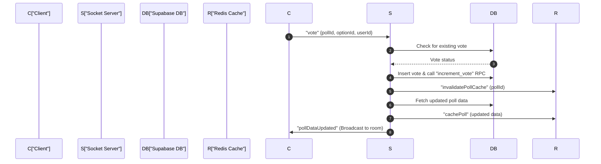
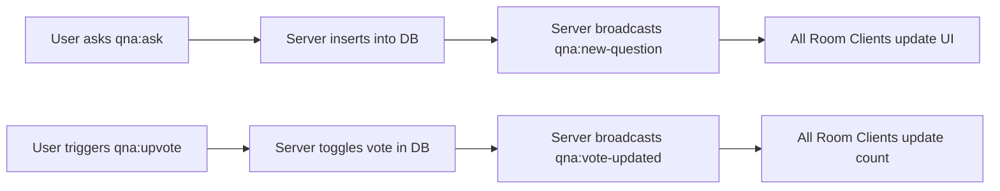

# Real-time Communication Layer

The Real-time Communication Layer of PollMap is built upon **Socket.io**, providing a bi-directional, event-driven bridge between the React frontend and the Node.js backend. This layer facilitates instant poll result updates, interactive room management, and a live Q&A system.

## Client-Side Connection Management

The application manages socket connections through a centralized React Context provider, ensuring that the socket instance is synchronized with the user's authentication state.

### SocketContext Implementation
The `SocketContextProvider` handles the lifecycle of the socket connection. It monitors the user's session and automatically reconnects when the authentication token changes.

```javascript
const newSocket = io(import.meta.env.VITE_SOCKET_URL || "http://localhost:5001", {
    auth: {
        token: token || null,
    },
});
```

**Key Connection Features:**
- **Authenticated Handshake:** The `access_token` from `UserAuth` is passed in the `auth` object during the initial handshake.
- **Automatic Cleanup:** The `useEffect` hook ensures previous connections are closed before creating a new one to prevent memory leaks.
- **Global Accessibility:** The `socket` instance is exposed via the `useSocketContext` hook for use in any UI component.

---

## Poll Real-time Logic & Caching

The `poll.socket.js` module manages the retrieval and updating of poll data. To optimize performance and reduce database load on Supabase, a Redis-based caching strategy is implemented.

### Caching Strategy
The `cacheService` manages two types of data:
1. **Single Polls:** Cached using the key `poll:${pollId}` with a default 300s expiry.
2. **Poll Lists:** Cached using paginated keys `polls:page_${page}_limit_${limit}` with a 60s expiry.

### Live Voting Workflow
Voting is a critical path that requires strict data consistency and instant broadcasting.



---

## Room & Q&A Management

The `room.socket.js` module handles the grouping of users into virtual sessions using Socket.io "rooms".

### Room Lifecycle
Rooms are identified by a 6-character alphanumeric code generated via `generateRoomCode()`, excluding confusing characters like `I, O, 0, 1`.

| Event | Action | Permissions |
| :--- | :--- | :--- |
| `room:create` | Generates a code, creates a room in DB, and adds host as participant. | Authenticated User |
| `room:join` | Verifies room activity and capacity, upserts participant, joins socket room. | Authenticated User |
| `room:generate-link` | Creates a one-time UUID token in Redis linked to the room code. | Host Only |
| `room:join-link` | Uses Redis `getDel` to consume the token and join the room. | Authenticated User |
| `room:end` | Sets `is_active: false` in DB and notifies all clients. | Host Only |

### Q&A Implementation
The Q&A system utilizes the same room-based broadcasting to ensure questions are only visible to participants of a specific session.



**Q&A Event Specifications:**
- **`qna:get`**: Fetches all questions for a room, joining with `profiles` to get author details and calculating `vote_count` based on `question_votes`.
- **`qna:upvote`**: Implements a toggle mechanism. If a vote exists, it is removed; otherwise, it is created.
- **`qna:mark-answered`**: A host-only event that updates the `is_answered` flag and broadcasts the change via `qna:question-answered`.

---

## Event Reference Summary

### Poll Events (`poll.socket.js`)
| Event Name | Direction | Payload | Description |
| :--- | :--- | :--- | :--- |
| `getPoll` | Client $\to$ Server | `pollId` | Fetches a single poll (Cache-first). |
| `getPolls` | Client $\to$ Server | `{page, limit}` | Fetches paginated poll list. |
| `joinPoll` | Client $\to$ Server | `pollId` | Joins the socket room for live updates. |
| `vote` | Client $\to$ Server | `{pollId, optionId, userId}` | Processes a vote and triggers broadcast. |
| `pollDataUpdated`| Server $\to$ Client | `{data: pollData}` | Broadcasts updated results to room. |

### Room & Q&A Events (`room.socket.js`)
| Event Name | Direction | Payload | Description |
| :--- | :--- | :--- | :--- |
| `room:create` | Client $\to$ Server | `{name}` | Initializes a new room session. |
| `room:link-poll` | Client $\to$ Server | `{roomId, pollId, code}` | Associates a poll with a specific room. |
| `room:participants-updated`| Server $\to$ Client | `{participants}` | Broadcasts current room member list. |
| `qna:ask` | Client $\to$ Server | `{roomId, content, code}` | Submits a new question to the room. |
| `qna:vote-updated`| Server $\to$ Client | `{questionId, action}` | Updates vote count in real-time. |