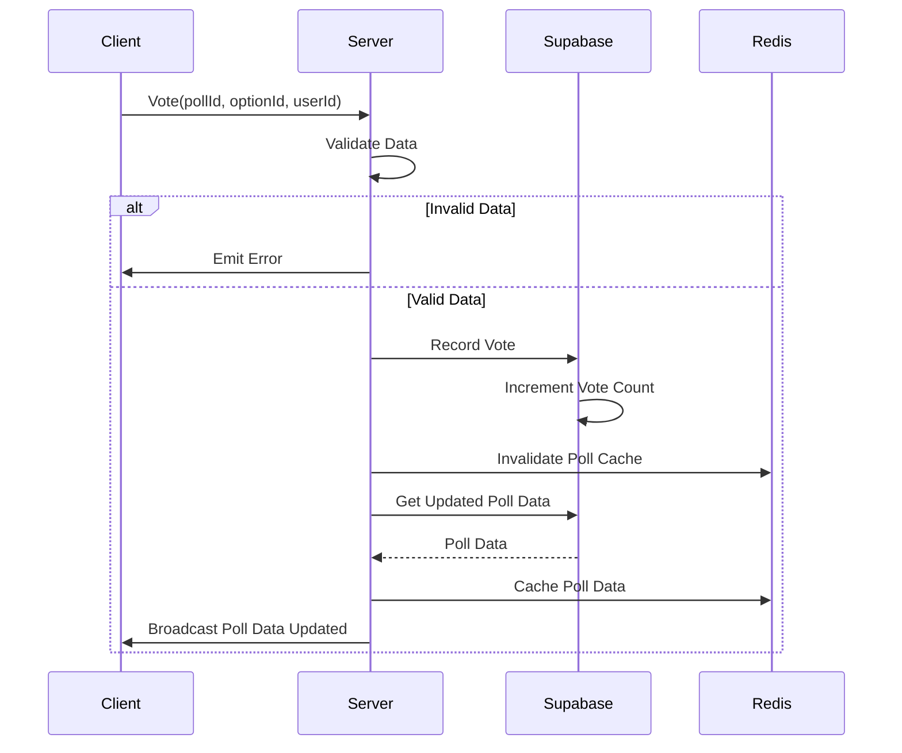

# Real-time Communication with Socket.IO

This section details the implementation of real-time features using Socket.IO in the PollMap application. Socket.IO enables interactive polling by facilitating bidirectional communication between the client and server, allowing for instant updates and a more engaging user experience. We utilize Socket.IO for features such as joining polls, casting votes, and receiving real-time updates on poll results.

## Key Features

-   **Real-time Updates:** Poll results are updated instantly across all connected clients.
-   **Scalability:** Integration with Redis caching to reduce database load and improve response times.
-   **User Engagement:** Provides an interactive and responsive polling experience.
-   **Error Handling:** Implements robust error handling to ensure a stable and reliable connection.
-	**Poll Listing and Single Poll Retrieval**: Implemented caching for frequently accessed polls and poll lists.

## Socket.IO Implementation

### Client-Side Setup

The client-side setup involves establishing a connection to the Socket.IO server and managing socket events using React context.

#### `SocketContext.jsx`

This file creates a `SocketContext` to provide the socket instance and online user information to all components in the application.

```javascript title="client/src/context/SocketContext.jsx"
import React, { createContext, useContext, useEffect, useState } from 'react';
import io from 'socket.io-client';

const SocketContext = createContext();

export const useSocketContext = () => {
    return useContext(SocketContext);
};

export const SocketContextProvider = ({ children }) => {
    const [socket, setSocket] = useState(null);
    const [onlineUsers, setOnlineUsers] = useState([]);

    useEffect(() => {
        const socket = io("http://localhost:5001");
        setSocket(socket);

        socket.on("connect", () => {
            console.log("Connected to socket server with ID:", socket.id);
        });
        socket.on("disconnect", () => {
            console.log("Disconnected from socket server");
        });
        return () => socket.close();
    }, []);

    return (
        <SocketContext.Provider value={{ socket, onlineUsers }}>
            {children}
        </SocketContext.Provider>
    );
};
```

[View on GitHub](https://github.com/lande26/PollMap/blob/main/client/src/context/SocketContext.jsx)

This code snippet demonstrates how the `SocketContext` is initialized. The `useEffect` hook ensures that the socket connection is established when the component mounts and closed when the component unmounts.

#### `socket.js`

This file creates socket instance to connect client side with server

```javascript title="client/src/socket.js"
import {io} from 'socket.io-client';

const SOCKET_URL = "http://localhost:5001";

export const socket = io(SOCKET_URL, {
    withCredentials: true,
});

export default socket;
```

[View on GitHub](https://github.com/lande26/PollMap/blob/main/client/src/socket.js)

### Server-Side Implementation

The server-side implementation manages socket connections, handles poll-related events, and interacts with the database.

#### `poll.socket.js`

This file contains the logic for handling Socket.IO connections and managing poll events such as joining polls, voting, and updating poll data.  It also includes caching mechanisms using Redis to improve performance.

```javascript title="server/socket/poll.socket.js"
import { supabase } from '../supabaseClient.js';

// Redis cache functions
const createCacheClient = () => {
  // This will be set from server.js
  let redisClient = null;
  
  return {
    setClient: (client) => {
      redisClient = client;
    },
    
    cachePoll: async (pollId, data, expiry = 300) => {
      if (!redisClient) return;
      try {
        await redisClient.setEx(`poll:${pollId}`, expiry, JSON.stringify(data));
        console.log(`Cached poll: ${pollId}`);
      } catch (error) {
        console.error('Redis cache set error:', error);
      }
    },
    
    getCachedPoll: async (pollId) => {
      if (!redisClient) return null;
      try {
        const cached = await redisClient.get(`poll:${pollId}`);
        return cached ? JSON.parse(cached) : null;
      } catch (error) {
        console.error('Redis cache get error:', error);
        return null;
      }
    },
    
    invalidatePollCache: async (pollId) => {
      if (!redisClient) return;
      try {
        await redisClient.del(`poll:${pollId}`);
        console.log(`Invalidated cache for poll: ${pollId}`);
      } catch (error) {
        console.error('Redis cache delete error:', error);
      }
    },
    
    cachePollsList: async (key, data, expiry = 60) => {
      if (!redisClient) return;
      try {
        await redisClient.setEx(`polls:${key}`, expiry, JSON.stringify(data));
      } catch (error) {
        console.error('Redis cache set error:', error);
      }
    },
    
    getCachedPollsList: async (key) => {
      if (!redisClient) return null;
      try {
        const cached = await redisClient.get(`polls:${key}`);
        return cached ? JSON.parse(cached) : null;
      } catch (error) {
        console.error('Redis cache get error:', error);
        return null;
      }
    }
  };
};

export const cacheService = createCacheClient();

export const handlePollSocket = (io) => {
  io.on("connection", (socket) => {
    console.log(`a user connected ${socket.id}`);
    
    // Get single poll with cache
    const handleGetPoll = async (pollId, callback) => {
      try {
        // Try cache first
        const cachedPoll = await cacheService.getCachedPoll(pollId);
        if (cachedPoll) {
          callback({ data: cachedPoll });
          console.log(`Served poll ${pollId} from cache`);
          return;
        }

        // If not cached, fetch from database
        const pollData = await getPollDataService(pollId);
        
        // Cache the result
        await cacheService.cachePoll(pollId, pollData);

        callback({ data: pollData });
        console.log(`Fetched and cached poll: ${pollId}`);
      } catch (error) {
        console.error('Error fetching poll:', error);
        callback({ error: 'Failed to fetch poll' });
      }
    };

    // Get polls list with cache
    const handleGetPolls = async ({ page = 1, limit = 12 }, callback) => {
      try {
        const cacheKey = `page_${page}_limit_${limit}`;
        
        // Try cache first
        const cachedPolls = await cacheService.getCachedPollsList(cacheKey);
        if (cachedPolls) {
          callback(cachedPolls);
          console.log(`Served polls page ${page} from cache`);
          return;
        }

        // If not cached, fetch from database
        const from = (page - 1) * limit;
        const to = from + limit - 1;

        const { data: polls, error, count } = await supabase
          .from('polls')
          .select(`
            *,
            options(*),
            profiles(username, avatar_url)
          `, { count: 'exact' })
          .order('created_at', { ascending: false })
          .range(from, to);

        if (error) throw error;

        // Process polls data
        const processedPolls = await Promise.all(
          polls.map(async (poll) => {
            const { count: participantCount } = await supabase
              .from('votes')
              .select('user_id', { count: 'exact', head: true })
              .eq('poll_id', poll.id);

            const totalVotes = poll.options.reduce((sum, option) => sum + option.votes_count, 0);
            const engagementRate = participantCount > 0 ? Math.round((totalVotes / participantCount) * 100) : 0;

            return {
              ...poll,
              totalVotes,
              participantCount: participantCount || 0,
              engagementRate
            };
          })
        );

        const result = {
          polls: processedPolls,
          hasMore: polls.length === limit,
          totalCount: count
        };

        // Cache the result
        await cacheService.cachePollsList(cacheKey, result);

        callback(result);
        console.log(`Fetched and cached polls page: ${page}`);
      } catch (error) {
        console.error('Error fetching polls:', error);
        callback({ error: 'Failed to fetch polls' });
      }
    };
    
    // Joining a poll room
    const handleJoinPoll = (pollId) => {
      if (!pollId) {
        socket.emit("pollError", { message: "Poll ID is required" });
        return;
      }
      socket.join(pollId);
      console.log(`User ${socket.id} joined poll room: ${pollId}`);
      socket.emit("joinedPoll", { pollId });
    };
    
    // Voting in a poll with cache invalidation
    const handleVote = async (data) => {
      console.log("Vote received:", data);
      
      if (!data || !data.pollId || !data.optionId) {
        socket.emit("pollError", { message: "Invalid vote data" });
        return;
      }
      
      try {
        // Check if user has already voted (only if userId is provided)
        if (data.userId) {
          const { data: existingVote, error: checkError } = await supabase
            .from('votes')
            .select('*')
            .eq('poll_id', data.pollId)
            .eq('user_id', data.userId);
            
          if (checkError) throw checkError;
          
          if (existingVote && existingVote.length > 0) {
            socket.emit("pollError", { message: "You have already voted in this poll" });
            return;
          }
        }
        
        // Record the vote in the database
        const { data: vote, error: voteError } = await supabase
          .from('votes')
          .insert([{
            poll_id: data.pollId,
            option_id: data.optionId,
            user_id: data.userId || null
          }]);
          
        if (voteError) throw voteError;
        
        console.log("Vote recorded successfully");
        
        // Update the vote count for the option
        console.log("Updating vote count for option:", data.optionId);
        const { error: updateError } = await supabase.rpc('increment_vote', {
          option_id: data.optionId
        });
        
        if (updateError) throw updateError;
        
        console.log("Vote count updated successfully");
        
        // Invalidate cache for this poll
        await cacheService.invalidatePollCache(data.pollId);
        
        // Get updated poll data
        console.log("Fetching updated poll data for poll:", data.pollId);
        const pollData = await getPollDataService(data.pollId);
        console.log("Updated poll data:", pollData);
        
        // Re-cache the updated poll
        await cacheService.cachePoll(data.pollId, pollData);
        
        // Broadcast updated results to all clients in the poll room
        io.to(data.pollId).emit("pollDataUpdated", { data: pollData });
        console.log("Poll data updated and broadcasted");
        
      } catch (error) {
        console.error("Error processing vote:", error);
        socket.emit("pollError", { message: "Failed to process vote" });
      }
    };
    
    // Disconnecting
    const handleDisconnect = () => {
      console.log(`User disconnected: ${socket.id}`);
    };
    
    // Register event handlers
    socket.on("getPoll", handleGetPoll);
    socket.on("getPolls", handleGetPolls);
    socket.on("joinPoll", handleJoinPoll);
    socket.on("vote", handleVote);
    socket.on("disconnect", handleDisconnect);
  });
};

// Helper function to get poll data with options and vote counts
async function getPollDataService(pollId) {
  try {
    console.log("Querying Supabase for poll with ID:", pollId);
    
    // Get poll with options and profiles
    const { data: poll, error: pollError } = await supabase
      .from('polls')
      .select(`
        *,
        options(*),
        profiles(username, avatar_url)
      `)
      .eq('id', pollId)
      .single();
      
    if (pollError) {
      console.error("Supabase error fetching poll:", pollError);
      throw pollError;
    }
    
    console.log("Poll data from Supabase:", poll);
    
    // Calculate total votes
    const totalVotes = poll.options.reduce((sum, option) => sum + option.votes_count, 0);
    console.log("Total votes calculated:", totalVotes);
    
    return {
      ...poll,
      totalVotes
    };
  } catch (error) {
    console.error('Error in getPollDataService:', error);
    throw error;
  }
}
```

[View on GitHub](https://github.com/lande26/PollMap/blob/main/server/socket/poll.socket.js)

Key functionalities include:

-   **`handleJoinPoll`**: Allows users to join a specific poll room to receive real-time updates.
-   **`handleVote`**: Records user votes, updates vote counts in the database, invalidates cache for the poll and broadcasts the updated results.
-	**`handleGetPoll`**: Retrieves poll data, utilizing Redis cache for faster access.
-	**`handleGetPolls`**: Retrieves a list of polls, utilizing Redis cache for faster access.
-   **`getPollDataService`**: Retrieves poll data from the Supabase database.

Here’s a snippet illustrating the voting process:

```javascript title="server/socket/poll.socket.js"
const handleVote = async (data) => {
  console.log("Vote received:", data);
  
  if (!data || !data.pollId || !data.optionId) {
    socket.emit("pollError", { message: "Invalid vote data" });
    return;
  }
  
  try {
    // Check if user has already voted (only if userId is provided)
    if (data.userId) {
      const { data: existingVote, error: checkError } = await supabase
        .from('votes')
        .select('*')
        .eq('poll_id', data.pollId)
        .eq('user_id', data.userId);
        
      if (checkError) throw checkError;
      
      if (existingVote && existingVote.length > 0) {
        socket.emit("pollError", { message: "You have already voted in this poll" });
        return;
      }
    }
    
    // Record the vote in the database
    const { data: vote, error: voteError } = await supabase
      .from('votes')
      .insert([{
        poll_id: data.pollId,
        option_id: data.optionId,
        user_id: data.userId || null
      }]);
      
    if (voteError) throw voteError;
    
    console.log("Vote recorded successfully");
    
    // Update the vote count for the option
    console.log("Updating vote count for option:", data.optionId);
    const { error: updateError } = await supabase.rpc('increment_vote', {
      option_id: data.optionId
    });
    
    if (updateError) throw updateError;
    
    console.log("Vote count updated successfully");
    
    // Invalidate cache for this poll
    await cacheService.invalidatePollCache(data.pollId);
    
    // Get updated poll data
    console.log("Fetching updated poll data for poll:", data.pollId);
    const pollData = await getPollDataService(data.pollId);
    console.log("Updated poll data:", pollData);
    
    // Re-cache the updated poll
    await cacheService.cachePoll(data.pollId, pollData);
    
    // Broadcast updated results to all clients in the poll room
    io.to(data.pollId).emit("pollDataUpdated", { data: pollData });
    console.log("Poll data updated and broadcasted");
    
  } catch (error) {
    console.error("Error processing vote:", error);
    socket.emit("pollError", { message: "Failed to process vote" });
  }
};
```

[View on GitHub](https://github.com/lande26/PollMap/blob/main/server/socket/poll.socket.js)

#### Redis Cache Implementation

```javascript title="server/socket/poll.socket.js"
// Redis cache functions
const createCacheClient = () => {
  // This will be set from server.js
  let redisClient = null;
  
  return {
    setClient: (client) => {
      redisClient = client;
    },
    
    cachePoll: async (pollId, data, expiry = 300) => {
      if (!redisClient) return;
      try {
        await redisClient.setEx(`poll:${pollId}`, expiry, JSON.stringify(data));
        console.log(`Cached poll: ${pollId}`);
      } catch (error) {
        console.error('Redis cache set error:', error);
      }
    },
    
    getCachedPoll: async (pollId) => {
      if (!redisClient) return null;
      try {
        const cached = await redisClient.get(`poll:${pollId}`);
        return cached ? JSON.parse(cached) : null;
      } catch (error) {
        console.error('Redis cache get error:', error);
        return null;
      }
    },
    
    invalidatePollCache: async (pollId) => {
      if (!redisClient) return;
      try {
        await redisClient.del(`poll:${pollId}`);
        console.log(`Invalidated cache for poll: ${pollId}`);
      } catch (error) {
        console.error('Redis cache delete error:', error);
      }
    },
    
    cachePollsList: async (key, data, expiry = 60) => {
      if (!redisClient) return;
      try {
        await redisClient.setEx(`polls:${key}`, expiry, JSON.stringify(data));
      } catch (error) {
        console.error('Redis cache set error:', error);
      }
    },
    
    getCachedPollsList: async (key) => {
      if (!redisClient) return null;
      try {
        const cached = await redisClient.get(`polls:${key}`);
        return cached ? JSON.parse(cached) : null;
      } catch (error) {
        console.error('Redis cache get error:', error);
        return null;
      }
    }
  };
};

export const cacheService = createCacheClient();
```

[View on GitHub](https://github.com/lande26/PollMap/blob/main/server/socket/poll.socket.js)

#### Retrieving List of Polls
```javascript title="server/socket/poll.socket.js"
 // Get polls list with cache
    const handleGetPolls = async ({ page = 1, limit = 12 }, callback) => {
      try {
        const cacheKey = `page_${page}_limit_${limit}`;
        
        // Try cache first
        const cachedPolls = await cacheService.getCachedPollsList(cacheKey);
        if (cachedPolls) {
          callback(cachedPolls);
          console.log(`Served polls page ${page} from cache`);
          return;
        }

        // If not cached, fetch from database
        const from = (page - 1) * limit;
        const to = from + limit - 1;

        const { data: polls, error, count } = await supabase
          .from('polls')
          .select(`
            *,
            options(*),
            profiles(username, avatar_url)
          `, { count: 'exact' })
          .order('created_at', { ascending: false })
          .range(from, to);

        if (error) throw error;

        // Process polls data
        const processedPolls = await Promise.all(
          polls.map(async (poll) => {
            const { count: participantCount } = await supabase
              .from('votes')
              .select('user_id', { count: 'exact', head: true })
              .eq('poll_id', poll.id);

            const totalVotes = poll.options.reduce((sum, option) => sum + option.votes_count, 0);
            const engagementRate = participantCount > 0 ? Math.round((totalVotes / participantCount) * 100) : 0;

            return {
              ...poll,
              totalVotes,
              participantCount: participantCount || 0,
              engagementRate
            };
          })
        );

        const result = {
          polls: processedPolls,
          hasMore: polls.length === limit,
          totalCount: count
        };

        // Cache the result
        await cacheService.cachePollsList(cacheKey, result);

        callback(result);
        console.log(`Fetched and cached polls page: ${page}`);
      } catch (error) {
        console.error('Error fetching polls:', error);
        callback({ error: 'Failed to fetch polls' });
      }
    };
```

[View on GitHub](https://github.com/lande26/PollMap/blob/main/server/socket/poll.socket.js)

This code establishes the caching mechanism using Redis to cache the poll. Before querying Supabase, Redis cache is checked, and if data is available, it's served from there. If it's not cached, it's retrieved from Supabase, then cached for future requests.

### Socket.IO Flow

The following diagram illustrates the flow of data during a voting event:


```mermaid
graph LR
    A["Client"] -->|"Vote Data"| B("Server (Socket.IO)");
    B --> C{{"Validate Data"}};
    C --|"Invalid Data"| D["Emit Error to Client"];
    C --|"Valid Data"| E("Supabase (Record Vote)");
    E --> F("Supabase (Increment Vote Count)");
    F --> G["Invalidate Poll Cache"];
    G --> H("Supabase (Get Updated Poll Data)");
    H --> I["Cache Poll Data"];
    I --> J("Server (Socket.IO)");
    J -->|"Updated Poll Data"| K["Broadcast to Clients in Poll Room"];
```


### Sequence Diagram of the Real-Time Voting Process





## Key Integration Points

-   **Event Handling**: Socket.IO simplifies handling real-time events, such as new votes and poll updates.
-   **Supabase Integration**: Seamlessly integrates with Supabase for data persistence and real-time data retrieval.
-   **Redis Caching**: Caching frequently accessed poll data in Redis to improve response times and reduce load on the database.

## Best Practices

-   **Error Handling**: Implement comprehensive error handling on both the client and server to manage potential issues.
-   **Data Validation**: Validate all incoming data to prevent malicious attacks and ensure data integrity.
-   **Scalability**: Utilize caching and optimize database queries to ensure the application can handle a large number of concurrent users.
```