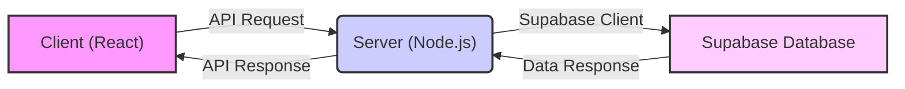

# Data Management with Supabase

This document explains how Supabase is utilized within the PollMap application for data storage, retrieval, and management. Supabase provides a backend-as-a-service (BaaS) solution, simplifying database management and authentication. The application interacts with Supabase from both the client-side (React) and the server-side (Node.js).

## Supabase Integration

PollMap employs Supabase for several core functionalities:

*   **Data Storage:** Storing poll data, user information (handled through Supabase Auth), and any other persistent application state.
*   **Realtime Updates:** While not explicitly shown in the provided snippets, Supabase's realtime capabilities can be leveraged for updating poll results in real-time.
*   **Authentication:** Supabase Auth handles user registration, login, and session management.

### Client-Side Supabase Initialization

The client-side integration resides in `client/src/supabaseClient.js`. This module is responsible for creating a Supabase client instance that can be used within the React application.

```javascript
// File: client/src/supabaseClient.js
import {createClient} from '@supabase/supabase-js';

const supabaseUrl = import.meta.env.VITE_SUPABASE_URL;
const supabaseAnonKey = import.meta.env.VITE_SUPABASE_ANON_KEY;

export const supabase = createClient(supabaseUrl, supabaseAnonKey);
```

[View on GitHub](https://github.com/lande26/PollMap/blob/main/client/src/supabaseClient.js)

**Explanation:**

1.  **Import `createClient`:** Imports the necessary function from the `@supabase/supabase-js` library.
2.  **Environment Variables:** Retrieves the Supabase URL and anonymous key from environment variables. These are crucial for connecting to your Supabase project. **Important:** Never hardcode these values directly into your application.
3.  **Create Client:** Creates a Supabase client instance using the URL and key. This client is then exported for use throughout the application.

### Server-Side Supabase Initialization

The server-side integration, found in `server/supabaseClient.js`, is similar but uses the service role key for elevated privileges.

```javascript
// File: server/supabaseClient.js
import { createClient } from "@supabase/supabase-js";
import dotenv from "dotenv";
dotenv.config();

console.log("Supabase URL:", process.env.SUPABASE_URL ? "Loaded" : "Not Loaded");
console.log(
  "Supabase Service Role Key:",
  process.env.SUPABASE_SERVICE_ROLE_KEY ? "Loaded" : "Not Loaded"
);
const supabase = createClient(
  process.env.SUPABASE_URL,
  process.env.SUPABASE_SERVICE_ROLE_KEY 
);
console.log("Supabase client created");
export { supabase };
```

[View on GitHub](https://github.com/lande26/PollMap/blob/main/server/supabaseClient.js)

**Explanation:**

1.  **Import Dependencies:** Imports the `createClient` function and the `dotenv` library for loading environment variables from a `.env` file.
2.  **Load Environment Variables:** `dotenv.config()` loads environment variables from the `.env` file into `process.env`.
3.  **Service Role Key:** Uses `SUPABASE_SERVICE_ROLE_KEY` instead of `SUPABASE_ANON_KEY`.  The service role key grants full access to your Supabase database, bypassing row-level security (RLS). **Use this key with extreme caution and only in secure server-side environments.**
4.  **Create and Export Client:** Creates the Supabase client and exports it for use within the server-side application.

## Data Flow

The following Mermaid diagram illustrates the typical data flow between the client, server, and Supabase.





## Example: Fetching Poll Data

Here's a hypothetical example of fetching poll data from the Supabase database using the client-side Supabase client.

```javascript
// Example: Fetching poll data (client-side)
import { supabase } from './supabaseClient';

async function fetchPolls() {
  try {
    const { data, error } = await supabase
      .from('polls')
      .select('*');

    if (error) {
      console.error("Error fetching polls:", error);
      return [];
    }

    console.log("Poll data:", data);
    return data;
  } catch (error) {
    console.error("An unexpected error occurred:", error);
    return [];
  }
}

// Call the function (example)
fetchPolls();
```

**Explanation:**

1.  **Import Client:** Imports the pre-configured Supabase client.
2.  **Asynchronous Function:** Defines an asynchronous function `fetchPolls` to handle the database query.
3.  **Query Supabase:** Uses `supabase.from('polls').select('*')` to query the `polls` table and retrieve all columns (`*`).
4.  **Error Handling:** Checks for errors returned by Supabase.
5.  **Return Data:** Returns the fetched poll data.

## Example: Creating a New Poll

Here's an example of how to create a new poll using the server-side Supabase client. This would likely be part of an API endpoint on the server.

```javascript
// Example: Creating a new poll (server-side)
import { supabase } from './supabaseClient';

async function createPoll(pollData) {
  try {
    const { data, error } = await supabase
      .from('polls')
      .insert([pollData]);

    if (error) {
      console.error("Error creating poll:", error);
      return null;
    }

    console.log("Poll created:", data);
    return data;
  } catch (error) {
    console.error("An unexpected error occurred:", error);
    return null;
  }
}

// Example usage (assuming pollData is an object containing poll information)
// createPoll({ title: "Favorite Programming Language", options: ["JavaScript", "Python", "Java"] });
```

**Explanation:**

1.  **Import Client:** Imports the server-side Supabase client.
2.  **Insert Data:** Uses `supabase.from('polls').insert([pollData])` to insert a new row into the `polls` table. `pollData` should be an object containing the data for the new poll.
3.  **Error Handling:** Checks for errors during the insertion process.
4.  **Return Data:** Returns the newly created poll data.

## Row Level Security (RLS)

Row Level Security is a vital feature of Supabase that allows you to control access to your data at a granular level. You can define policies that restrict which users can read, insert, update, or delete data based on specific conditions.

```sql
-- Example: RLS policy to allow only the poll creator to update a poll
CREATE POLICY "Allow users to update their own polls"
ON polls
FOR UPDATE
USING (auth.uid() = creator_id);
```

**Explanation:**

This SQL code defines a policy on the `polls` table that allows users to update a poll only if their user ID (`auth.uid()`) matches the `creator_id` of the poll. This ensures that only the poll creator can modify the poll.

## Key Integration Points

*   **Environment Variables:** Always use environment variables to store your Supabase URL and keys. This is crucial for security and allows you to easily switch between different environments (e.g., development, production).
*   **Service Role Key:** Use the service role key only on the server-side and with extreme caution. Never expose it to the client.
*   **Row Level Security:** Implement RLS to protect your data and ensure that users can only access the data they are authorized to see.
*   **Error Handling:** Always handle errors when interacting with Supabase. This will help you identify and resolve issues quickly.
*   **Data Validation:** Validate data on both the client-side and server-side before sending it to Supabase. This will help prevent data integrity issues.

By following these best practices, you can effectively integrate Supabase into your PollMap application and build a secure and scalable backend.