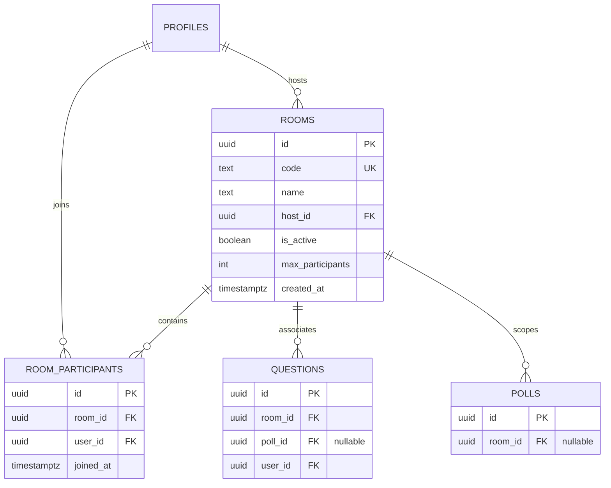

# Database Schema & Data Model

PollMap utilizes **Supabase (PostgreSQL)** as its primary persistence layer. The data model is designed to support multi-tenant "rooms" where hosts can manage participants, polls, and real-time questions.

## Data Architecture Overview

The schema is centered around the `rooms` entity, which serves as the primary grouping mechanism for all interactive elements. The architecture allows for a flexible relationship where questions can exist independently of specific polls, provided they are linked to a room.

### Entity Relationship Diagram



## Table Specifications

### 1. Rooms (`rooms`)
The core entity for session management.

| Column | Type | Constraints | Description |
| :--- | :--- | :--- | :--- |
| `id` | UUID | PK, Default: `gen_random_uuid()` | Unique identifier for the room. |
| `code` | TEXT | NOT NULL, UNIQUE | Short code used by participants to join. |
| `name` | TEXT | NOT NULL | Display name of the room. |
| `host_id` | UUID | FK (`profiles.id`), SET NULL | The user who created/manages the room. |
| `is_active` | BOOLEAN | DEFAULT TRUE | Toggle for room availability. |
| `max_participants`| INT | DEFAULT 100 | Cap on the number of users per room. |
| `created_at` | TIMESTAMPTZ | DEFAULT NOW() | Timestamp of room creation. |

### 2. Room Participants (`room_participants`)
A junction table managing the many-to-many relationship between users and rooms.

| Column | Type | Constraints | Description |
| :--- | :--- | :--- | :--- |
| `id` | UUID | PK, Default: `gen_random_uuid()` | Unique record ID. |
| `room_id` | UUID | FK (`rooms.id`), CASCADE | Reference to the room. |
| `user_id` | UUID | FK (`profiles.id`), CASCADE | Reference to the user. |
| `joined_at` | TIMESTAMPTZ | DEFAULT NOW() | Timestamp of entry. |

**Constraint:** A unique index on `(room_id, user_id)` prevents duplicate entries for the same user in a single room.

### 3. Questions (`questions`)
Updated to allow for room-level scoping regardless of whether a specific poll is active.

- **Room Linkage**: `room_id` (UUID) added as a foreign key to `rooms(id)` with `ON DELETE CASCADE`.
- **Poll Decoupling**: The `poll_id` column was altered to `DROP NOT NULL`, allowing questions to be linked directly to a room without requiring a parent poll.
- **Performance**: An index `idx_questions_room_id` is implemented for fast room-based queries.

## Row Level Security (RLS) & Access Control

Security is enforced at the database level using PostgreSQL RLS policies to ensure data integrity and privacy.

### Rooms & Participants
| Table | Action | Policy | Logic |
| :--- | :--- | :--- | :--- |
| `rooms` | SELECT | Viewable by all | `true` |
| `rooms` | INSERT | Users can create | `auth.uid() = host_id` |
| `rooms` | UPDATE | Hosts can update | `auth.uid() = host_id` |
| `room_participants`| SELECT | Viewable by all | `true` |
| `room_participants`| INSERT | Users can join | `auth.uid() = user_id` |
| `room_participants`| DELETE | Users can leave | `auth.uid() = user_id` |

### Questions
| Action | Policy | Logic |
| :--- | :--- | :--- |
| INSERT | Users can ask questions | `auth.uid() = user_id` |
| UPDATE | Users can update own | `auth.uid() = user_id` |

## Supabase Client Implementation

The project utilizes two distinct Supabase client configurations to separate administrative privileges from user-level access.

### Server-Side Client
Located in `server/supabaseClient.js`, this client uses the **Service Role Key**, bypassing RLS for administrative tasks.

```javascript
const supabase = createClient(
  process.env.SUPABASE_URL,
  process.env.SUPABASE_SERVICE_ROLE_KEY 
);
```

### Client-Side Client
Located in `client/src/supabaseClient.js`, this client uses the **Anon Key**, subjecting all requests to the RLS policies defined above.

```javascript
const supabaseUrl = import.meta.env.VITE_SUPABASE_URL;
const supabaseAnonKey = import.meta.env.VITE_SUPABASE_ANON_KEY;

export const supabase = createClient(supabaseUrl, supabaseAnonKey);
```

## Real-time Synchronization
To support live updates of room states and participant lists, the following tables are added to the `supabase_realtime` publication:
- `rooms`
- `room_participants`