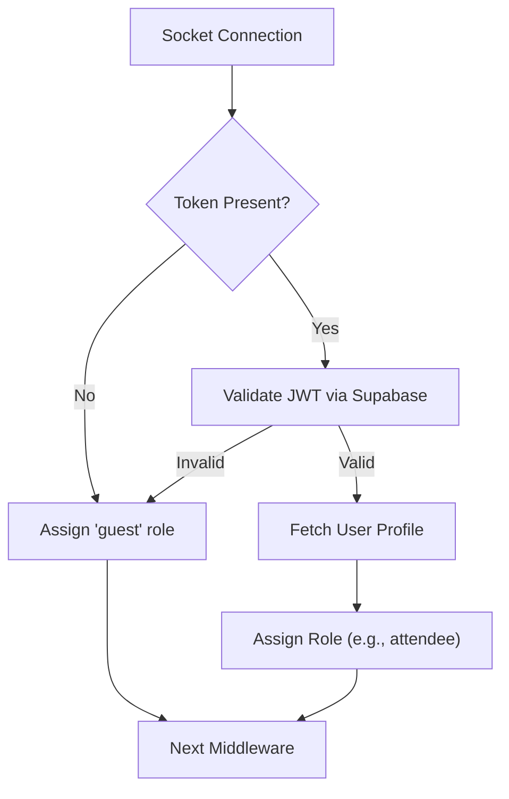

# Authentication & Security

PollMap employs a multi-layered security architecture that integrates identity management, transport-level validation for real-time communication, and resource-specific access controls.

## User Identity Management

The client-side authentication is managed via the `AuthContext`, which wraps the application to provide global access to the user's session and authentication methods through Supabase.

### Authentication Methods
The system supports three primary ways to establish identity:

| Method | Implementation | Description |
| :--- | :--- | :--- |
| **Email/Password** | `login()` / `signup()` | Standard credential-based authentication using `supabase.auth`. |
| **OAuth** | `signInWithGoogle()` | Third-party authentication via Google provider. |
| **Anonymous** | Guest Access | Users without a session are treated as guests for public areas. |

### Session Lifecycle
The `AuthProvider` utilizes `supabase.auth.onAuthStateChange` to synchronize the application state with the Supabase authentication server in real-time.

```javascript
// client/src/context/AuthContext.jsx
const { data: { subscription } } = supabase.auth.onAuthStateChange((_event, session) => {
  setSession(session);
  setUser(session?.user ?? null);
  setLoading(false);
});
```

## Real-time Socket Security

To ensure secure real-time communication, the Node.js server implements a custom middleware, `authorizeUser`, which validates the identity of every socket connection attempt.

### Validation Workflow
The middleware follows a **permissive** security model, meaning it does not block connections but assigns a `guest` role to unauthenticated users.



### Middleware Logic
The `authorizeUser` function extracts the JWT from the handshake and attaches the user's identity and role to the socket instance for use in subsequent event handlers.

```javascript
// server/middlewares/socketAuth.js
export const authorizeUser = async (socket, next) => {
    const token = socket.handshake.auth.token;
    if (!token) {
        socket.user = { id: null, email: null, role: 'guest' };
        return next();
    }
    const { data: { user }, error } = await supabase.auth.getUser(token);
    // ... profile fetch and role assignment
    socket.user = { id: user.id, email: user.email, role: profile?.role || 'attendee' };
    next();
};
```

## Resource-Level Protection

Beyond user identity, PollMap supports granular access control for specific poll instances through password protection.

### Password Protected Polls
The `PasswordProtectedPoll` component acts as a gatekeeper for sensitive polls. It validates a user-provided key against a hash stored in the database before allowing access to the voting flow.

**Verification Process:**
1. **Fetch:** The component retrieves the `password_hash` from the `polls` table for the specific `pollId`.
2. **Compare:** The user input is compared against the stored hash.
3. **Grant:** If the password matches (or if no password is set for the poll), the `onAuthenticated()` callback is triggered to unlock the poll.

```javascript
// client/src/components/ProtectedRoute/PasswordProtectedPoll.jsx
const { data, error } = await supabase
  .from('polls')
  .select('password_hash')
  .eq('id', pollId)
  .single();

if (data.password_hash === password) {
  onAuthenticated();
}
```

## Integrated Authentication Flow

The following sequence diagram illustrates the full lifecycle from initial login to authenticated socket communication.

```mermaid
sequenceDiagram
    autonumber
    participant U as "User/Browser"
    participant C as "Client (AuthContext)"
    participant S as "Supabase Auth"
    participant N as "Socket Server"
    participant DB as "PostgreSQL (Profiles)"

    U ->> C: Enter Credentials
    C ->> S: signInWithPassword()
    S -->> C: Return JWT Session
    C ->> N: Connect (auth: { token: JWT })
    Note over N: execute authorizeUser middleware
    N ->> S: getUser(token)
    S -->> N: User Identity
    N ->> DB: SELECT role FROM profiles WHERE id = user.id
    DB -->> N: User Role (e.g., 'admin')
    N ->> N: Attach user object to socket
    N -->> U: Connection Established