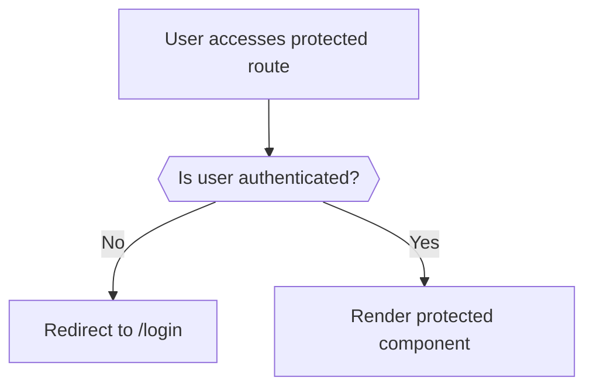
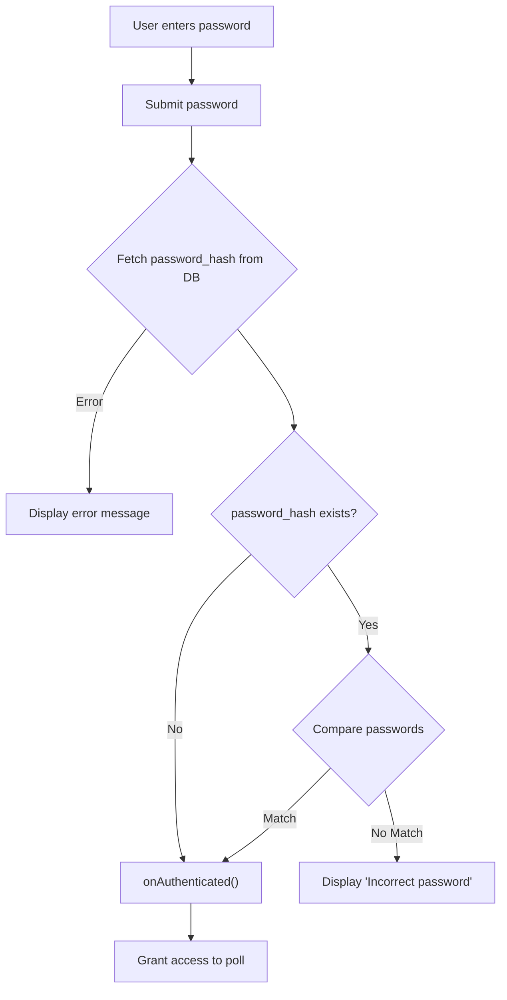

# Protected Routes

This document details the implementation of protected routes within the PollMap application, focusing on how unauthorized access is prevented and how conditional password protection is applied to polls.

## Overview

Protected routes are crucial for securing sensitive parts of the application, ensuring that only authenticated users can access certain features. Additionally, PollMap implements password protection for individual polls, adding a layer of security for potentially sensitive content.

## Authentication Protection

The primary method of protection involves checking if a user is authenticated before granting access to certain routes. This is handled by the `ProtectedRoute` component.

### `ProtectedRoute` Component

The `ProtectedRoute` component, found in `client/src/components/ProtectedRoute/ProtectedRoute.jsx`, is a higher-order component that wraps around other components. It verifies if a user is logged in via the `AuthContext`. If not, the user is redirected to the login page.

```javascript title="client/src/components/ProtectedRoute/ProtectedRoute.jsx"
import React from "react";
import { Navigate } from "react-router-dom";
import { UserAuth } from "../../context/AuthContext";

const ProtectedRoute = ({ children }) => {
  const { user, loading } = UserAuth();

  if (loading) {
    return <div>Loading...</div>;
  }

  if (!user) {
    return <Navigate to="/login" replace />;
  }

  return children;
};

export default ProtectedRoute;
```

[View on GitHub](https://github.com/lande26/PollMap/blob/main/client/src/components/ProtectedRoute/ProtectedRoute.jsx)

**Explanation:**

- The `ProtectedRoute` component accesses the user authentication state from `AuthContext` using the `UserAuth` hook.
- While the authentication status is loading, a loading message is displayed.
- If the user is not authenticated (i.e., `user` is null), the user is redirected to the `/login` route using `Navigate`.
- If the user is authenticated, the component renders its `children`, granting access to the protected route.

### Authentication Flow

The authentication flow can be visualized as follows:





## Password Protection

In addition to authentication, individual polls can be password-protected. The `PasswordProtectedPoll` component handles this functionality.

### `PasswordProtectedPoll` Component

The `PasswordProtectedPoll` component, found in `client/src/components/ProtectedRoute/PasswordProtectedPoll.jsx`, is responsible for rendering a password form and verifying the entered password against a stored hash. If the password is correct, or if the poll doesn't have a password set, the user gains access.

```javascript title="client/src/components/ProtectedRoute/PasswordProtectedPoll.jsx"
import React, { useState } from 'react';
import { useNavigate } from 'react-router-dom';
import { supabase } from '../../supabaseClient';
import { Card, CardContent, CardDescription, CardHeader, CardTitle } from "@/components/ui/card";
import { Button } from "@/components/ui/button";
import { Input } from "@/components/ui/input";
import { Label } from "@/components/ui/label";
import { Shield, AlertCircle, Lock, Loader2, Eye } from "lucide-react";
import { toast } from 'sonner';

const PasswordProtectedPoll = ({ pollId, onAuthenticated, onSkip }) => {
  const [password, setPassword] = useState('');
  const [error, setError] = useState('');
  const [loading, setLoading] = useState(false);
  const navigate = useNavigate();

  const handleSubmit = async (e) => {
    e.preventDefault();
    setLoading(true);
    setError('');

    try {
      const { data, error } = await supabase
        .from('polls')
        .select('password_hash')
        .eq('id', pollId)
        .single();

      if (error) throw error;
      
      if(!data.password_hash){
        onAuthenticated();
        return;
      }
      
      // Compare the password with the hash (you should use a proper hashing comparison)
      if (data.password_hash === password) {
        onAuthenticated();
      } else {
        setError('Incorrect password');
        toast.error('Incorrect password');
      }
    } catch (err) {
      setError('Failed to verify password');
      toast.error('Failed to verify password');
      console.log(err);
    } finally {
      setLoading(false);
    }
  };

  return (
    <div className="flex items-center justify-center min-h-screen p-6">
      <Card className="w-full max-w-md bg-[#10172A]/90 backdrop-blur-md border border-gray-700 text-white shadow-2xl">
        <CardHeader className="space-y-1">
          <div className="flex items-center justify-center mb-4">
            <div className="p-4 rounded-full bg-yellow-500/20 border border-yellow-500/30">
              <Shield className="h-8 w-8 text-yellow-400" />
            </div>
          </div>
          <CardTitle className="text-2xl text-center">Password Protected</CardTitle>
          <CardDescription className="text-center text-gray-300">
            This poll is password protected. Please enter the password to continue.
          </CardDescription>
        </CardHeader>
        <CardContent>
          <form onSubmit={handleSubmit} className="space-y-4">
            <div className="space-y-2">
              <Label htmlFor="password" className="flex items-center gap-2">
                <Lock className="h-4 w-4" />
                Password
              </Label>
              <Input
                id="password"
                type="password"
                value={password}
                onChange={(e) => setPassword(e.target.value)}
                className="bg-[#0D1425] border-gray-600 text-white placeholder:text-gray-400 focus:border-blue-500/50"
                placeholder="Enter password"
                required
              />
            </div>
            
            {error && (
              <div className="flex items-center gap-2 p-3 bg-red-500/10 border border-red-500/30 rounded-lg text-red-300">
                <AlertCircle className="h-4 w-4" />
                <span className="text-sm">{error}</span>
              </div>
            )}
            
            <div className="flex flex-col gap-2">
              <Button
                type="submit"
                disabled={loading}
                className="w-full bg-blue-600 hover:bg-blue-700 disabled:bg-gray-600 disabled:cursor-not-allowed"
              >
                {loading ? (
                  <>
                    <Loader2 className="mr-2 h-4 w-4 animate-spin" />
                    Verifying...
                  </>
                ) : (
                  'Submit'
                )}
              </Button>
              
              {onSkip && (
                <Button
                  type="button"
                  variant="outline"
                  onClick={onSkip}
                  className="w-full border-gray-600 bg-[#0D1425] hover:bg-[#1a2332] text-white"
                >
                  <Eye className="mr-2 h-4 w-4" />
                  View Without Password
                </Button>
              )}
            </div>
          </form>
        </CardContent>
      </Card>
    </div>
  );
};

export default PasswordProtectedPoll;
```

[View on GitHub](https://github.com/lande26/PollMap/blob/main/client/src/components/ProtectedRoute/PasswordProtectedPoll.jsx)

**Explanation:**

1.  **State Management:**
    *   `password`: Stores the password entered by the user.
    *   `error`: Stores any error messages to display to the user.
    *   `loading`: Indicates whether the password verification process is in progress.

2.  **`handleSubmit` Function:**
    *   This function is triggered when the user submits the password form.
    *   It first sets `loading` to `true` and clears any previous errors.
    *   It then queries the `polls` table in the Supabase database to retrieve the `password_hash` associated with the given `pollId`.
    *   If the query returns an error, an error message is displayed.
    *   If the `password_hash` is null, it means the poll is not password protected, and the `onAuthenticated` callback is invoked immediately.
    *   It compares the entered password with the retrieved `password_hash`.  **NOTE:** In a production environment, you should use a secure password hashing algorithm (e.g., bcrypt) to compare the entered password with the stored hash.
    *   If the passwords match, the `onAuthenticated` callback is invoked.
    *   If the passwords don't match, an error message is set and displayed to the user via a toast notification.
    *   Finally, `loading` is set back to `false`.

3.  **Skip Functionality:**
    *   The `onSkip` prop allows the user to skip entering a password, which can be useful if the poll creator allows viewing without a password.

4.  **UI Components:**
    *   The component uses `Card`, `CardHeader`, `CardContent`, `CardTitle`, and `CardDescription` components from `@/components/ui/card` to create a visually appealing card layout.
    *   It uses `Input` and `Label` components from `@/components/ui/input` and `@/components/ui/label` for the password input field.
    *   It uses a `Button` component from `@/components/ui/button` for the submit button.
    *   It uses icons from the `lucide-react` library to enhance the user interface.
    *   It uses `toast` from the `sonner` to display success and error messages.

### Data Fetching

The `supabase` client is used to fetch the password hash from the database.

```javascript title="Data Fetching Example"
const { data, error } = await supabase
  .from('polls')
  .select('password_hash')
  .eq('id', pollId)
  .single();
```

[View on GitHub](https://github.com/lande26/PollMap/blob/main/client/src/components/ProtectedRoute/PasswordProtectedPoll.jsx)

**Explanation:**

- This snippet shows how Supabase is used to query the `polls` table.
- It selects the `password_hash` column for a specific `pollId`.
- The `.single()` method ensures that only one record is returned.

### Conditional Rendering
The component conditionally renders either a loading indicator or a submit button based on the `loading` state.

```jsx title="Conditional Rendering Example"
<Button
  type="submit"
  disabled={loading}
  className="w-full bg-blue-600 hover:bg-blue-700 disabled:bg-gray-600 disabled:cursor-not-allowed"
>
  {loading ? (
    <>
      <Loader2 className="mr-2 h-4 w-4 animate-spin" />
      Verifying...
    </>
  ) : (
    'Submit'
  )}
</Button>
```

[View on GitHub](https://github.com/lande26/PollMap/blob/main/client/src/components/ProtectedRoute/PasswordProtectedPoll.jsx)

**Explanation:**

- This code snippet demonstrates conditional rendering within the `Button` component.
- If `loading` is true, a loading spinner (`Loader2`) and the text "Verifying..." are displayed.
- Otherwise, the text "Submit" is displayed.

### Password Verification Flow

The password verification flow can be visualized as follows:





### Toast Notifications
The component uses sonner's toast notifications to give feedback to the user.
```javascript
import { toast } from 'sonner';
...
toast.error('Incorrect password');
toast.success('Password verified successfully!');
toast.info('Viewing poll without password');
```
[View on GitHub](https://github.com/lande26/PollMap/blob/main/client/src/components/ProtectedRoute/PasswordProtectedPoll.jsx)

## Key Integration Points

-   **Authentication Context:** The `ProtectedRoute` relies on `AuthContext` to determine user authentication status. Ensure that `AuthContext` is correctly set up and provides the necessary user information.
-   **Supabase Integration:** The `PasswordProtectedPoll` component relies on Supabase to fetch the password hash for a given poll. Proper Supabase configuration is essential for this component to work correctly.
-   **Callback Functions:**  The `PasswordProtectedPoll` component uses callback functions (`onAuthenticated`, `onSkip`) to communicate with the parent component or router. These callbacks should be correctly implemented to handle successful authentication or skipping password verification.
-   **Password Hashing:** Never store passwords in plain text. Use a secure hashing algorithm like bcrypt before storing them in the database.  The comparison should also be done using the same hashing algorithm.
-   **Error Handling:** Properly handle errors during password verification and display informative error messages to the user.
```
```