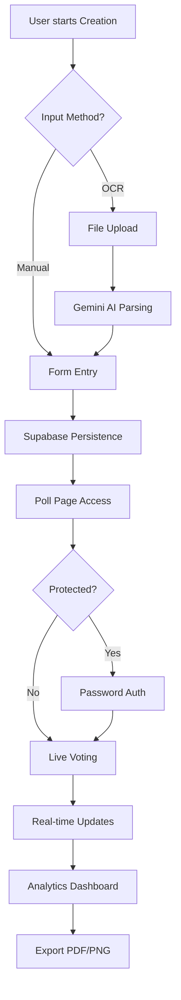
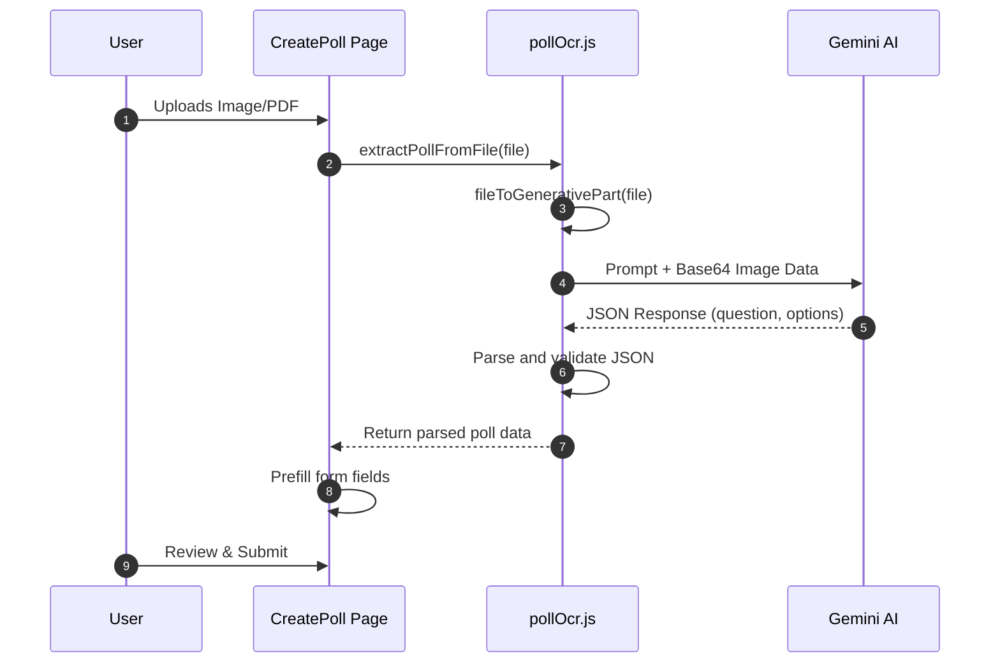

# Poll Lifecycle Workflow

The Poll Lifecycle Workflow defines the end-to-end journey of a poll within the PollMap ecosystem. This process spans from the initial ingestion of a question—either through manual entry or AI-powered OCR—to the real-time gathering of votes and the final generation of analytical reports.

## Process Overview

The lifecycle is divided into four primary stages: **Creation**, **Validation & Access**, **Live Participation**, and **Analytics**.



---

## 1. Poll Creation Phase

Polls can be initialized through two distinct pathways in the `CreatePoll` component.

### Manual Entry
Users define the poll structure by providing:
- **Question**: The primary query.
- **Options**: A list of choices (minimum 2, maximum 10).
- **Settings**: 
    - `is_password_protected`: Boolean to restrict access.
    - `password_hash`: The required password for entry.
    - `expires_at`: A future timestamp after which voting is disabled.

### AI-Powered OCR Extraction
The `pollOcr.js` utility integrates with the Google Generative AI (Gemini) to automate poll creation from images or PDFs.

**OCR Execution Sequence:**


**OCR Configuration Parameters**
| Parameter | Source Environment Variable | Default Value | Description |
| :--- | :--- | :--- | :--- |
| Provider | `VITE_POLL_OCR_PROVIDER` | `gemini` | The AI provider used for OCR. |
| API Key | `VITE_POLL_OCR_API_KEY` | N/A | Key for Gemini AI authentication. |
| Model | `VITE_POLL_OCR_MODEL` | `gemini-2.5-flash` | The specific generative model version. |

---

## 2. Persistence & Routing

Once the user submits the form, the application performs a two-step insertion into Supabase:

1. **Poll Record**: Inserts the core metadata into the `polls` table (including `created_by`, `room_id`, and protection settings).
2. **Option Records**: Maps the array of options and inserts them into the `options` table linked by `poll_id`.

**Post-Creation Routing Logic:**
- **Room Flow**: If a `roomId` is present in the location state, the user is redirected back to the room: `/rooms/[roomCode]?newPollId=[id]`.
- **Standard Flow**: The user is redirected to the dedicated poll page: `/polls/[id]`.

---

## 3. Access Control & Participation

The `PollPage` component acts as a gatekeeper, ensuring that security constraints are met before the voting interface is mounted.

### Validation Logic
1. **Metadata Fetch**: The system queries the `polls` table for `is_password_protected` and `created_by`.
2. **Authorization**:
    - If the current user is the `created_by` user, access is granted immediately.
    - If the poll is password protected and the user is not the creator, the `PasswordProtectedPoll` component is rendered.
    - If the poll is public, the voting surface (`Polls` component) is rendered.

---

## 4. Analytics & Export

The `PollAnalytics` page provides a comprehensive breakdown of poll performance using real-time data and advanced visualizations.

### Data Synchronization
The analytics surface maintains a live connection to the backend via Socket.io:
- **Join**: The client emits `joinPoll` with the `pollId`.
- **Update**: The server emits `pollDataUpdated`, triggering a state refresh of the poll data and total vote counts.

### Visualizations & Metrics
The system transforms Supabase data into formats compatible with Nivo charts:
- **Bar Chart**: Comparison of votes per option.
- **Pie Chart**: Percentage distribution of choices.
- **Line Chart**: Vote trends across options.
- **Radar Chart**: Multi-dimensional option analysis.

### Export Capabilities
To facilitate reporting, the system implements a client-side export utility:
- **Mechanism**: Uses `html-to-image` to capture the `contentRef` DOM element as a PNG.
- **PDF Generation**: The `jsPDF` library wraps the captured image into a PDF document with dimensions matching the original element's offset width and scroll height.

```javascript
// Simplified export logic from PollAnalytics.jsx
const dataUrl = await toPng(clone, { cacheBust: true });
const pdf = new jsPDF({
  orientation: 'portrait',
  unit: 'px',
  format: [element.offsetWidth, element.scrollHeight]
});
pdf.addImage(dataUrl, 'PNG', 0, 0, element.offsetWidth, element.scrollHeight);
pdf.save(`poll-analytics-${pollId}.pdf`);