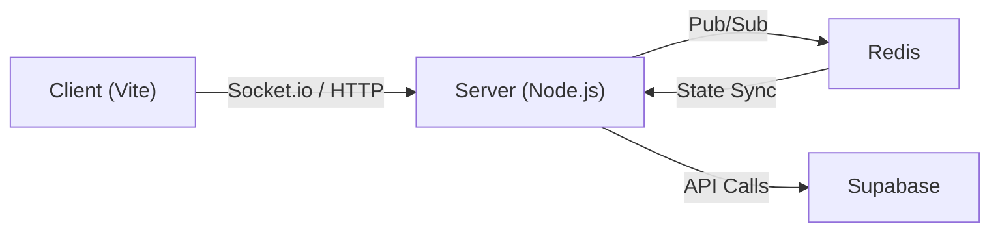

# Infrastructure & Deployment

This section provides the technical configuration required to run PollMap in a local development environment and deploy it to production. The system utilizes a containerized approach for local orchestration and a serverless frontend deployment strategy.

## Local Development Environment

PollMap uses Docker Compose to synchronize the frontend, backend, and caching layers, ensuring consistency across different development machines.

### Container Orchestration

The system is composed of three primary services that interact to provide real-time polling capabilities.



### Service Definitions

The following table details the service configuration and port mappings as defined in the `docker-compose.yml` file.

| Service | Docker Image / Build | Host Port | Container Port | Dependencies | Purpose |
| :--- | :--- | :--- | :--- | :--- | :--- |
| `redis` | `redis:alpine` | 6379 | 6379 | None | Session and socket state management |
| `server` | `./server/Dockerfile` | 5050 | 5001 | `redis` | Socket.io and Express API server |
| `client` | `./client/Dockerfile` | 8080 | 80 | `server` | React frontend served via Vite |

### Environment Configuration

The application relies on specific environment variables to establish connectivity between the tiered architecture.

**Server Configuration:**
- `REDIS_URL`: Points to the redis service (`redis://redis:6379`).
- `CLIENT_URL`: The origin of the frontend for CORS validation (`http://localhost:8080`).
- `.env`: Loaded from `./server/.env` for sensitive secrets.

**Client Configuration:**
- `VITE_SOCKET_URL`: Passed as a build argument to ensure the Vite bundle targets the correct backend endpoint (`http://localhost:5050`).
- `.env`: Loaded from `./client/.env`.

---

## Backend Infrastructure

The backend is built as a modular Node.js application using ES Modules (`"type": "module"`).

### Tech Stack & Dependencies

The server leverages a combination of Express for routing and Socket.io for real-time bidirectional communication.

| Dependency | Version | Role |
| :--- | :--- | :--- |
| `express` | `^5.1.0` | Web framework for API endpoints |
| `socket.io` | `^4.8.1` | Real-time communication engine |
| `@socket.io/redis-adapter` | `^8.3.0` | Enables socket scaling across multiple server instances |
| `@supabase/supabase-js` | `^2.57.0` | Database and authentication client |
| `redis` | `^5.8.2` | High-performance key-value store |

### Execution Scripts

The `server/package.json` defines two primary execution modes:
- **Development**: `npm run dev` (uses `nodemon` for hot-reloading).
- **Production**: `npm start` (standard `node` execution).

---

## Frontend Configuration

The frontend is a TypeScript-based React application optimized for modern browser environments.

### TypeScript Specification

As defined in `tsconfig.json`, the project uses a strict type-checking configuration to ensure production stability:

- **Target**: `ES2020`
- **Module Resolution**: `bundler`
- **JSX**: `react-jsx`
- **Path Aliasing**: The `@/*` alias is mapped to `./src/*` for cleaner import statements.

### Deployment to Vercel

The production frontend is deployed via Vercel using a specialized configuration to handle Single Page Application (SPA) routing.

#### Routing Strategy
Since React handles routing internally, the `client/vercel.json` file implements a rewrite rule to prevent 404 errors during page refreshes on client-side routes:

```json
{
    "framework": "vite",
    "rewrites": [
        {
            "source": "/(.*)",
            "destination": "/index.html"
        }
    ]
}
```

This configuration ensures that all incoming requests are directed to `index.html`, allowing the React Router to resolve the correct component based on the URL path.