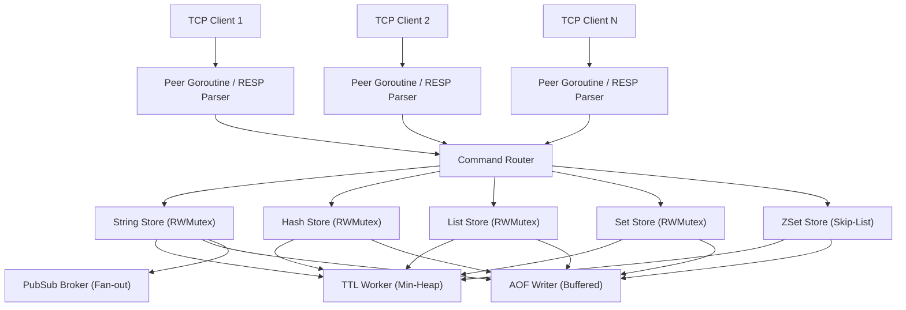

# Introduction

Valkyr is a production-grade, Redis-compatible key-value store engineered from the ground up in Go. Designed as a systems programming exercise in high-performance networking and concurrent data structures, Valkyr implements the **RESP2 (Redis Serialization Protocol)** to provide a seamless drop-in experience for Redis clients without relying on any third-party Redis libraries.

At its core, Valkyr leverages Go's concurrency primitives—goroutines and channels—to handle thousands of simultaneous TCP connections, utilizing a granular locking strategy to ensure that read operations remain non-blocking across different data types.

## Core Technical Pillars

Valkyr is built upon several sophisticated systems design patterns to ensure reliability and speed:

- **RESP2 Implementation**: A hand-rolled parser and writer supporting simple strings, errors, integers, bulk strings, and arrays, with fallback support for inline commands via `telnet` or `netcat`.
- **Advanced Data Structures**: 
    - **Sorted Sets (ZSets)**: Powered by a custom Skip-List implementation for $O(\log N)$ insertions and range queries.
    - **TTL Engine**: A background worker utilizing a binary min-heap to efficiently track and expire keys every 100ms.
- **Durability**: An Append-Only File (AOF) persistence system that logs every write operation, featuring a concurrent background rewrite process (`BGREWRITEAOF`) to prevent log bloat.
- **Memory Management**: Configurable `maxmemory` limits with pluggable eviction policies, including **LRU** (Least Recently Used), **LFU** (Least Frequently Used), and **Random**.

## High-Level Architecture

The following diagram illustrates the request lifecycle within Valkyr, from the TCP socket to the underlying storage engines and background workers.



## Getting Started

### Installation

To build Valkyr from source, ensure you have Go installed on your system.

```bash
# Clone the repository
git clone https://github.com/lande26/valkyr.git
cd valkyr

# Build the server and CLI binaries
make build
```

### Running the Server

You can start the server using the provided Makefile or by executing the binary directly.

```bash
# Start with default configuration
make run

# Or start with custom CLI flags
./bin/valkyr --port 6379 --loglevel debug --maxmemory 104857600
```

### Connecting to Valkyr

Valkyr is fully compatible with the standard `redis-cli` or its own built-in client.

**Using Valkyr-CLI:**
```bash
./bin/valkyr-cli
```

**Using Redis-CLI:**
```bash
redis-cli -p 6379
```

### First Commands

Once connected, you can begin using the store immediately:

```text
valkyr:6379> SET greeting "Hello Valkyr!"
OK

valkyr:6379> GET greeting
"Hello Valkyr!"

valkyr:6379> EXPIRE greeting 60
(integer) 1