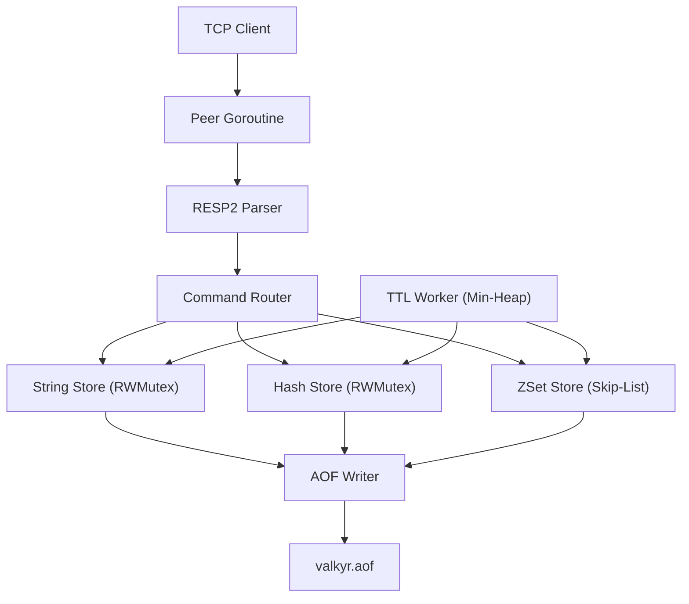

# Introduction

Valkyr is a high-performance, Redis-compatible key-value store implemented from scratch in Go. It is designed as a systems-programming exercise in building a production-grade database, eschewing third-party Redis libraries in favor of raw TCP sockets, Go's concurrency primitives, and custom data structure implementations.

By implementing the **RESP2 (Redis Serialization Protocol)**, Valkyr allows clients to interact with it using standard Redis tools like `redis-cli` or any language-specific Redis driver.

## Core Architecture

Valkyr utilizes a multi-threaded, asynchronous architecture that leverages Go's goroutines to handle thousands of concurrent connections without blocking the main execution thread.

### Data Flow & Concurrency
The system is designed around a "Shared-Nothing" philosophy for the network layer and a "Granular Locking" philosophy for the data layer:

1.  **Connection Handling**: Every incoming TCP connection is assigned its own peer goroutine.
2.  **Protocol Parsing**: A hand-rolled RESP2 parser transforms raw bytes into structured commands.
3.  **Command Routing**: The router dispatches commands to specific store implementations.
4.  **Granular Locking**: Instead of a single global lock, Valkyr uses per-data-type `sync.RWMutex` locks. This ensures that a heavy operation on a Sorted Set does not block reads from a String or Hash.




## Technical Pillars

### 1. The RESP2 Protocol
Valkyr implements the full RESP2 specification, supporting:
- **Simple Strings**: For basic status replies (e.g., `+OK\r\n`).
- **Errors**: For failure notifications (e.g., `-ERR\r\n`).
- **Integers**: For counts and increments (e.g., `:1000\r\n`).
- **Bulk Strings**: For binary-safe data.
- **Arrays**: For multi-bulk responses.

### 2. Advanced Data Structures
To maintain Redis-level performance, Valkyr uses specialized structures:
- **Sorted Sets (ZSets)**: Implemented via a **Skip-List**, enabling $O(\log N)$ time complexity for insertions, deletions, and range queries.
- **TTL Engine**: A background goroutine manages key expiry using a **Min-Heap**, ensuring the server efficiently sweeps expired keys every 100ms.

### 3. Persistence & Reliability
Valkyr employs an **Append-Only File (AOF)** system. Every write operation is logged to disk. To prevent the AOF file from growing indefinitely, Valkyr supports `BGREWRITEAOF`, which performs a concurrent background compaction to rewrite the log into the smallest possible set of commands required to restore the current state.

---

## Getting Started

### Installation

Clone the repository and build the binaries using the provided Makefile:

```bash
git clone https://github.com/lande26/valkyr.git
cd valkyr
make build
```

### Running the Server

You can start the server using the default configuration:

```bash
make run
# Or specify a custom port via CLI flags
./bin/valkyr --port 6379
```

### Connecting to Valkyr

You can use the bundled CLI or the official `redis-cli`:

**Using Valkyr-CLI:**
```bash
./bin/valkyr-cli
```

**Using Redis-CLI:**
```bash
redis-cli -p 6379
```

### Quick Start Example

Once connected, you can use standard Redis commands:

```text
valkyr:6379> SET greeting "Hello Valkyr"
OK
valkyr:6379> GET greeting
"Hello Valkyr"
valkyr:6379> ZADD leaderboard 100 "Player1" 200 "Player2"
(integer) 2
valkyr:6379> ZRANGE leaderboard 0 -1 WITHSCORES
1) "Player1"
2) "100"
3) "Player2"
4) "200"
```