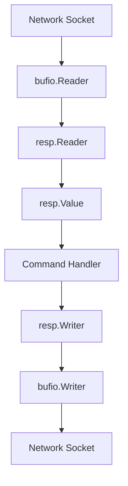

# Communication Protocol

Valkyr implements the **Redis Serialization Protocol (RESP2)**, a binary-safe text protocol used for communication between the client and the server. This implementation ensures high performance and compatibility with standard Redis clients while providing a flexible internal representation for command handling.

## Protocol Overview

RESP is designed to be simple to implement and fast to parse. Every request and response is prefixed with a single byte that identifies the data type.

### Data Types

| Prefix | Type | Description | Example |
| :--- | :--- | :--- | :--- |
| `+` | **Simple String** | Short, non-binary safe strings | `+OK\r\n` |
| `-` | **Error** | Error messages | `-ERR unknown command\r\n` |
| `:` | **Integer** | 64-bit signed integers | `:1000\r\n` |
| `$` | **Bulk String** | Binary safe strings (length-prefixed) | `$6\r\nfoobar\r\n` |
| `*` | **Array** | A collection of other RESP types | `*2\r\n$3\r\nGET\r\n$3\r\nkey\r\n` |
| `$-1` | **Null** | Null Bulk String or Null Array | `$-1\r\n` |

## Architecture Flow

The communication layer operates as a pipeline, converting raw bytes from the network into structured `Value` objects and vice versa.




## Implementation Details

### The `Value` Type

To handle the dynamic nature of RESP, Valkyr uses a unified `Value` struct. This allows command handlers to operate on a generic type regardless of whether the input was a simple string or a complex array.

```go
type Value struct {
    Typ   ValueType
    Str   string  // Used for SimpleString, Error, BulkString
    Num   int64   // Used for Integer
    Array []Value // Used for Array
}
```

### Parsing Logic (`resp.Reader`)

The `Reader` wraps a `bufio.Reader` to efficiently process the incoming stream. It performs a "peek" on the first byte to determine the type and then delegates the parsing to specialized internal methods (e.g., `readBulkString`, `readArray`).

#### Inline Command Support
For developer convenience, Valkyr supports **Inline Commands**. If a request does not start with a valid RESP prefix, the reader treats it as plain text (typical of `telnet` or `netcat` clients). 

**Example:** 
`SET mykey myval\n` $\rightarrow$ is automatically converted to a RESP Array: `*3\r\n$3\r\nSET\r\n$5\r\nmykey\r\n$5\r\nmyval\r\n`.

### Writing Logic (`resp.Writer`)

The `Writer` provides a high-level API to construct RESP-compliant responses. It ensures that all values are correctly framed with their respective prefixes and terminated with the required `\r\n` (CRLF) sequences.

The `WriteValue` method provides a polymorphic way to write any `Value` type:

```go
func (w *Writer) WriteValue(v Value) error {
    switch v.Typ {
    case SimpleString: return w.WriteSimpleString(v.Str)
    case Error:        return w.WriteError(v.Str)
    case Integer:      return w.WriteInteger(v.Num)
    case BulkString:   return w.WriteBulkString(v.Str)
    case Null:         return w.WriteNull()
    case Array:        // Recursive write for array elements
        // ...
    }
}
```

## Usage Example

### Reading a Request
```go
reader := resp.NewReader(bufio.NewReader(conn))
val, err := reader.ReadValue()
if err != nil {
    // Handle error
}

if val.Typ == resp.Array {
    command := val.Array[0].Str // e.g., "GET"
}
```

### Writing a Response
```go
writer := resp.NewWriter(bufio.NewWriter(conn))
err := writer.WriteValue(resp.BulkStringValue("Hello Valkyr"))
writer.Flush()
```

## Error Handling

The protocol implementation defines specific error types to distinguish between network failures and protocol violations:

- `ErrInvalidSyntax`: The input does not follow the RESP specification.
- `ErrUnexpectedType`: A type prefix was encountered where another was expected.
- `ErrInvalidLength`: The declared length of a bulk string or array is inconsistent with the payload.