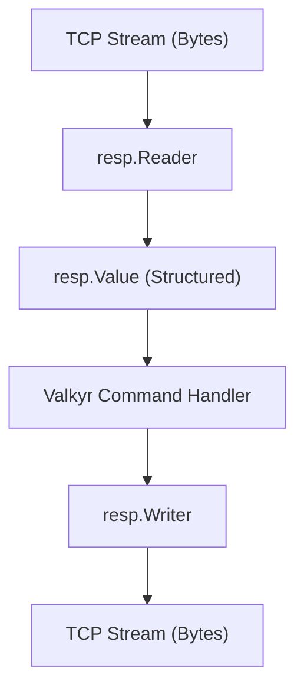

# RESP Protocol

The `resp` package provides a high-performance implementation of the **Redis Serialization Protocol (RESP2)**. It enables Valkyr to communicate with Redis-compatible clients by parsing incoming request streams into structured Go types and encoding responses back into the wire format.

## Protocol Overview

RESP is a binary-safe text protocol. Every value is prefixed by a single byte that determines its type.

### Wire Types

| Prefix | Type | Description | Example |
| :--- | :--- | :--- | :--- |
| `+` | Simple String | Short, non-binary safe strings. | `+OK\r\n` |
| `-` | Error | Error messages returned by the server. | `-ERR unknown command\r\n` |
| `:` | Integer | 64-bit signed integers. | `:1000\r\n` |
| `$` | Bulk String | Binary-safe strings prefixed by their length. | `$6\r\nfoobar\r\n` |
| `*` | Array | A collection of other RESP values. | `*2\r\n$3\r\nGET\r\n$3\r\nkey\r\n` |
| `$-1` | Null | Represents a null bulk string or null array. | `$-1\r\n` |

## Architecture

The protocol implementation is split into a `Reader` for decoding and a `Writer` for encoding.



## Data Model

The core of the package is the `Value` struct, which acts as a polymorphic container for any RESP data type.

```go
type Value struct {
    Typ   ValueType
    Str   string  // Used for SimpleString, Error, BulkString
    Num   int64   // Used for Integer
    Array []Value // Used for Array
}
```

### Helper Constructors
To simplify the creation of `Value` types, the package provides several helper functions:
- `SimpleStringValue(s string)`
- `ErrorValue(msg string)`
- `IntegerValue(n int64)`
- `BulkStringValue(s string)`
- `ArrayValue(elems []Value)`
- `NullValue()`

## Parsing Requests

The `Reader` wraps a `bufio.Reader` to efficiently process the stream.

### Basic Usage
```go
reader := resp.NewReader(bufio.NewReader(conn))
val, err := reader.ReadValue()
if err != nil {
    // Handle error
}
```

### Inline Command Support
Valkyr provides support for "inline commands," allowing developers to test the server via `telnet` or `netcat` without manually crafting RESP arrays. If the `Reader` encounters a line that does not start with a RESP prefix, it treats the entire line as an array of bulk strings.

**Example:**
- Input: `SET mykey myval\r\n`
- Result: `Value{Typ: Array, Array: [{BulkString, "SET"}, {BulkString, "mykey"}, {BulkString, "myval"}]}`

## Writing Responses

The `Writer` wraps a `bufio.Writer` and provides methods to encode values back to the wire.

### High-Level Writing
The `WriteValue` method automatically detects the `ValueType` and applies the correct RESP framing.

```go
writer := resp.NewWriter(bufio.NewWriter(conn))
response := resp.SimpleStringValue("OK")

if err := writer.WriteValue(response); err != nil {
    log.Fatal(err)
}
writer.Flush() // Required to push buffered data to the network
```

### Low-Level Writing
For maximum performance or specific framing needs, specialized methods are available:
- `WriteSimpleString(s string)`
- `WriteError(msg string)`
- `WriteInteger(n int64)`
- `WriteBulkString(s string)`
- `WriteArrayHeader(n int)` (Must be followed by `n` subsequent writes)
- `WriteNull()` / `WriteNullArray()`

## Error Handling

The parser returns specific sentinel errors to help the server decide how to handle malformed requests:

| Error | Description |
| :--- | :--- |
| `ErrInvalidSyntax` | The data does not conform to the RESP specification. |
| `ErrUnexpectedType` | An unexpected type prefix was encountered. |
| `ErrInvalidLength` | The declared length of a bulk string or array is invalid. |