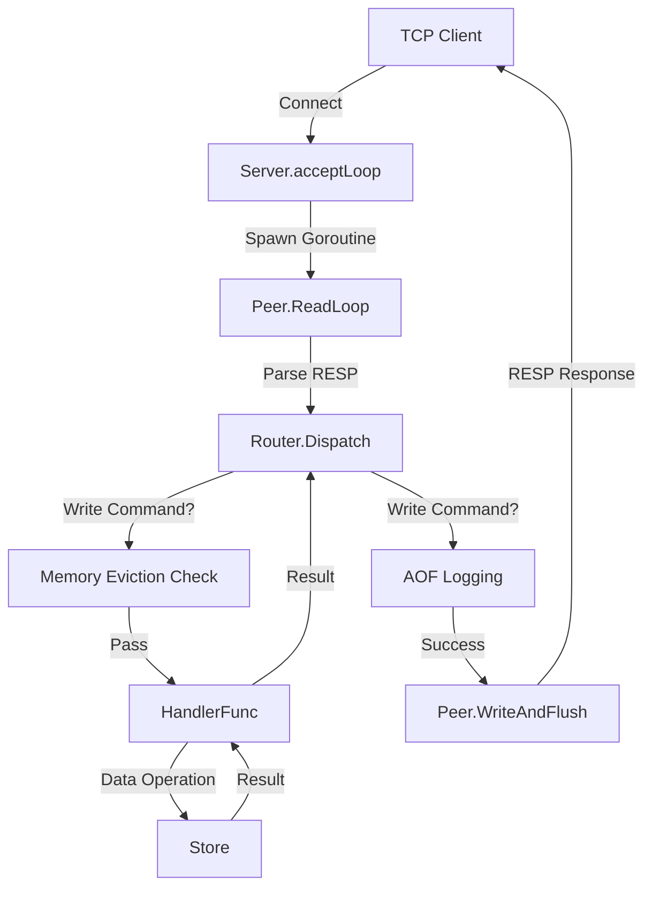

# Server Architecture

Valkyr utilizes a multi-threaded, event-driven architecture designed to handle concurrent TCP connections while maintaining a consistent internal data store. The server implements the RESP (REdis Serialization Protocol) to ensure compatibility with Redis clients.

## High-Level Request Flow

The following diagram illustrates the lifecycle of a request from the moment a client connects until a response is returned.

## Server Lifecycle

The `Server` struct acts as the central orchestrator. Its lifecycle is managed through three primary phases:

1.  **Initialization**: Upon calling `NewServer`, the system initializes the `Store` (in-memory database), the `Router` (command mapping), and the Pub/Sub registries.
2.  **Execution**: The `Start()` method initiates two critical background processes:
    *   **TTL Sweeper**: A background routine that periodically removes expired keys from the store.
    *   **Accept Loop**: A blocking loop that listens for incoming TCP connections using `net.Listen`. Each accepted connection is handed off to a dedicated `Peer` goroutine.
3.  **Shutdown**: The `Shutdown()` method ensures a graceful exit by closing the TCP listener, stopping the TTL sweeper, and forcibly closing all active `Peer` connections to prevent resource leaks.

## Peer Connection Handling

Each connected client is represented by a `Peer` object. To maximize throughput, Valkyr assigns every peer its own goroutine running a `ReadLoop`.

### The Read Loop
The `ReadLoop` is the heartbeat of the peer connection. It performs the following steps in a continuous cycle:
1.  **Read**: Uses a `bufio.Reader` to parse incoming RESP values.
2.  **Context Validation**:
    *   **Pub/Sub Check**: If the peer is in a subscribed state, the loop intercepts commands. Only `SUBSCRIBE`, `UNSUBSCRIBE`, `PSUBSCRIBE`, `PUNSUBSCRIBE`, `PING`, and `QUIT` are permitted.
    *   **Transaction Check**: If the peer has initiated a transaction via `MULTI`, commands are not executed immediately. Instead, they are validated for existence and appended to a `txQueue`.
3.  **Dispatch**: Validated commands are passed to the `Router`.
4.  **Write**: The result is sent back to the client via `WriteAndFlush`, which uses a `sync.Mutex` to ensure that concurrent writes (e.g., a command response and a Pub/Sub message) do not interleave and corrupt the TCP stream.

## Request Routing Logic

The `Router` is responsible for mapping command strings to their respective implementation logic.

### The Dispatch Pipeline
When `Router.Dispatch` is called, it follows a strict pipeline:

1.  **Handler Lookup**: The command is converted to uppercase and looked up in the `handlers` map.
2.  **Memory Guard**: If the command is identified as a "write command" (e.g., `SET`, `LPUSH`, `SADD`), the server invokes `CheckAndEvictMemory`. If the `maxmemory` limit is reached, the server attempts to evict keys based on the configured policy before allowing the write to proceed.
3.  **Execution**: The `HandlerFunc` is executed, interacting with the `Store` to retrieve or modify data.
4.  **Persistence**: If the command mutated state and returned successfully, the router logs the original arguments to the **Append Only File (AOF)** to ensure durability.

### Command Categorization
To maintain type safety and clean code, the router uses helper functions to wrap store-specific logic:

| Wrapper | Target Store Component | Example Commands |
| :--- | :--- | :--- |
| `makeStringCmd` | `st.Strings` | `GET`, `SET`, `INCR` |
| `makeHashCmd` | `st.Hashes` | `HSET`, `HGETALL` |
| `makeListCmd` | `st.Lists` | `LPUSH`, `LPOP` |
| `makeSetCmd` | `st.Sets` | `SADD`, `SMEMBERS` |
| `makeZSetCmd` | `st.ZSets` | `ZADD`, `ZRANGE` |

## Special Server States

### Transactions (`MULTI`/`EXEC`)
Valkyr implements transactions by altering the `Peer` state. When `MULTI` is received, `p.inTx` is set to `true`. Subsequent commands are stored in `p.txQueue` and the client receives a `QUEUED` response. Upon `EXEC`, the server iterates through the queue and dispatches each command sequentially, returning an array of all results.

### Pub/Sub Mechanism
Unlike standard request-response cycles, Pub/Sub requires the server to push data to clients asynchronously. 
- **Subscription**: The server maintains `pubsubChannels` and `pubsubPatterns` maps, linking channel names to sets of `Peer` pointers.
- **Publication**: When `PUBLISH` is called, the server iterates through both direct subscribers and pattern-matching subscribers, calling `Peer.WriteAndFlush` for each recipient.