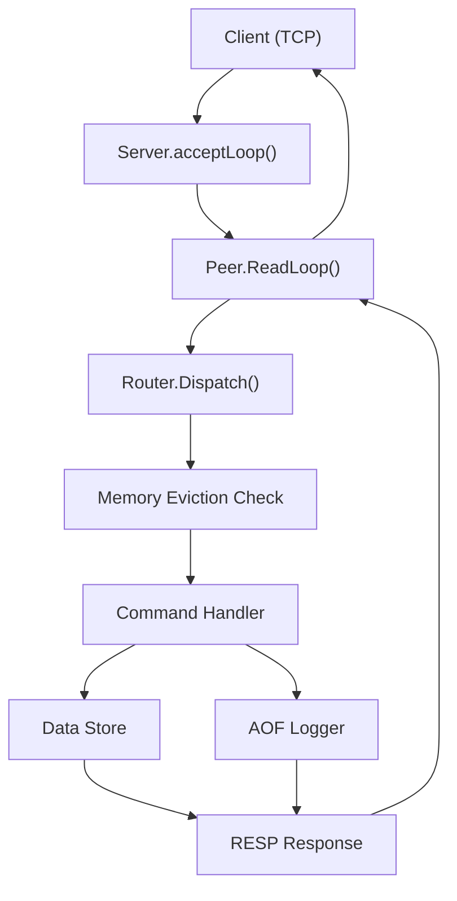

# Server Architecture

Valkyr's server architecture is designed as a high-performance, single-threaded execution model layered over a multi-threaded networking stack. It utilizes Go's goroutines to handle concurrent TCP connections while ensuring that data store mutations remain predictable and consistent.

## Networking Overview

The networking layer follows a "connection-per-goroutine" pattern. The `Server` acts as the central orchestrator, while each connected client is represented by a `Peer` object.

## Connection Handling

### The Peer Lifecycle
When a new TCP connection is accepted in `Server.acceptLoop()`, the server instantiates a `Peer`. The `Peer` is responsible for the full lifecycle of the client session:

1.  **Initialization**: Each peer is equipped with a `resp.Reader` (buffered) and a `resp.Writer`.
2.  **Read Loop**: The `ReadLoop()` method runs in its own goroutine, continuously parsing incoming RESP (Redis Serialization Protocol) arrays.
3.  **Write Safety**: Since multiple components (like the Pub/Sub system) may attempt to write to a peer simultaneously, `WriteAndFlush()` uses a `sync.Mutex` (`writeMu`) to prevent interleaved responses.
4.  **Cleanup**: Upon disconnection, the server triggers `UnsubscribeAll()` to remove the peer from all Pub/Sub channels and closes the underlying TCP socket.

## Request Routing

The `Router` acts as the dispatch engine, mapping string commands to their respective `HandlerFunc` implementations.

### Dispatch Logic
The `Router.Dispatch` method follows a strict execution pipeline for every incoming command:

1.  **Command Lookup**: Commands are converted to uppercase and looked up in the `handlers` map.
2.  **Write-Command Detection**: The router checks if the command exists in the `writeCommands` set. If it is a mutating command:
    *   **Memory Guard**: `Server.CheckAndEvictMemory()` is called. If the server has reached `maxmemory`, it attempts to evict keys based on the configured policy. If eviction fails or is disabled, it returns an OOM error.
3.  **Execution**: The associated handler function is executed, interacting with the `store.Store`.
4.  **Persistence**: If the command was a write operation and succeeded, the router logs the original arguments to the Append Only File (AOF) via `Server.LogToAOF()`.

## State-Aware Processing

The `Peer.ReadLoop` implements state machines to handle specific Redis-compatible modes:

### Pub/Sub Mode
When a peer subscribes to a channel or pattern, it enters a restricted state. In this mode, the `ReadLoop` blocks all commands except:
*   `SUBSCRIBE`, `UNSUBSCRIBE`, `PSUBSCRIBE`, `PUNSUBSCRIBE`
*   `PING`, `QUIT`

Any other command attempted while in Pub/Sub mode returns a RESP error.

### Transactional Mode (`MULTI`/`EXEC`)
Valkyr implements atomic transactions using a queuing mechanism within the `Peer` object:

*   **Queuing**: When `MULTI` is called, `Peer.inTx` is set to true. Subsequent commands are not executed immediately; instead, they are validated via `Router.HasHandler()` and appended to the `txQueue`.
*   **Execution**: When `EXEC` is called, the server iterates through the `txQueue`, dispatching each command through the router sequentially and returning an array of all results.
*   **Discard**: `DISCARD` clears the `txQueue` and resets the `inTx` state.

## Peer Management & Pub/Sub

The `Server` manages a global map of connected peers to facilitate broadcast operations.

*   **Channel Management**: The server maintains `pubsubChannels` and `pubsubPatterns` maps.
*   **Complexity**: 
    *   **Direct Publish**: $O(N)$ where $N$ is the number of subscribers to a specific channel.
    *   **Pattern Publish**: $O(P \cdot M)$ where $P$ is the number of registered patterns and $M$ is the number of peers matching those patterns.
*   **Concurrency**: A `sync.RWMutex` (`pubsubMu`) ensures that channel subscriptions can be modified while messages are being published.