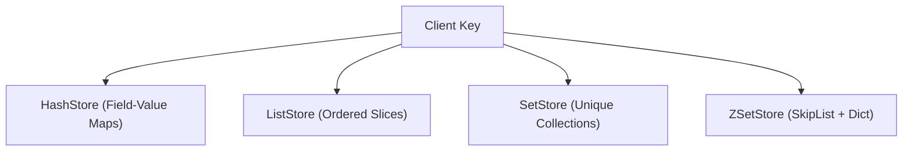

# Complex Data Types

Valkyr implements a suite of specialized data structures that extend beyond simple key-value pairs. These structures are designed to handle complex data relationships while maintaining high performance through Go's concurrency primitives and efficient algorithmic implementations.

## Architecture Overview

Each complex data type is managed by a dedicated store implementation. To ensure thread safety and minimize lock contention, each store utilizes its own `sync.RWMutex`, allowing multiple concurrent readers or a single writer.

---

## Hashes (`HashStore`)

Hashes are maps between string fields and string values, effectively acting as a "map within a map." They are ideal for representing objects (e.g., user profiles).

### Key Capabilities
- **Field-Level Access**: Retrieve or update specific fields without rewriting the entire object.
- **Atomic Increments**: Support for `HIncrBy` and `HIncrByFloat` to modify numeric values stored as strings.
- **Bulk Operations**: Retrieve all fields via `HGetAll` or specific subsets via `HMGet`.

### Implementation Detail
The `HashStore` uses a `map[string]map[string]string`. When a field is deleted via `HDel` and the resulting hash becomes empty, the top-level key is automatically removed to prevent memory leaks.

---

## Lists (`ListStore`)

Lists are ordered sequences of strings. They are typically used for queues, stacks, or timelines.

### Key Capabilities
- **Bidirectional Insertion**: Use `LPush` (head) and `RPush` (tail).
- **Efficient Popping**: `LPop` and `RPop` provide $O(1)$ removal from either end.
- **Range Queries**: `LRange` supports negative indexing (e.g., `-1` for the last element).
- **Positional Manipulation**: `LInsert` allows adding elements relative to a "pivot" value (`BEFORE` or `AFTER`).

### Complexity
Most operations are $O(1)$, though `LRange` and `LInsert` scale linearly with the number of elements in the list.

---

## Sets (`SetStore`)

Sets are unordered collections of unique strings. They are implemented using a map to an empty struct `map[string]struct{}`, ensuring minimal memory overhead per element.

### Key Capabilities
- **Uniqueness**: `SAdd` ensures no duplicate members exist within a set.
- **Set Theory**:
    - `SInter`: Intersection of multiple sets.
    - `SUnion`: Union of multiple sets.
    - `SDiff`: Difference (elements in the first set not present in others).
- **Randomization**: `SPop` and `SRandMember` allow for random element selection.
- **Atomic Movement**: `SMove` transfers a member from one set to another.

---

## Sorted Sets (`ZSetStore`)

Sorted Sets are the most complex structure in Valkyr. They associate a floating-point **score** with every member, keeping the collection sorted by that score.

### The Dual-Structure Approach
To achieve $O(\log N)$ performance for both lookups and range queries, `ZSetStore` uses two internal structures:
1. **Dictionary (`map[string]float64`)**: Provides $O(1)$ access to the score of a specific member.
2. **Skip List (`zskiplist`)**: A probabilistic data structure that maintains elements in sorted order, enabling efficient rank calculations and range retrievals.

### Key Capabilities
- **Ranking**: `ZRank` and `ZRevRank` determine the position of a member relative to the sorted order.
- **Score-Based Ranges**: `ZRange` and `ZRevRange` retrieve members by index.
- **Cardinality by Score**: `ZCount` returns the number of members within a specific score range `[min, max]`.

### Skip List Logic
The implementation uses a maximum level of 32 with a growth probability of 0.25. This ensures that even with millions of elements, the search depth remains shallow.