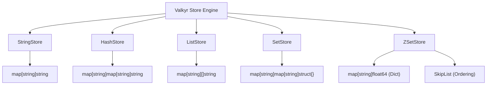

# Data Type Implementations

Valkyr utilizes a decoupled storage architecture where each Redis-compatible data type is managed by a specialized store. Every store implementation is designed for thread-safety using `sync.RWMutex`, ensuring high concurrency for read-heavy workloads while maintaining data integrity during writes.

## Strings

The `StringStore` is the simplest implementation, serving as the primary key-value store.

- **Underlying Structure**: A flat `map[string]string`.
- **Concurrency**: Uses a read-write mutex to allow multiple simultaneous readers or a single writer.
- **Key Features**:
    - **Atomic Increments**: The `IncrBy` method handles string-to-integer conversion using `strconv.ParseInt`, allowing Valkyr to treat strings as integers for counting operations.
    - **Atomic Appends**: Directly modifies the underlying string value, returning the resulting length.

## Hashes

The `HashStore` implements field-value maps, allowing a single key to associate with multiple fields.

- **Underlying Structure**: A nested map `map[string]map[string]string`.
- **Implementation Details**:
    - **Memory Efficiency**: When the last field of a hash is deleted via `HDel`, the top-level key is also removed from the store to prevent memory leaks from empty maps.
    - **Numeric Fields**: Supports `HIncrBy` and `HIncrByFloat`, which perform on-the-fly parsing and formatting of field values.

## Lists

The `ListStore` manages ordered sequences of strings.

- **Underlying Structure**: A map of string slices `map[string][]string`.
- **Technical Nuances**:
    - **Indexing**: Supports negative indexing (e.g., `-1` for the last element), which is resolved by adding the index to the current list length.
    - **Push/Pop Dynamics**: 
        - `LPush` prepends elements by creating a new slice.
        - `RPush` appends elements using Go's built-in `append` function.
    - **Trim & Range**: Implements slicing logic to provide `LRange` and `LTrim` capabilities, ensuring indices are clamped within valid bounds.

## Sets

The `SetStore` provides unordered collections of unique strings.

- **Underlying Structure**: A map where the value is an empty struct: `map[string]map[string]struct{}`.
- **Efficiency**: Using `struct{}` as the map value ensures that the set consumes minimal memory, as empty structs occupy zero bytes in Go.
- **Set Theory Operations**:
    - **Intersection (`SInter`)**: Iterates through the smallest set and checks for existence in all other provided sets.
    - **Union (`SUnion`)**: Merges all members into a temporary map to guarantee uniqueness.
    - **Difference (`SDiff`)**: Filters members of the first set that exist in any subsequent sets.

## Sorted Sets (ZSets)

The `ZSetStore` is the most complex implementation, providing $O(\log N)$ time complexity for most operations by combining two data structures.

### Dual-Structure Architecture
To achieve both fast member lookups and fast range queries, Valkyr uses:
1. **Dictionary (`map[string]float64`)**: Maps members to their scores for $O(1)$ score retrieval.
2. **Skip List (`zskiplist`)**: A probabilistic data structure that maintains elements sorted by score.

### Skip List Implementation
The `zskiplist` allows Valkyr to skip over large sections of the list to find elements quickly:
- **Levels**: Nodes are assigned a random level (up to 32) with a probability of $P=0.25$.
- **Spans**: Each forward pointer stores a `span` (the number of elements skipped). This allows `ZRank` to calculate the rank of an element in $O(\log N)$ time by summing spans during traversal.
- **Ordering**: Elements are sorted primarily by score. If scores are identical, they are sorted lexicographically by the member string.

### Complexity Analysis
| Operation | Time Complexity | Implementation Path |
| :--- | :--- | :--- |
| `ZAdd` | $O(\log N)$ | Dict Update $\rightarrow$ Skip List Insert |
| `ZScore` | $O(1)$ | Dict Lookup |
| `ZRank` | $O(\log N)$ | Skip List Traversal (Summing Spans) |
| `ZRange` | $O(\log N + M)$ | Skip List Search $\rightarrow$ Linear Walk |