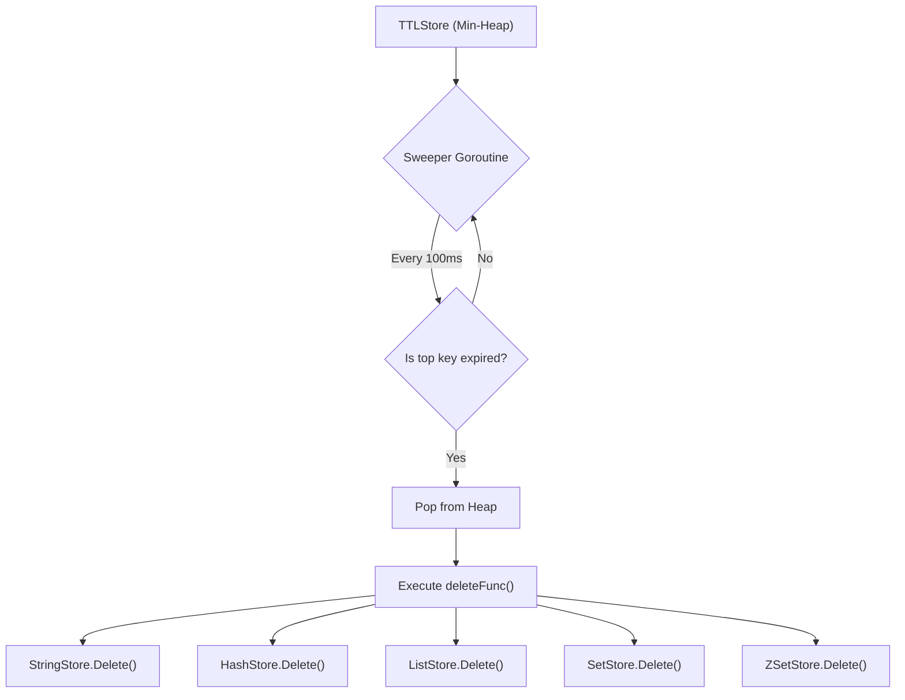

# TTL and Expiration

Valkyr implements a robust Time-To-Live (TTL) and eviction system to ensure that memory is managed efficiently and keys can expire automatically, mimicking Redis behavior.

## TTL Architecture

TTL management is decoupled from the primary data stores and handled by a dedicated `TTLStore`. This store tracks expiration deadlines and triggers deletions across all data types via a callback mechanism.

### The Expiration Process

The `TTLStore` utilizes a **Min-Heap** to track keys based on their expiration deadlines. This ensures that the system only needs to check the top of the heap to determine if any keys have expired.

### Key TTL Mechanisms

- **Relative Expiration**: Set via `SetExpire(key, seconds)`, calculating a deadline from the current time.
- **Absolute Expiration**: Set via `SetExpireAt(key, unixSeconds)`, allowing for specific timestamp-based expiration.
- **Background Sweeper**: A goroutine runs every 100ms, popping expired entries from the heap and invoking the cleanup callback.
- **Lazy Cleanup**: If a key's TTL is updated, the old entry remains in the heap but is ignored during the `sweep()` process because the `deadlines` map is updated to the most recent value.

## Memory Eviction

When memory limits are reached or explicit eviction is triggered, Valkyr provides several policies to reclaim space. Eviction is handled by the aggregate `Store` using access metadata tracked in `KeyMetadata`.

### Access Tracking
Every time a key is accessed via `KeyExists` or `KeyType`, the `Touch()` method is called, updating:
- `LastAccess`: The timestamp of the most recent operation.
- `AccessCount`: An incremental counter of total accesses.

### Eviction Policies

Valkyr supports both `allkeys` (all keys in memory) and `volatile` (only keys with an associated TTL) policies:

| Policy | Description | Implementation |
| :--- | :--- | :--- |
| `allkeys-random` | Randomly selects any key for eviction. | `rand.Intn` across all keys. |
| `volatile-random` | Randomly selects a key that has a TTL set. | Filter by `TTL.Exists()` $\rightarrow$ Random. |
| `allkeys-lru` | Evicts the Least Recently Used key. | Approximated via sampling 5 random keys. |
| `volatile-lru` | Evicts the LRU key among those with a TTL. | Filter by `TTL.Exists()` $\rightarrow$ Sample 5. |
| `allkeys-lfu` | Evicts the Least Frequently Used key. | Approximated via sampling 5 random keys. |
| `volatile-lfu` | Evicts the LFU key among those with a TTL. | Filter by `TTL.Exists()` $\rightarrow$ Sample 5. |

### Approximation Strategy
To avoid the performance overhead of maintaining a globally sorted list of all keys (which would require locking the entire store on every access), Valkyr uses a **sampling approach**. It selects 5 random candidates from the target pool and evicts the "best" victim among that sample. This provides a high-performance approximation of LRU/LFU.

## Complexity Analysis

| Operation | Time Complexity | Space Complexity | Notes |
| :--- | :--- | :--- | :--- |
| `SetDeadline` | $O(\log N)$ | $O(1)$ | Heap push operation. |
| `sweep()` | $O(K \log N)$ | $O(1)$ | Where $K$ is the number of expired keys. |
| `GetTTL` | $O(1)$ | $O(1)$ | Map lookup. |
| `Evict` | $O(S)$ | $O(1)$ | $S$ = Sample size (constant 5). |