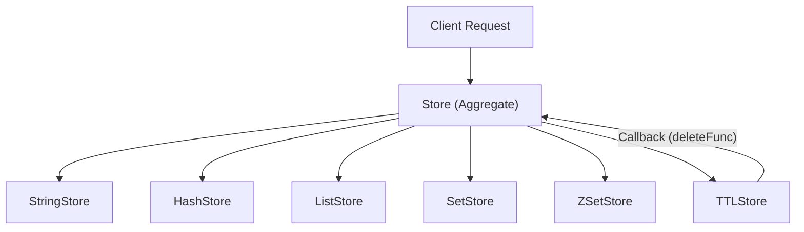

# Core Data Store

The Core Data Store is the heart of Valkyr, providing a high-performance, in-memory storage engine. It is designed as a coordinated aggregate that manages multiple specialized data type stores while providing a unified interface for key management, time-to-live (TTL) expiration, and memory eviction.

## Architecture Overview

Valkyr avoids global state by utilizing constructor injection. The `Store` aggregate acts as the primary coordinator, delegating specific data operations to specialized stores (e.g., `StringStore`, `HashStore`) and managing the lifecycle of keys via the `TTLStore`.

## The Store Aggregate

The `Store` struct is the top-level entity that ensures consistency across different data types. Because a single key in Redis can only hold one data type at a time, the aggregate `Store` handles the logic for determining key types and routing deletions.

### Key Management
The aggregate store provides several global operations:
- **Existence & Typing**: `KeyExists` and `KeyType` scan all sub-stores to identify where a key resides.
- **Atomic Renaming**: `RenameKey` transfers the value, TTL deadlines, and access metadata from an old key to a new one.
- **Global Purge**: `FlushDB` clears all sub-stores, TTL entries, and access metadata.

### Access Metadata
To support advanced eviction policies, the `Store` tracks `KeyMetadata` for every accessed key:
- `LastAccess`: Timestamp of the most recent operation.
- `AccessCount`: Total number of times the key has been touched.

## Specialized Data Stores

Each data type is managed by its own store implementation to ensure optimal concurrency and data structure usage.

### String Store
The `StringStore` handles basic key-value pairs. It uses a `sync.RWMutex` to allow multiple concurrent readers while ensuring exclusive access for writers.

**Key Features:**
- **Conditional Sets**: Supports `SetNX` (Set if Not eXists) and `SetXX` (Set if eXists).
- **Atomic Increments**: `IncrBy` parses string values as `int64` for atomic mathematical operations.
- **Bulk Operations**: `MGet` and `MSet` allow retrieving or setting multiple keys in a single lock cycle.

## TTL Management

The `TTLStore` implements an efficient expiration mechanism combining a **Hash Map** for $O(1)$ lookups and a **Min-Heap** for $O(1)$ access to the next expiring key.

### The Sweeper Mechanism
Instead of checking every key on every request, Valkyr employs a background "Sweeper" goroutine:
1. **Frequency**: Runs every 100ms.
2. **Logic**: Inspects the top of the min-heap. If the current time exceeds the deadline, the key is popped.
3. **Verification**: The sweeper checks the `deadlines` map to ensure the heap entry hasn't been superseded by a newer TTL update.
4. **Execution**: Triggers a `deleteFunc` callback that removes the key from all specialized stores and metadata maps.

## Eviction Policies

When memory limits are reached, Valkyr uses the `Evict` method to reclaim space. To avoid the performance penalty of sorting the entire keyspace, Valkyr uses an **approximation algorithm** by sampling a small subset of keys (5 random candidates) and selecting the best victim.

| Policy | Strategy | Target |
| :--- | :--- | :--- |
| `allkeys-random` | Randomly selects any key. | All Keys |
| `volatile-random` | Randomly selects a key with a TTL. | Keys with TTL |
| `allkeys-lru` | Selects the Least Recently Used from a sample. | All Keys |
| `volatile-lru` | Selects the LRU key among those with a TTL. | Keys with TTL |
| `allkeys-lfu` | Selects the Least Frequently Used from a sample. | All Keys |
| `volatile-lfu` | Selects the LFU key among those with a TTL. | Keys with TTL |