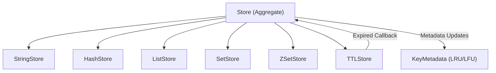

# Storage Engine

The Storage Engine is the heart of Valkyr, providing a high-performance, in-memory key-value store. It utilizes an **aggregate store pattern**, where a central `Store` coordinator manages several specialized data-type stores and a unified TTL (Time-to-Live) manager.

## Architecture

Valkyr avoids global state by using constructor injection. The `Store` struct acts as the primary entry point, routing requests to the appropriate specialized store based on the data type.

## Core Components

### 1. Aggregate Store (`Store`)
The `Store` provides a unified interface for managing keys regardless of their underlying type. It handles:
- **Key Routing**: Determining which sub-store holds a specific key.
- **Metadata Tracking**: Maintaining access timestamps and frequency counts for eviction policies.
- **Global Operations**: Managing `FlushDB`, `DBSize`, and `AllKeys`.

### 2. Specialized Data Stores
Valkyr implements separate stores for each Redis-compatible data type to optimize memory layout and operation complexity:
- **Strings**: Simple key-value pairs with support for atomic increments.
- **Hashes**: Maps of strings to strings.
- **Lists**: Ordered sequences of strings.
- **Sets**: Unordered collections of unique strings.
- **ZSets**: Sorted sets based on floating-point scores.

### 3. TTL Management
TTL is handled by a dedicated `TTLStore`. When a key is initialized with an expiration, the `TTLStore` monitors it. Upon expiration, it triggers a callback registered in `NewStore()`, which ensures the key is purged across all sub-stores and the metadata map simultaneously.

## Eviction Policies

To prevent memory exhaustion, Valkyr implements a sophisticated eviction system. Rather than maintaining a perfectly sorted list of all keys (which would be computationally expensive), Valkyr uses **random sampling** to approximate the best victim for eviction.

### Supported Policies

| Policy | Description |
| :--- | :--- |
| `allkeys-random` | Randomly selects any key for eviction. |
| `volatile-random` | Randomly selects a key that has an expiration set. |
| `allkeys-lru` | Approximates **Least Recently Used** by sampling 5 keys and picking the oldest. |
| `volatile-lru` | Approximates LRU among keys with an expiration set. |
| `allkeys-lfu` | Approximates **Least Frequently Used** by sampling 5 keys and picking the one with the lowest access count. |
| `volatile-lfu` | Approximates LFU among keys with an expiration set. |

### Sampling Logic
The `selectLRUVictim` and `selectLFUVictim` methods implement the sampling strategy:
1. A random sample of up to 5 candidates is selected from the key set.
2. The engine inspects the `KeyMetadata` for these candidates.
3. The candidate with the oldest `LastAccess` (LRU) or lowest `AccessCount` (LFU) is evicted.

## Key API Reference

### `Touch(key string)`
Updates the `KeyMetadata` for a key. This is called internally by `KeyExists` and `KeyType` to ensure that active keys are not accidentally evicted.

### `DeleteKey(key string) bool`
Performs a cross-store deletion. It removes the key from whichever sub-store contains it and clears any associated TTL and metadata.

### `RenameKey(oldKey, newKey string) bool`
Transfers the value and associated TTL from the source key to the destination key. This operation ensures that metadata (LRU/LFU stats) is preserved during the rename.

### `Evict(policy string, count int) int`
The primary memory management function. It attempts to remove `count` keys based on the provided policy. If keys are successfully evicted, it manually triggers `runtime.GC()` to encourage the Go garbage collector to reclaim memory.