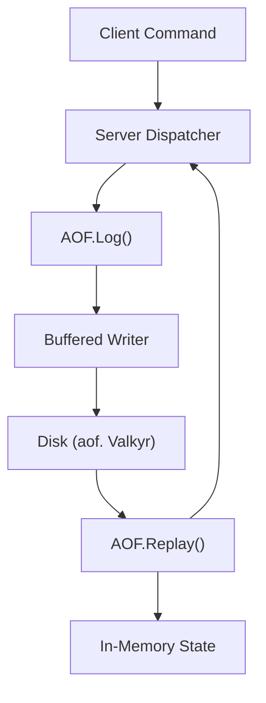

# Persistence

Valkyr ensures data durability across server restarts using an **Append-Only File (AOF)** system. Instead of snapshotting the entire memory state periodically, Valkyr logs every write command to a persistent file on disk. Upon startup, these commands are replayed in sequence to reconstruct the exact state of the database.

## AOF Architecture

The AOF system acts as a write-ahead log. Every command that modifies the server state is serialized into the Redis Serialization Protocol (RESP) format and appended to the log.

## Core Mechanisms

### 1. Command Logging
When a write command is processed, the `Log` method serializes the arguments as a RESP array of bulk strings. This ensures that the data stored on disk is identical to the protocol used for network communication.

- **Format**: `*<count>\r\n$<len>\r\n<data>\r\n...`
- **Concurrency**: Access to the file and buffer is synchronized via a `sync.Mutex` to ensure atomic writes.
- **Performance**: To minimize disk I/O overhead, writes are first sent to a `bufio.Writer`.

### 2. State Recovery (Replay)
During the server boot sequence, the `Replay` function reads the AOF file from the beginning. 

1. It parses the RESP values using a `resp.Reader`.
2. Each command array is passed back into the server's `Dispatch` function.
3. The server executes these commands against the fresh in-memory state.
4. Any errors encountered during replay are logged as warnings but do not stop the recovery process.

### 3. AOF Rewriting
To prevent the AOF file from growing indefinitely (e.g., logging 1,000 `INCR` commands on one key), Valkyr supports an AOF rewrite process.

**The Rewrite Workflow:**
1. **Initiation**: `StartRewrite()` is called, signaling the AOF manager to begin buffering new incoming writes into a temporary memory buffer (`rewriteBuf`).
2. **Compaction**: An external process (or background task) generates a minimized version of the current state into a temporary file.
3. **Finalization**: `FinalizeRewrite(tempPath)` is called:
   - The buffered commands accumulated during the rewrite are appended to the temporary file.
   - The temporary file is `fsync`ed to disk.
   - The old AOF file is replaced by the temporary file using an atomic rename operation.

## Data Durability Guarantees

Valkyr provides mechanisms to control when data is physically committed to the disk:

| Method | Action | Trigger |
| :--- | :--- | :--- |
| `Sync()` | Flushes `bufio` buffer and calls `os.File.Sync()` (fsync). | `BGSAVE` command or Graceful Shutdown. |
| `Close()` | Executes a final `Sync()` before closing the file handle. | Server termination. |

## Technical Reference

### `AOF` Struct

| Field | Type | Description |
| :--- | :--- | :--- |
| `mu` | `sync.Mutex` | Ensures thread-safe access to the file and rewrite buffer. |
| `file` | `*os.File` | The underlying handle to the AOF file. |
| `buf` | `*bufio.Writer` | Buffered writer to optimize write throughput. |
| `rewriteActive` | `bool` | Flag indicating if the system is currently in rewrite mode. |
| `rewriteBuf` | `[][]resp.Value` | Temporary storage for commands received during a rewrite. |