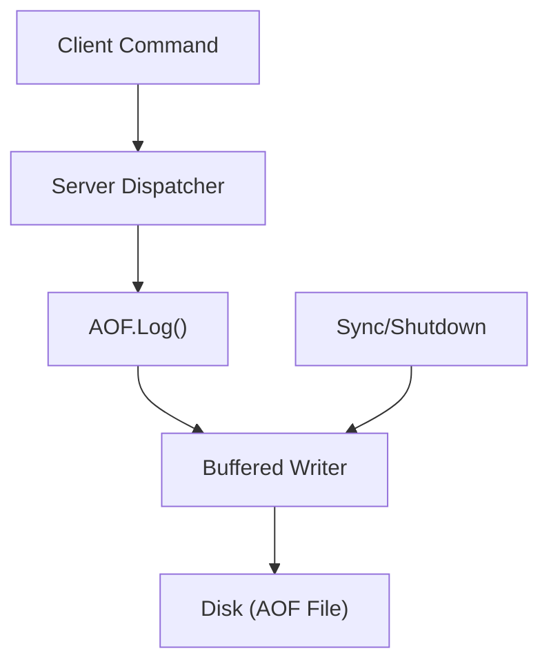

# Persistence and AOF

Valkyr ensures data durability through an **Append-Only File (AOF)** mechanism. Unlike snapshotting, which saves the state of the database at a specific point in time, AOF logs every write operation received by the server, allowing for near-zero data loss in the event of a crash or restart.

## How AOF Works

The AOF implementation records commands as raw **RESP (Redis Serialization Protocol)** bytes. When a command that modifies the server state is executed, it is passed to the AOF logger, which serializes the arguments into the AOF file.

### The Write Pipeline

To optimize performance, Valkyr uses a buffered writer (`bufio.Writer`). Writes are not immediately committed to the physical disk for every single command to avoid I/O bottlenecks. Instead, they are flushed to the operating system and synced to disk during specific events:
- Explicit calls to `Sync()` (e.g., via a `BGSAVE` command).
- Graceful server shutdown.

## State Recovery (Replay)

On startup, Valkyr restores its in-memory state by "replaying" the AOF file. The `Replay` method reads the file from the beginning and passes every logged command back through the server's dispatch function.

**Replay Process:**
1. **Seek:** The file pointer is moved to the start of the AOF file.
2. **Parse:** The `resp.Reader` parses the raw bytes back into RESP arrays.
3. **Execute:** Each command is executed against the current data store.
4. **Reset:** The file pointer is moved back to the end of the file to prepare for new appends.

## AOF Rewrite

Over time, AOF files can grow indefinitely as every single write is logged. To prevent the file from consuming excessive disk space, Valkyr supports an **AOF Rewrite** process. This process creates a condensed version of the AOF file.

### Rewrite Workflow

To maintain consistency while a rewrite is happening in the background, Valkyr employs a buffering strategy:

1. **Initialization:** `StartRewrite()` marks the AOF instance as being in "rewrite mode."
2. **Buffering:** While `rewriteActive` is true, all new incoming commands are logged to the main AOF file (for safety) AND appended to an in-memory `rewriteBuf`.
3. **Finalization:** When the rewrite of the base state is complete, `FinalizeRewrite()` is called:
    - The contents of `rewriteBuf` are appended to the temporary rewrite file.
    - The temporary file is synced to disk.
    - The old AOF file is closed and atomically replaced by the new file using `os.Rename`.

## Technical Reference

### AOF Struct Methods

| Method | Description |
| :--- | :--- |
| `New(path string)` | Initializes a new AOF instance or opens an existing file in append mode. |
| `Log(args []resp.Value)` | Serializes a command as a RESP array and writes it to the buffer. |
| `Replay(dispatchFn)` | Reads the AOF file and executes commands via the provided dispatcher to restore state. |
| `Sync()` | Flushes the `bufio.Writer` and calls `fsync` on the underlying file. |
| `StartRewrite()` | Enables rewrite mode and initializes the command buffer. |
| `FinalizeRewrite(path)` | Merges the rewrite buffer into the temp file and atomically replaces the main AOF. |
| `Close()` | Ensures all data is synced to disk before closing the file handle. |

### Complexity Analysis
- **Write Latency:** $O(1)$ per command (buffered).
- **Recovery Time:** $O(N)$ where $N$ is the number of commands in the AOF file.
- **Space Complexity:** $O(N)$ until a rewrite is performed.