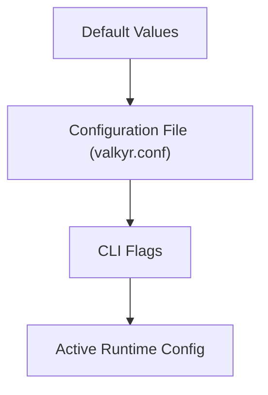

# Configuration and Tuning

Valkyr utilizes a layered configuration system that allows for flexible deployment across different environments. Settings are resolved in a specific order of precedence, where more specific sources override general ones.

## Configuration Hierarchy

The server determines its final runtime configuration by merging three distinct layers. If a setting is defined in multiple places, the CLI flag always takes the highest priority.




## Configuration Methods

### 1. Configuration File
Valkyr supports a Redis-style configuration file. By default, the server looks for a file named `valkyr.conf` in the working directory. 

The file uses a simple `key value` format. Lines starting with `#` are treated as comments and ignored.

**Example `valkyr.conf`:**
```conf
# Network settings
port 6379
bind 127.0.0.1

# Persistence settings
aof-path /var/lib/valkyr/appendonly.aof
no-persist no

# Performance and Logging
loglevel debug
maxmemory 2147483648
maxmemory-policy allkeys-lru
```

### 2. Command Line Interface (CLI)
CLI flags are used to override file-based configurations at runtime. This is particularly useful for containerized deployments (e.g., Docker/Kubernetes) where environment variables are passed as arguments.

**Example Command:**
```bash
./valkyr --port 7000 --loglevel warn --no-persist=true
```

## Parameter Reference

| Parameter | CLI Flag | Config Key | Default | Description |
| :--- | :--- | :--- | :--- | :--- |
| **Port** | `--port` | `port` | `6379` | The TCP port the server listens on. |
| **Bind Address** | `--bind` | `bind` | `0.0.0.0` | The IP address to bind the server to. |
| **AOF Path** | `--aof-path` | `aof-path` | `valkyr.aof` | Filesystem path for the Append-Only File. |
| **Log Level** | `--loglevel` | `loglevel` | `info` | Logging verbosity: `debug`, `info`, `warn`, `error`. |
| **Disable Persistence** | `--no-persist` | `no-persist` | `false` | If `true`, disables AOF logging and replay. |
| **Max Memory** | `--maxmemory` | `maxmemory` | `0` | Maximum memory limit in bytes. `0` means unlimited. |
| **Memory Policy** | `--maxmemory-policy` | `maxmemory-policy` | `noeviction` | Eviction strategy when `maxmemory` is reached. |

## Tuning and Optimization

### Persistence Tuning
Persistence is handled via an Append-Only File (AOF). When Valkyr starts, it performs a **Replay** phase where it reads the AOF file and executes all logged commands to restore the server state before accepting new client connections.

To disable persistence for use as a pure cache:
- Use the `--no-persist` flag or set `no-persist yes` in the config file.

### Memory Management
To prevent the server from consuming all available system RAM, configure the `maxmemory` limit. 

- **`noeviction` (Default):** Returns an error when the memory limit is reached and a write is attempted.
- **Policy Tuning:** Ensure the `maxmemory-policy` aligns with your data volatility requirements (e.g., using LRU for caching).

### Logging Levels
Adjust the `loglevel` based on the environment:
- **Production:** Use `info` or `warn` to reduce I/O overhead.
- **Development:** Use `debug` to trace command execution and server lifecycle events.