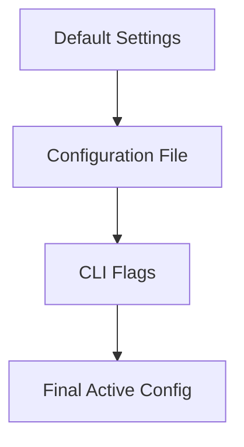

# Configuration

Valkyr uses a layered configuration system to manage server settings. Settings are applied in a specific order of precedence, allowing you to define base configurations in a file and override them dynamically using command-line flags.

## Configuration Hierarchy

The server resolves configuration values by merging sources in the following order. Later stages override previous ones.



## Configuration Options

The following parameters can be tuned to optimize Valkyr for your specific environment.

| Parameter | CLI Flag | Config Key | Default | Description |
| :--- | :--- | :--- | :--- | :--- |
| **Port** | `--port` | `port` | `6379` | The TCP port the server listens on. |
| **Bind Address** | `--bind` | `bind` | `0.0.0.0` | The network interface to bind to. |
| **AOF Path** | `--aof-path` | `aof-path` | `valkyr.aof` | File path for Append-Only File (AOF) persistence. |
| **Log Level** | `--loglevel` | `loglevel` | `info` | Logging verbosity: `debug`, `info`, `warn`, `error`. |
| **No Persist** | `--no-persist` | `no-persist` | `false` | If `true` (or `yes`/`1`), disables AOF persistence. |
| **Max Memory** | `--maxmemory` | `maxmemory` | `0` | Max memory limit in bytes. `0` means unlimited. |
| **Memory Policy** | `--maxmemory-policy` | `maxmemory-policy` | `noeviction` | Eviction strategy used when `maxmemory` is reached. |

## Using a Configuration File

Valkyr supports a Redis-style configuration file format. Each line should contain a key and a value separated by whitespace. Lines starting with `#` are treated as comments.

### Example `valkyr.conf`
```conf
# Network Settings
port 6380
bind 127.0.0.1

# Persistence
aof-path /var/lib/valkyr/appendonly.aof
no-persist no

# Resource Management
maxmemory 2147483648
maxmemory-policy allkeys-lru

# Logging
loglevel debug
```

## Command Line Overrides

CLI flags take the highest precedence. If a flag is provided during startup, it will override any value set in the configuration file or the system defaults.

### Example: Overriding Port and Log Level
To start the server using a config file but overriding the port to `7000` and the log level to `debug`:

```bash
./valkyr --config valkyr.conf --port 7000 --loglevel debug
```

## Implementation Details

The configuration is managed via the `config` package. The `Load` function initializes the process:

1. **Initialization**: Calls `DefaultConfig()` to populate the `Config` struct with hardcoded defaults.
2. **File Parsing**: If a path is provided, `loadFromFile` scans the file line-by-line, converting strings to the appropriate Go types (e.g., `strconv.Atoi` for ports).
3. **Flag Parsing**: `loadFromFlags` uses the standard `flag` package to intercept command-line arguments and overwrite existing fields in the `Config` struct.