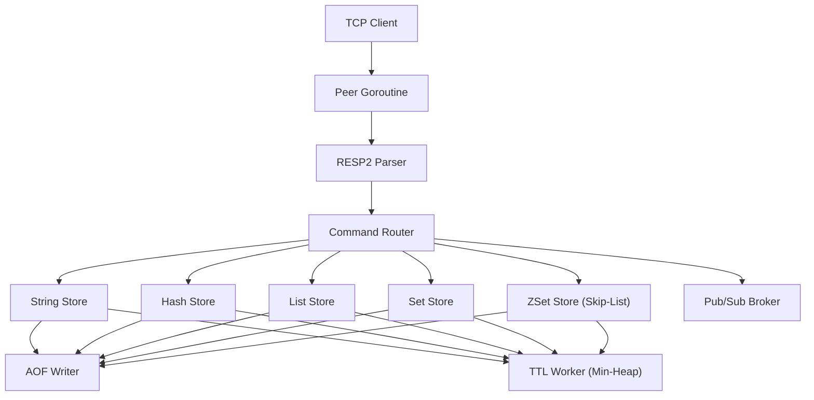

# Introduction

Valkyr is a high-performance, Redis-compatible key-value store engineered from the ground up in Go. Designed as a pedagogical and functional clone of Redis, Valkyr implements the **RESP2 (Redis Serialization Protocol)** to provide a seamless interface for existing Redis clients while leveraging Go's first-class concurrency primitives to handle thousands of simultaneous connections.

At its core, Valkyr is a systems-level implementation of an in-memory database, focusing on low-latency data access, efficient memory management, and reliable persistence.

## Core Purpose

The primary goal of Valkyr is to provide a robust, standalone KV store that mirrors the behavior of Redis without relying on third-party Redis libraries. It serves as a showcase of careful systems design, implementing complex data structures—such as **Skip-Lists** for Sorted Sets and **Min-Heaps** for TTL management—to ensure logarithmic time complexity for critical operations.

## High-Level Architecture

Valkyr employs a multi-threaded, asynchronous architecture. Every incoming TCP connection is promoted to its own goroutine, allowing the server to handle I/O concurrently. The command routing logic ensures that data access is thread-safe through granular `sync.RWMutex` locks per data type, preventing global bottlenecks.

## Key Technical Pillars

### 1. RESP2 Protocol Implementation
Valkyr implements a hand-rolled parser and writer for the Redis Serialization Protocol version 2. This ensures compatibility with `redis-cli` and other standard libraries, supporting:
- Simple Strings, Errors, and Integers.
- Bulk Strings and Arrays.
- Inline command fallback for raw `telnet` or `netcat` interactions.

### 2. Advanced Data Structures
To maintain Redis-like performance characteristics, Valkyr utilizes specialized structures:
- **Sorted Sets (ZSets):** Powered by a custom Skip-List implementation to support $\mathcal{O}(\log N)$ insertions and range queries.
- **Key Expiry:** A background goroutine monitors a binary min-heap of expiration timestamps, sweeping expired keys every 100ms.
- **Memory Eviction:** Implements approximated `LRU`, `LFU`, and `Random` policies when the `maxmemory` limit is reached.

### 3. Persistence & Reliability
Valkyr ensures data durability through an **Append-Only File (AOF)**. Every write operation is logged to disk and replayed sequentially during the server bootstrap process. To prevent the AOF file from growing indefinitely, Valkyr supports a concurrent background rewrite process (`BGREWRITEAOF`) that compacts the log.

## Project Structure & Lifecycle

The project is organized to separate the network layer from the storage engine:

- **`main.go`**: The orchestrator. It handles configuration loading, initializes the `slog` logger, manages the AOF replay sequence, and implements graceful shutdown via OS signal trapping.
- **`server/`**: Manages TCP listeners and the connection lifecycle.
- **`config/`**: Handles `valkyr.conf` parsing and CLI flag overrides.
- **`aof/`**: Manages the persistence layer, including file I/O and command replay.
- **`stores/`**: Contains the logic for the various data-type engines (Strings, Lists, Sets, etc.).

### Server Startup Sequence
1. **Configuration**: Loads `valkyr.conf` and merges CLI flags.
2. **Initialization**: Initializes the server instance and logging.
3. **Recovery**: If AOF is enabled, the server reads the `valkyr.aof` file and replays all commands into the memory stores to restore state.
4. **Listening**: Opens the TCP port and begins spawning goroutines for incoming client peers.