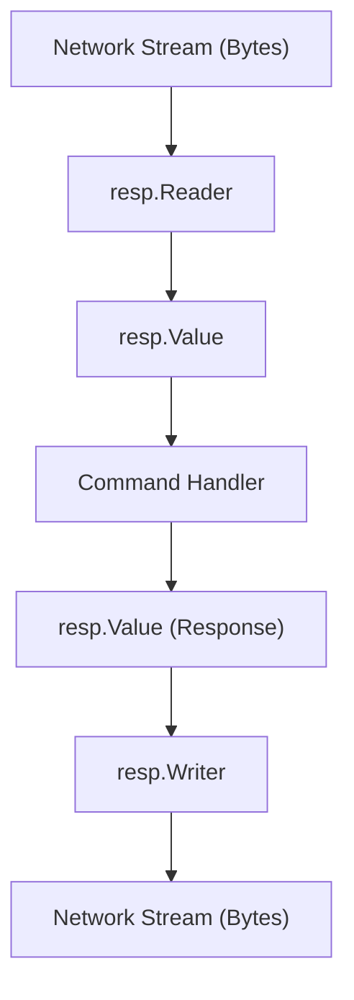

# RESP Protocol

The `resp` package provides a complete implementation of the **Redis Serialization Protocol (RESP2)**. It is designed to handle the binary-safe serialization format used by Redis for communication between clients and servers.

The implementation supports all primary RESP2 wire types, including a specialized parser for inline commands used by telnet and netcat clients.

## Protocol Data Types

The protocol uses a prefix-based system to identify the type of data being transmitted. In `valkyr`, these are encapsulated in the `Value` struct.

| Prefix | Type | Go Type | Description |
| :--- | :--- | :--- | :--- |
| `+` | Simple String | `string` | A short, non-binary safe string. |
| `-` | Error | `string` | An error message. |
| `:` | Integer | `int64` | A signed 64-bit integer. |
| `$` | Bulk String | `string` | A binary-safe string specifying its length. |
| `*` | Array | `[]Value` | A collection of other RESP values. |
| `$-1` / `*-1` | Null | `Null` | Represents a null bulk string or null array. |

## Architecture

The `resp` package separates concerns into two primary components: the `Reader` for deserialization and the `Writer` for serialization.



## Reading and Parsing

The `Reader` wraps a `bufio.Reader` to efficiently parse the incoming byte stream.

### Basic Usage

```go
buf := bufio.NewReader(conn)
reader := resp.NewReader(buf)

val, err := reader.ReadValue()
if err != nil {
    log.Fatal(err)
}

switch val.Typ {
case resp.BulkString:
    fmt.Printf("Received bulk string: %s\n", val.Str)
case resp.Array:
    fmt.Printf("Received array with %d elements\n", len(val.Array))
}
```

### Inline Command Support
To maintain compatibility with manual debugging tools (like `telnet`), the `Reader` automatically detects "Inline Commands". If a line does not start with a RESP prefix, the parser treats the entire line as an array of bulk strings, splitting the content by whitespace.

**Example:**
Input: `SET mykey myval\r\n`  
Parsed as: `Array([BulkString("SET"), BulkString("mykey"), BulkString("myval")])`

## Writing Responses

The `Writer` provides methods to encode Go types back into the RESP wire format.

### Basic Usage

```go
writer := resp.NewWriter(bufio.NewWriter(conn))

// Write a simple "OK" response
err := writer.WriteSimpleString("OK")

// Write a complex value using WriteValue
val := resp.ArrayValue([]resp.Value{
    resp.BulkStringValue("key"),
    resp.IntegerValue(100),
})
err = writer.WriteValue(val)

// Crucial: Flush the buffer to the network
writer.Flush()
```

### Helper Constructors
The package provides convenience functions to create `Value` objects without manually initializing the struct:

- `resp.SimpleStringValue(s string)`
- `resp.ErrorValue(msg string)`
- `resp.IntegerValue(n int64)`
- `resp.BulkStringValue(s string)`
- `resp.ArrayValue(elems []Value)`
- `resp.NullValue()`

## Error Handling

The parser returns specific errors to help the server decide whether to close the connection or send an error response to the client:

- `ErrInvalidSyntax`: The data does not follow the RESP specification.
- `ErrUnexpectedType`: An invalid prefix byte was encountered.
- `ErrInvalidLength`: The length specified in a bulk string or array is invalid.