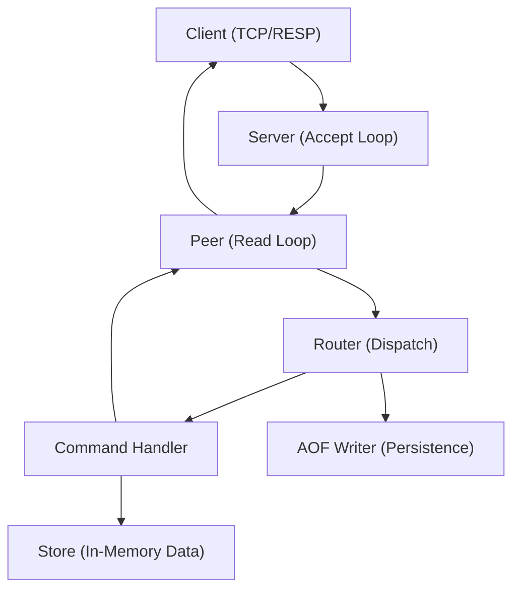

# Server Architecture

Valkyr employs a concurrent, event-driven TCP server architecture designed to handle multiple simultaneous client connections using the Redis Serialization Protocol (RESP). The architecture is decoupled into three primary layers: the **Server** (Connection Manager), the **Peer** (Session Handler), and the **Router** (Command Dispatcher).

## High-Level Request Flow

The following diagram illustrates the lifecycle of a request from the moment a client connects until a response is returned.

## Connection Handling & Peer Management

The `Server` acts as the orchestrator, managing the TCP listener and the lifecycle of all connected clients.

### The Accept Loop
When the server starts, it initializes a `net.Listen` loop. For every successful TCP handshake, the server spawns a new goroutine to execute `handleConn`. This ensures that one slow client cannot block the processing of other connections.

### The Peer Lifecycle
A `Peer` represents a stateful session with a connected client. Each `Peer` encapsulates:
- **I/O Buffering**: Uses `bufio` readers and writers to minimize syscalls.
- **Concurrency Control**: A `sync.Mutex` (`writeMu`) ensures that responses are written atomically to the socket, preventing interleaved RESP frames.
- **Session State**: Tracks whether the client is currently in a transaction (`inTx`) or subscribed to Pub/Sub channels.

The `ReadLoop` is the heartbeat of the Peer. It continuously parses incoming RESP arrays and determines the routing path based on the current session state.

## Request Routing Pipeline

The `Router` is responsible for mapping command strings (e.g., `SET`, `HGET`) to their respective logic handlers.

### Dispatch Logic
When the `Peer` passes a command to the `Router.Dispatch` method, the following sequence occurs:

1.  **Handler Lookup**: The router converts the command to uppercase and checks the `handlers` map.
2.  **Memory Guard**: If the command is identified as a "write command" (defined in `writeCommands`), the router invokes `CheckAndEvictMemory`. If the server has exceeded `maxmemory`, it attempts to evict keys based on the configured policy or returns an OOM error.
3.  **Execution**: The associated `HandlerFunc` is executed, interacting with the `store.Store` to perform data operations.
4.  **Persistence**: If the command was a mutation and succeeded, the router logs the original arguments to the **Append Only File (AOF)** via the `AOFWriter`.

## Advanced State Handling

The server implements complex protocol states that alter how the `ReadLoop` and `Router` behave.

### Transactional Mode (`MULTI`/`EXEC`)
When a peer receives a `MULTI` command, it enters transactional mode. 
- **Queuing**: Instead of immediate execution, commands are validated for existence and then appended to the `txQueue`.
- **Response**: The server responds with `QUEUED` for each command.
- **Execution**: Upon receiving `EXEC`, the server iterates through the `txQueue`, dispatches each command through the router, and returns an array of all results.

### Pub/Sub Mode
Once a client executes `SUBSCRIBE` or `PSUBSCRIBE`, the `Peer` is marked as subscribed. 
- **Context Restriction**: The `ReadLoop` enforces a strict filter. Only `SUBSCRIBE`, `UNSUBSCRIBE`, `PSUBSCRIBE`, `PUNSUBSCRIBE`, `PING`, and `QUIT` are permitted. Any other command returns a RESP error.
- **Asynchronous Pushing**: The `Server` maintains maps of channels and patterns to peers. When a `PUBLISH` command is received, the server iterates through the matching peers and uses `Peer.WriteAndFlush` to push messages asynchronously.

## Summary of Components

| Component | Responsibility | Key Mechanism |
| :--- | :--- | :--- |
| **Server** | Connection orchestration & Pub/Sub registry | `net.Listener`, `sync.RWMutex` |
| **Peer** | Protocol parsing & session state | `ReadLoop`, `txQueue`, `writeMu` |
| **Router** | Command mapping & middleware (AOF/Memory) | `HandlerFunc` map, `writeCommands` set |
| **Store** | Thread-safe data storage | Specialized type stores (Strings, Hashes, etc.) |