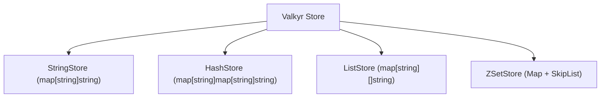

# Data Type Implementations

Valkyr employs a decoupled storage architecture where each Redis-compatible data type is managed by a specialized store implementation. This design ensures that concurrency primitives (like `sync.RWMutex`) are granular, reducing lock contention across different data types.

## Strings

The `StringStore` is the simplest implementation, utilizing a Go map to store key-value pairs where both the key and the value are strings.

### Implementation Details
- **Underlying Structure**: `map[string]string`
- **Concurrency**: Protected by a `sync.RWMutex`.
- **Key Features**:
    - **Atomic Increments**: `IncrBy` parses the string value into an `int64`, performs the operation, and stores it back as a string.
    - **Conditional Sets**: Implements `SetNX` (Set if Not eXists) and `SetXX` (Set if eXists) by checking map keys before insertion.
    - **Complexity**: Most operations (Get, Set, Delete) operate in $O(1)$ average time.

## Hashes

The `HashStore` implements field-value maps, allowing a single Redis key to associate with multiple fields.

### Implementation Details
- **Underlying Structure**: `map[string]map[string]string`
- **Concurrency**: Protected by a `sync.RWMutex`.
- **Key Features**:
    - **Nested Mapping**: The top-level map tracks the Redis key, while the inner map tracks the fields and their corresponding values.
    - **Automatic Cleanup**: When the last field of a hash is deleted via `HDel`, the top-level key is automatically removed from the store to prevent memory leaks.
    - **Numeric Operations**: `HIncrBy` and `HIncrByFloat` provide type-safe incrementing by attempting to cast the stored string value to `int64` or `float64`.

## Lists

The `ListStore` manages ordered collections of strings, behaving like a doubly-linked list but implemented via Go slices for better cache locality.

### Implementation Details
- **Underlying Structure**: `map[string][]string`
- **Concurrency**: Protected by a `sync.RWMutex`.
- **Key Features**:
    - **Head/Tail Operations**: `LPush`/`LPop` (left side) and `RPush`/`RPop` (right side) allow the list to be used as a stack or a queue.
    - **Indexing**: Supports negative indexing (e.g., `-1` for the last element) by calculating the offset from the slice length.
    - **Slicing**: `LRange` and `LTrim` leverage Go's native slice expressions for efficient range retrieval and modification.

## Sorted Sets (ZSets)

The `ZSetStore` is the most complex implementation, combining a hash map for fast lookups and a skip list for ordered range queries.

### Implementation Details
- **Dual-Structure Architecture**:
    1. **Dictionary (`map[string]float64`)**: Provides $O(1)$ access to the score of any given member.
    2. **Skip List (`zskiplist`)**: Maintains members sorted by score (and lexicographically by member string for identical scores).
- **Skip List Mechanics**:
    - **Levels**: Uses a probabilistic multi-level linked list (max 32 levels) to achieve $O(\log N)$ search, insertion, and deletion.
    - **Span**: Each forward pointer stores a "span" (the number of elements skipped), enabling $O(\log N)$ rank calculations (`ZRank` and `ZRevRank`).
- **Complexity**:
    - **ZAdd/ZRem**: $O(\log N)$
    - **ZScore**: $O(1)$
    - **ZRange**: $O(\log N + M)$ where $M$ is the number of elements returned.

### ZSet Storage Logic
When a member is added via `ZAdd`, Valkyr first checks the dictionary. If the member exists, it is removed from the skip list and re-inserted with the new score to maintain the sorted order. This ensures that the dictionary and the skip list remain perfectly synchronized.