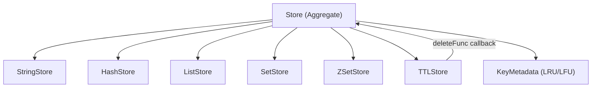

# Storage Core

The Storage Core is the heart of Valkyr, providing a unified interface for managing disparate data structures while ensuring consistency across key lifecycles, TTL (Time-To-Live) expirations, and memory eviction.

## Architecture Overview

Valkyr uses an aggregate pattern. Instead of a single monolithic map, the `Store` struct orchestrates specialized stores for each Redis-compatible data type. This separation allows for optimized internal implementations for strings, hashes, lists, sets, and sorted sets.

## TTL Management

The `TTLStore` handles key expiration using a high-performance min-heap. This ensures that the store always knows which key is expiring next without scanning the entire dataset.

### Expiration Workflow
1. **Registration**: When a TTL is set, the key and its deadline (Unix milliseconds) are pushed onto a min-heap (`expiryHeap`).
2. **Background Sweeping**: A background goroutine runs every 100ms, checking the top of the heap.
3. **Validation**: Because keys can be updated or deleted before they expire, the sweeper verifies the deadline against a `deadlines` map before executing the deletion.
4. **Callback Execution**: Once a key is confirmed expired, the `TTLStore` invokes a `deleteFunc` provided by the main `Store`, which cleans up the key across all data-type stores.

## Eviction Policies

To prevent memory exhaustion, Valkyr implements several eviction strategies based on the `KeyMetadata` (access count and last access time).

### Policy Types
Valkyr supports two primary scopes for eviction:
- **allkeys-***: Considers all keys in the database.
- **volatile-***: Only considers keys that have an associated TTL.

### Algorithms
| Policy | Logic | Implementation |
| :--- | :--- | :--- |
| **Random** | Picks a random key from the candidate pool. | `rand.Intn` |
| **LRU** | Least Recently Used. | Samples 5 random keys and evicts the one with the oldest `LastAccess`. |
| **LFU** | Least Frequently Used. | Samples 5 random keys and evicts the one with the lowest `AccessCount`. |

> **Note:** Valkyr uses a sampling-based approach for LRU and LFU (similar to Redis) to avoid the massive overhead of maintaining a perfectly sorted list of all keys.

## Key Lifecycle Operations

### Touching Keys
Every time a key is accessed via `KeyExists` or `KeyType`, the `Store.Touch(key)` method is called. This updates the `KeyMetadata`, incrementing the access count and updating the timestamp to ensure accurate LRU/LFU eviction.

### Renaming Keys
The `RenameKey` operation is an atomic transfer across stores:
1. **Metadata Transfer**: Moves `KeyMetadata` from the old key to the new key.
2. **Data Migration**: Identifies which sub-store holds the data, deletes the old key, and inserts the value under the new key.
3. **TTL Transfer**: If the old key had a deadline, it is migrated to the new key in the `TTLStore`.

### Deletion
Deletion is handled centrally. When `DeleteKey` is called, Valkyr:
1. Removes access metadata.
2. Attempts deletion across all sub-stores.
3. If the key existed in any store, it explicitly removes the associated TTL entry to prevent the background sweeper from attempting to delete a non-existent key.

## Technical Specifications

- **Time Complexity**: 
  - `KeyExists`/`KeyType`: $O(1)$
  - `TTL Set/Remove`: $O(\log N)$
  - `Eviction Sampling`: $O(1)$ (constant sample size)
- **Concurrency**: The `Store` uses a combination of granular mutexes within sub-stores and a `metaMu` mutex for access metadata to ensure thread safety.
- **Memory Management**: Explicit calls to `runtime.GC()` are triggered after large eviction events to signal the Go garbage collector to reclaim memory.