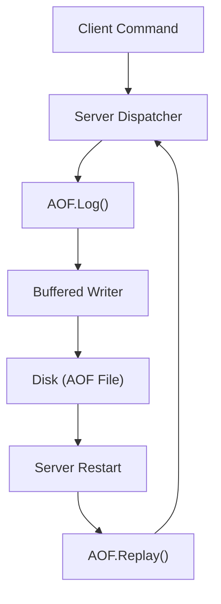

# Persistence

Valkyr ensures data durability through an **Append-Only File (AOF)** mechanism. Instead of periodically snapshotting the entire memory state, Valkyr logs every write command as a sequence of raw RESP (Redis Serialization Protocol) bytes. This ensures that in the event of a crash or restart, the server can reconstruct the exact state of the database by re-executing the logged commands.

## How AOF Works

The AOF implementation follows a write-ahead logging pattern. When a client sends a command that modifies data, the server serializes that command and appends it to the AOF file before (or during) the application of the change to the in-memory `Store`.

### Persistence Lifecycle

## Key Mechanisms

### 1. Command Logging
The `Log` method serializes arguments into the RESP array format. For example, a command like `SET key value` is stored as:
`*3\r\n$3\r\nSET\r\n$3\r\nkey\r\n$5\r\nvalue\r\n`

To optimize performance, Valkyr uses a `bufio.Writer`. Data is not immediately written to the physical disk until a `Sync` operation is triggered.

### 2. Data Recovery (Replay)
Upon startup, Valkyr invokes the `Replay` method. This process:
1. Seeks to the beginning of the AOF file.
2. Parses the RESP stream back into command arrays.
3. Passes each array to the server's dispatch function.
4. Re-applies the operations to the `Store` aggregate, effectively rebuilding the state.

### 3. The Rewrite Process
To prevent the AOF file from growing indefinitely, Valkyr supports a rewrite mechanism. This allows the server to create a condensed version of the AOF file (typically by saving the current state) without blocking incoming writes.

- **StartRewrite**: Signals the AOF manager to begin buffering new commands in memory (`rewriteBuf`) instead of writing them to the main file.
- **FinalizeRewrite**: 
    - Appends the buffered commands to a temporary AOF file.
    - Performs an atomic filesystem rename to replace the old AOF file with the new, condensed one.
    - Re-opens the file handle for continued logging.

## API Reference

### `AOF` Struct

| Method | Description |
| :--- | :--- |
| `Log(args []resp.Value)` | Appends a command to the AOF buffer. |
| `Sync()` | Flushes the buffer and calls `fsync` to ensure data is physically written to disk. |
| `Replay(dispatchFn)` | Reads the AOF file and executes commands via the provided dispatcher to restore state. |
| `StartRewrite()` | Begins buffering writes for the rewrite process. |
| `FinalizeRewrite(path)` | Atomicly replaces the main AOF file with a rewritten version. |
| `Close()` | Syncs pending writes and closes the file handle. |

## Performance Considerations

- **Buffering**: By using `bufio.Writer`, Valkyr reduces the number of system calls during high-throughput write operations.
- **Atomic Replacement**: The rewrite process uses `os.Rename`, which is atomic on Unix-like systems, ensuring that the AOF file is never in a corrupted state during a rewrite.
- **Memory Pressure**: During a rewrite, commands are buffered in `rewriteBuf`. Extremely high write volume during a rewrite can increase memory usage.