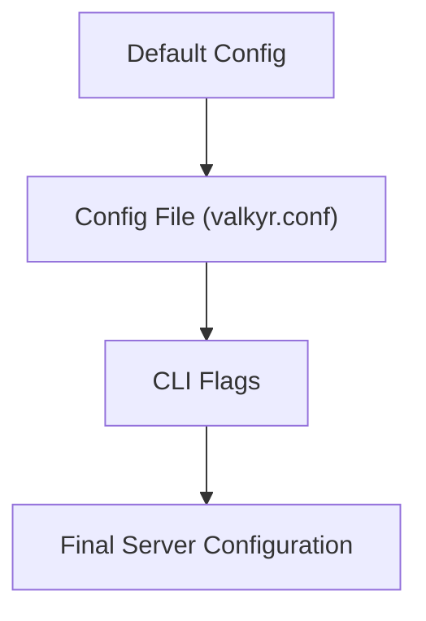

# Configuration

Valkyr uses a layered configuration system that allows you to define server behavior through default values, a configuration file, and command-line overrides.

## Configuration Hierarchy

Valkyr resolves configuration settings using the following order of precedence (highest priority first):

1.  **Command-Line Flags**: Overrides all other settings.
2.  **Configuration File**: Settings defined in `valkyr.conf`.
3.  **Default Values**: Sensible defaults used if no other source provides a value.



## Configuration Options

The following options are available for tuning the Valkyr server:

| Option | CLI Flag | Config Key | Default | Description |
| :--- | :--- | :--- | :--- | :--- |
| **Port** | `-port` | `port` | `6379` | TCP port the server listens on. |
| **Bind Address** | `-bind` | `bind` | `0.0.0.0` | Network interface to bind to. |
| **AOF Path** | `-aof-path` | `aof-path` | `valkyr.aof` | File path for Append-Only File persistence. |
| **Log Level** | `-loglevel` | `loglevel` | `info` | Logging verbosity: `debug`, `info`, `warn`, `error`. |
| **Disable Persist** | `-no-persist` | `no-persist` | `false` | Set to `yes` or `true` to disable AOF persistence. |
| **Max Memory** | `-maxmemory` | `maxmemory` | `0` | Maximum memory limit in bytes (`0` for unlimited). |
| **Memory Policy** | `-maxmemory-policy` | `maxmemory-policy` | `noeviction` | Eviction strategy when `maxmemory` is reached. |

## Configuration File

By default, Valkyr looks for a file named `valkyr.conf` in the working directory. The file follows a simple `key value` format. Lines starting with `#` are treated as comments.

**Example `valkyr.conf`:**

```conf
# Network settings
port 6379
bind 127.0.0.1

# Persistence settings
aof-path /var/lib/valkyr/appendonly.aof
no-persist no

# Resource limits
maxmemory 2147483648
maxmemory-policy allkeys-lru

# Logging
loglevel debug
```

## Command Line Usage

You can override any configuration file setting by passing flags during startup.

### Basic Start
Start the server using default configuration and `valkyr.conf`:
```bash
./valkyr
```

### Overriding Settings
Change the port and log level via CLI:
```bash
./valkyr -port 7000 -loglevel debug
```

### Disabling Persistence
Run the server in-memory only without writing to disk:
```bash
./valkyr -no-persist
```

## Environment Setup

Valkyr expects the process to have write permissions in the directory specified by `aof-path` to ensure data persistence is maintained during graceful shutdowns. When the server receives a `SIGINT` or `SIGTERM` signal, it automatically flushes the AOF buffer to disk before exiting.