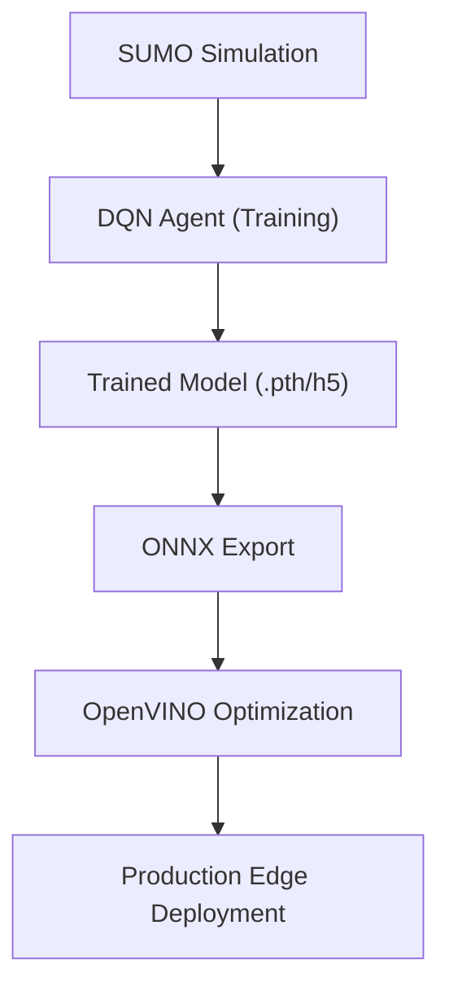

# Project Overview

**SMART FLOW** is an advanced, AI-driven traffic management system designed to replace conventional static timer-based signal controls with an adaptive intelligence framework. By integrating computer vision and reinforcement learning, the system dynamically adjusts traffic signal timings based on real-time congestion patterns, significantly reducing commuter wait times and urban vehicle emissions.

## Objectives

The primary goal of the system is to transition urban mobility from "pre-programmed" to "reactive" intelligence. Key objectives include:

- **Dynamic Adaptation:** Eliminating the inefficiency of fixed-time signals by responding to actual vehicle density.
- **Congestion Mitigation:** Reducing the average time vehicles spend idling at intersections.
- **Environmental Impact:** Lowering CO2 emissions through the reduction of stop-and-go traffic patterns.
- **Computational Efficiency:** Optimizing AI models for edge deployment to ensure low-latency decision-making.

## System Workflow

The project follows a rigorous pipeline from environment simulation to hardware-optimized inference. The workflow is divided into three primary phases: simulation setup, model training, and deployment optimization.

### 1. Simulation and Environment Setup
The system utilizes **SUMO (Simulation of Urban MObility)** to create a digital twin of traffic intersections.
- **Network Creation:** Using `netedit` or `netconvert` (for OSM files) to define the physical road layout.
- **Demand Generation:** Utilizing `randomTrips.py` to simulate realistic vehicle flow and routing.
- **Configuration:** Defining the simulation parameters within `.sumocfg` files to synchronize the environment with the AI agent.

### 2. Intelligence Layer (DQN)
The core decision-making engine is powered by a **Deep Q-Network (DQN)**.
- **Observation:** The agent monitors vehicle counts and lane density.
- **Action:** The agent decides whether to switch the signal phase or extend the current green light.
- **Reward:** A reward function is applied based on the reduction of total waiting time and queue length.

### 3. Deployment Pipeline
To move from a research environment to a production-ready system, the model undergoes an optimization pipeline:
- **Training:** The model is trained within the SUMO environment using Python.
- **Export:** The trained weights are exported to the **ONNX** (Open Neural Network Exchange) format for interoperability.
- **Optimization:** The ONNX model is processed via **OpenVINO** to optimize inference speed for Intel-based edge hardware.

## High-Level Architecture Flow

## Core Technology Stack

| Component | Technology | Purpose |
| :--- | :--- | :--- |
| **Simulation** | SUMO | Traffic environment and vehicle dynamics |
| **AI Framework** | PyTorch / TensorFlow | Reinforcement Learning implementation |
| **Computer Vision** | OpenCV | Vehicle detection and lane analysis |
| **Optimization** | OpenVINO | Model quantization and inference acceleration |
| **Interoperability**| ONNX | Standardized model representation |