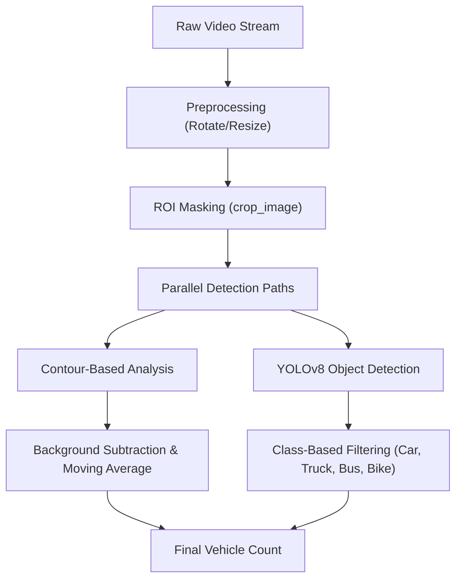

# Vehicle Detection Pipeline

The Vehicle Detection Pipeline is the primary sensory component of the AI-Based Traffic Signal Control System. It transforms raw video feeds into actionable numerical data (vehicle counts) using a hybrid approach that combines traditional computer vision (CV) techniques with deep learning-based object detection.

## System Architecture

The pipeline operates through a multi-stage process: preprocessing the frames, isolating the road area (ROI), and calculating vehicle density via two parallel methods: Contour Analysis and YOLOv8 detection.

## Core Components

### 1. Region of Interest (ROI) Masking
To reduce computational overhead and eliminate noise from sidewalks or sky, the system implements a polygon-based cropping mechanism in `crop_image()`. 

The process involves:
- Defining a polygon using `top`, `left`, and `right` coordinates.
- Creating a binary mask using `cv.fillPoly`.
- Applying a bitwise AND operation to isolate the road.
- Extracting the smallest bounding rectangle containing the polygon to minimize the processed image area.

### 2. Contour-Based Detection
The `contours_detector` function provides a lightweight method for estimating vehicle presence:
- **Preprocessing**: Converts frames to grayscale and applies a Gaussian Blur to remove high-frequency noise.
- **Edge Detection**: Uses the Canny algorithm to identify structural boundaries.
- **Contour Extraction**: Finds contours using `cv.RETR_LIST` and `cv.CHAIN_APPROX_SIMPLE`.
- **Morphological Operations**: Applies dilation to merge fragmented edges into solid object blobs.

### 3. Background Noise Compensation
One of the primary challenges in contour detection is "background noise" (stationary objects, road markings). The system solves this via a two-step calibration process:

#### Baseline Calculation (`background_contour`)
The system analyzes the video to find the minimum number of contours present when the road is relatively empty. This baseline is subtracted from real-time counts to ensure only moving/new objects are counted.

#### Temporal Smoothing
To prevent erratic jumps in vehicle counts due to flicker or lighting changes, the system implements a moving average:
- It maintains a buffer of the last 10 frames.
- It calculates the mean of these frames every 10th frame interval.
- **Counting Formula**:
  $$\text{Real Count} = \frac{\text{Average Vehicle Count} - \text{Background Contour}}{8}$$

### 4. YOLOv8 Integration
For high-precision detection, the system integrates the **YOLOv8n (Nano)** model. This provides a robust alternative to contour analysis by classifying specific objects.

- **Class Filtering**: The system explicitly filters for `car`, `truck`, `bus`, and `motorbike` to ignore pedestrians or animals.
- **Validation**: The YOLO output is used to validate the results of the contour-based system, ensuring higher reliability in varying traffic conditions.

## Technical Implementation Summary

| Feature | Contour-Based Method | YOLOv8 Method |
| :--- | :--- | :--- |
| **Computational Cost** | Very Low | Medium |
| **Dependency** | OpenCV, NumPy | Ultralytics, PyTorch |
| **Robustness** | Sensitive to lighting/shadows | High accuracy across conditions |
| **Primary Use** | Fast, real-time density estimation | Precise vehicle classification |
| **Processing Logic** | Edge $\rightarrow$ Contour $\rightarrow$ Area | Tensor $\rightarrow$ Bounding Box $\rightarrow$ Class |