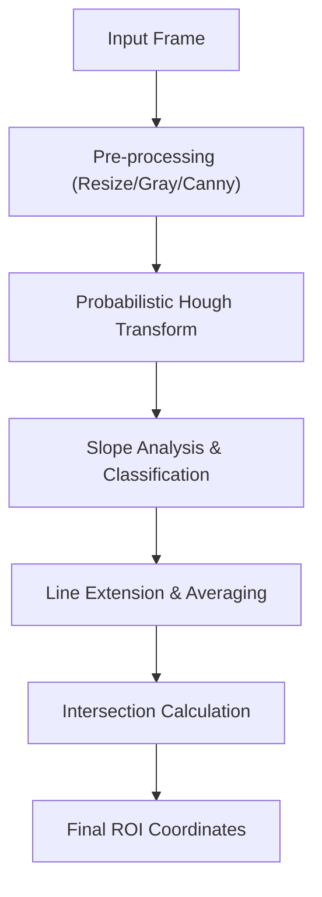

# Lane Detection System

The Lane Detection System is a critical component of the AI-Based Traffic Signal Control System. It utilizes computer vision techniques to identify road boundaries and stop lines, enabling the system to define the region of interest (ROI) for vehicle counting and traffic density analysis.

## System Architecture

The system processes visual data through a linear pipeline, moving from raw pixel data to geometric primitives.

## Technical Implementation

### 1. Pre-processing Pipeline
To ensure consistency across different camera resolutions and lighting conditions, the system applies the following transformations:
- **Resizing**: Frames are normalized to $800 \times 600$ pixels.
- **Grayscale Conversion**: Reduces dimensionality from 3-channel BGR to 1-channel luminance.
- **Canny Edge Detection**: Applies a gradient-based edge detector with thresholds (50, 150) to isolate high-contrast boundaries.

### 2. Lane Classification Logic
The system uses the **Probabilistic Hough Line Transform** (`cv2.HoughLinesP`) to detect line segments. Each segment is classified based on its calculated slope ($m = \frac{y_2 - y_1}{x_2 - x_1}$):

| Lane Type | Slope Condition | Assigned Color | Purpose |
| :--- | :--- | :--- | :--- |
| **Left Lane** | $m < -0.4$ | Blue | Defines left boundary |
| **Right Lane** | $m > 0.3$ | Green | Defines right boundary |
| **Stop Line** | $-0.1 \le m \le 0.1$ | Red | Defines the stop/entry line |

### 3. Geometric Refinement
To handle fragmented lines and noise, the system implements several geometric utilities:

#### Line Extension
Since Hough Transform often returns short segments, the `extend_line` function uses the linear equation $y = mx + c$ to project the line across the entire frame dimensions, ensuring a continuous boundary.

#### Intersection & ROI Calculation
The system calculates the intersection of the left lane and the stop line using the determinant method:
1. Calculate coefficients $A, B, C$ for the line equations $Ax + By = C$.
2. Solve for the intersection point $(ix, iy)$.
3. Compute a midpoint between the intersection and the stop line center to determine the optimal "Top" vertex for the detection polygon.

## Processing Modes

### Static Image Analysis (`all_lines.py`)
Used for calibration and testing. It processes a single frame to verify that slope thresholds correctly categorize road markings under specific lighting conditions.

### Real-time Video Stream (`main_line_video.py`)
Optimized for performance to maintain a high frame rate:
- **Temporal Sampling**: Line detection is performed every 10th frame (`frame_count % 10 == 0`) to reduce CPU load.
- **State Persistence**: Detected lines are stored in a `stored_lines` dictionary, allowing the system to render smooth boundaries even between detection cycles.
- **Dynamic Averaging**: In `final_lane_detection.py`, the system averages coordinates over multiple frames to eliminate "jitter" caused by sensor noise.

## Mathematical Summary

The core of the coordinate system relies on the intersection of two lines:
$L_1: A_1x + B_1y = C_1$
$L_2: A_2x + B_2y = C_2$

The intersection point is derived as:
$$x = \frac{C_1B_2 - C_2B_1}{A_1B_2 - A_2B_1}, \quad y = \frac{A_1C_2 - A_2C_1}{A_1B_2 - A_2B_1}$$