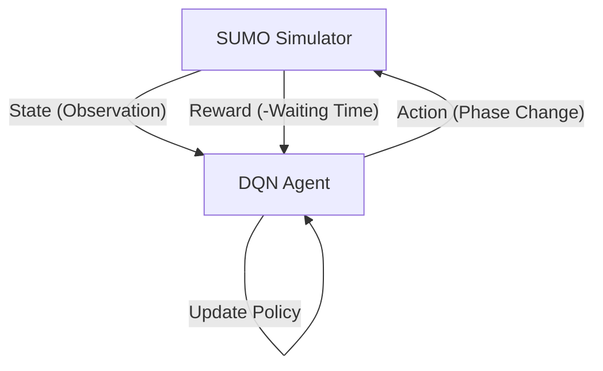

# AI Model Training and Evaluation

The system utilizes Reinforcement Learning (RL) to optimize traffic signal timing dynamically. By treating the traffic intersection as a Gymnasium environment, the agent learns to minimize vehicle waiting times through a trial-and-error process implemented via the Deep Q-Network (DQN) algorithm.

## Reinforcement Learning Architecture

The core of the system is a generalized RL loop where the agent interacts with the SUMO (Simulation of Urban MObility) simulator via the TraCI API.

## The Gymnasium Environment: `TrafficLightEnv`

The `TrafficLightEnv` class wraps the SUMO simulation into a standard RL interface, allowing compatibility with the `stable-baselines3` library.

### 1. Observation Space (State)
To ensure the model is generalized across different intersection layouts, the observation space is dynamically calculated based on the number of controlled lanes and traffic lights:

$$\text{Observation Size} = \sum (\text{Lanes per Traffic Light}) + (2 \times \text{Number of Traffic Lights})$$

The state vector includes:
- **Waiting Vehicles**: The number of halting vehicles on each controlled lane (`getLastStepHaltingNumber`).
- **Current Phase**: The integer index of the current signal phase.
- **Time Remaining**: The remaining duration of the current phase, clipped between $0$ and $1000$.

### 2. Action Space
The agent operates on a discrete action space consisting of three possible decisions:
- **Action 0 (Extend)**: If the current phase is green, extend its duration by 5 seconds.
- **Action 1 (Switch)**: Trigger an immediate transition to the next phase in the signal program.
- **Action 2 (Hold)**: Maintain the current state without modification.

### 3. Reward Function
The goal is to maximize traffic flow. The reward is defined as the negative sum of the waiting time for all vehicles in the network:
$$R = -\sum_{i=1}^{n} \text{waiting\_time}(\text{lane}_i)$$
By maximizing this negative value, the agent is incentivized to minimize the total cumulative delay of all vehicles.

## Training Procedure

Training is handled by `train_generalised.py` using the **Deep Q-Network (DQN)** algorithm with a Multi-Layer Perceptron (MLP) policy.

### Training Workflow
1. **Environment Initialization**: The system starts SUMO in headless mode (`-no-step-log`) for maximum performance.
2. **Environment Validation**: `check_env(env)` is called to ensure the Gymnasium wrapper adheres to API standards.
3. **Model Optimization**: The DQN agent learns via `model.learn(total_timesteps=10000)`, interacting with the simulation to discover which actions reduce waiting times.
4. **Persistence**: The trained weights are saved to `models/traffic_light_dqn` for deployment.

## Evaluation and Testing

Evaluation is performed using `test_generalised.py`, which loads a pre-trained model and runs it against a specific configuration file (e.g., `intersection.sumocfg`).

### Testing Workflow
- **Visualization**: Unlike training, testing is typically run with `sumo-gui` to allow developers to visually verify the agent's behavior.
- **Deterministic Prediction**: The model uses `model.predict(obs, deterministic=True)` to ensure the most optimal learned action is taken rather than an exploratory one.
- **Performance Metric**: The total accumulated reward over a fixed number of steps (e.g., 1000) is printed to quantify the agent's efficiency.

## Implementation Summary

| Component | Implementation |
| :--- | :--- |
| **Library** | `stable-baselines3`, `gymnasium`, `traci` |
| **Algorithm** | DQN (Deep Q-Network) |
| **Policy** | MlpPolicy (Multi-Layer Perceptron) |
| **Input** | Vehicle counts, phase IDs, phase timers |
| **Output** | Phase extension or phase switch |
| **Optimization Goal** | Minimum total waiting time |